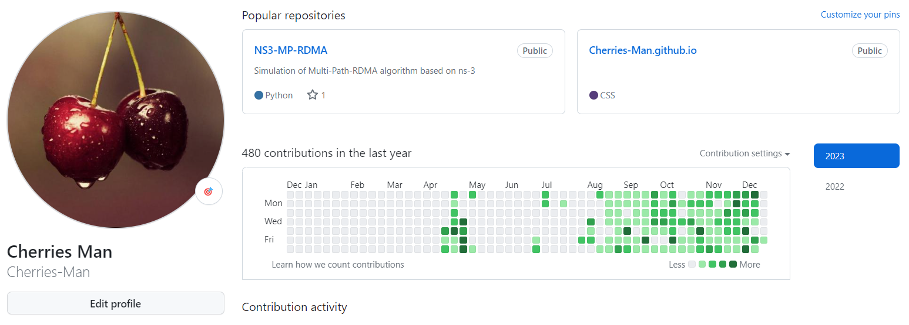
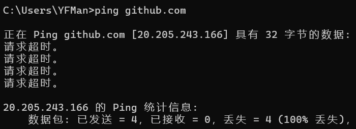
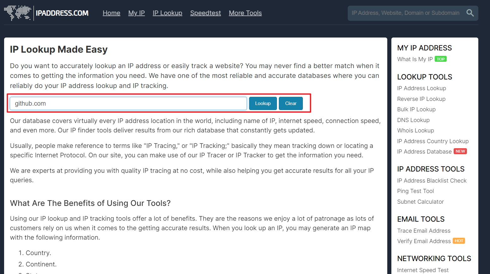
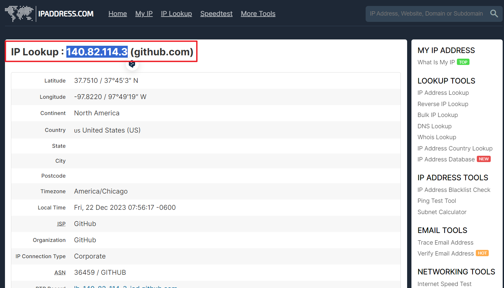
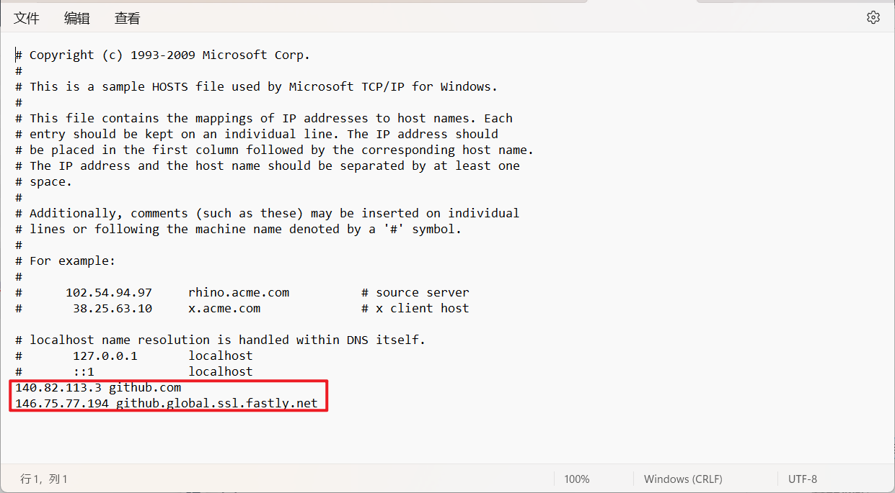
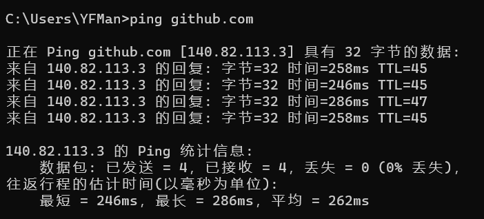

# git报错：ssh: connect to host github.com port 22: Connection timed out fatal: Could not read from remote……


## 报错

```java
> git pull --tags origin main
ssh: connect to host github.com port 22: Connection timed out
fatal: Could not read from remote repository.

Please make sure you have the correct access rights
and the repository exists.
```

## 分析


登录了一下github网站，发现可以访问： 

但是，ping了一下github，发现请求超时。




git、命令行都无法正确解析域名，但浏览器可以，有些奇怪。

但可以判断，确实是网络域名解析出现了问题，下面将采用手动修改hosts文件的方式解决。

## 解决

1. 打开网站： [https://www.ipaddress.com/ip-lookup](https://www.ipaddress.com/ip-lookup)，并在红框中输入域名，查询域名对应的IP地址；  

2. 点击lookup； 
    <li>得到对应区域的github主机名； </li> 

3. 查询如下两个主机名：

   ```java
   140.82.113.3 github.com
   146.75.77.194 github.global.ssl.fastly.net
   ```

4. 补充到C:\Windows\System32\drivers\etc\hosts文件的末尾，该文件不可编辑，可以复制到桌面，然后再复制回去实现替换。  
5. 测试结果：    <


***

 **声明：**本文转载自 [ssh: connect to host github.com port 22: Connection timed out fatal: Could not read from remote……-CSDN博客](https://blog.csdn.net/myf_666/article/details/135161840) ，版权归原作者所有。如有侵权，请联系删除。 


