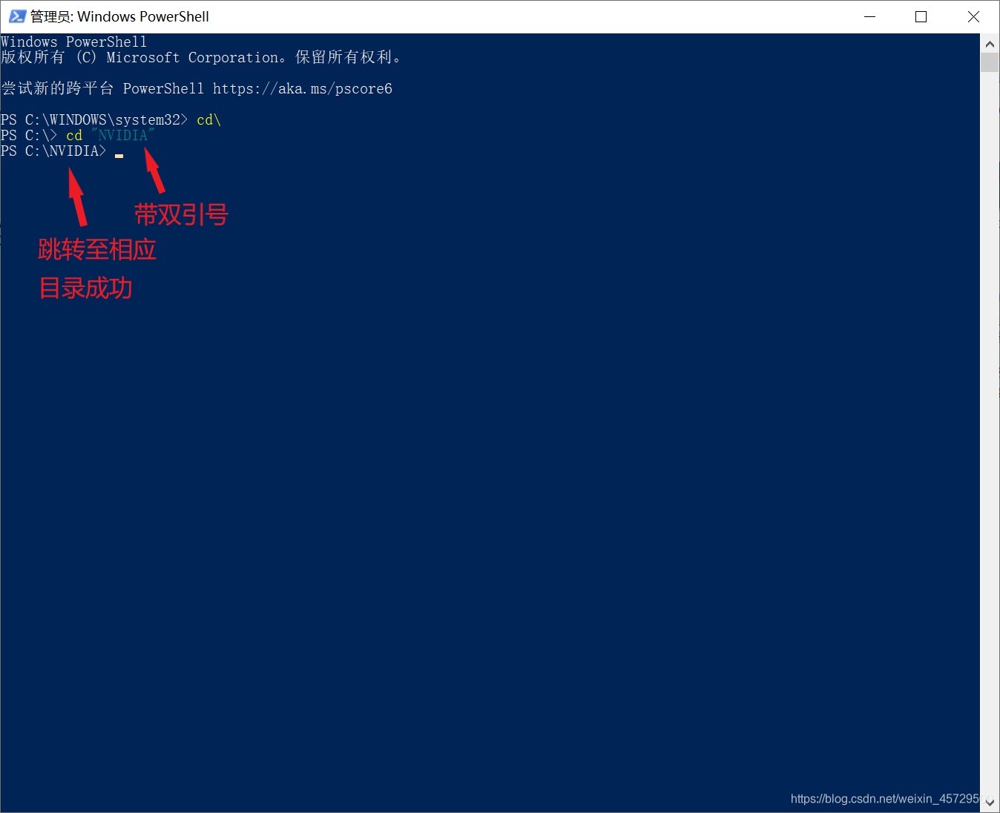

# jdk没有jre的解决方法

[TOC]

## 安装的jdk没有jre(JDK11以上版本)

- **我猜你安装后的jdk目录大概是这样的**

 **可以看到，现在的jdk目录下是没有jre的**

### 解决方法

#### 方法一：

##### 步骤1：

- **首先，也是最重要的一步：以管理员身份运行cmd** **操作方法：** 在Windows系统的**开始菜单**上，单击鼠标右键，这时候出现的菜单中，我们选择**命令提示符（管理员）**（或者是**Windows PowerShell（管理员）**）点击打开即可。    **之后是这样的界面** 

##### 步骤2：

- **通过dos命令安装jre** **步骤：**

1. **首先**，跳转到**jdk安装目录** 例如我的jdk安装目录为C:\Program Files\Java\jdk-15.0.1 

- 可以**借助cd命令跳转到该目录** 
- **首先**，输入 cd\，**回车**，跳转到**C盘根目录**  
- **之后**，输入cd "Program Files\Java\jdk-15.0.1",**回车**，**跳转到jdk目录**

><strong>格式</strong>为<code>cd "jdk安装目录"</code>，其中，<strong>jdk安装目录</strong>为<strong>你自己安装jdk时的目录</strong>

 2. **最后**，输入bin\jlink.exe --module-path jmods --add-modules java.desktop --output jre,**回车**  3. **安装成功** 

#### 注意:

1. 执行cd命令跳转到指定目录时，若 <strong>cd后所跟的目录名含有特殊字符，需加引号</strong> 例如 **C盘下的 Progam Files 目录：** C:\Program Files **含有特殊字符 : 与 \ 以及Progrom与Files之间含有特殊字符"空格"** <strong>在执行cd命令时：</strong> cd "C:\Progam Files" **需在目录两边加双引号**

><strong>格式</strong>为：<code>"含有特殊字符的目录"</code>**

1. **如果该目录不含有特殊字符，则双引号可加可不加**

>如下图所示：  目录Progam Files含有特殊字符，必须加双引号  而目录NVIDIA不含有特殊字符，双引号可加可不加

 

#### 方法二：

**注：** 方法二只是以管理员身份运行cmd方法不同，其他操作步骤与方法一基本相同

##### 步骤1：

1. **首先，和方法一一样，也是最重要的一步：以管理员身份运行cmd** **操作方法：**

- 搜索框输入**cmd** 

1. **方法一：**

- 同时按住**Ctrl+Shift+Enter，以管理员身份运行cmd**  **方法二：** 
- 直接**点击以管理员身份运行**，如下图：  

1. **打开后的界面时这样的：** 

##### 步骤2：

与方法一步骤二操作基本相同，所以以下我只简述一下步骤：

><strong>格式</strong>为<code>cd "jdk安装目录"</code>，其中，<strong>jdk安装目录</strong>为<strong>你自己安装jdk时的目录</strong>

><mark><strong>大家可以与方法一对比着操作</strong></mark>

#### 值得注意的是：

##### 1.**方法二的步骤2中：** **跳转到jdk安装目录**操作可以**借助命令cd "%JAVA_HOME%"完成：** 

##### 2.用<strong>方法二的方式以管理员身份运行cmd</strong>，在进行<code>cd</code>命令跳转到指定目录时，<strong>无论该目录名是否含有特殊字符，双引号都是可加可不加</strong>

   

><strong>对命令<code>cd "%JAVA_HOME%"</code>也是如此：</strong>

 

***
 **声明：** 本文转载自  [jdk没有jre的解决方法_新版jdk没有jre-CSDN博客](https://blog.csdn.net/weixin_45729500/article/details/110509807)  ，版权归原作者所有。如有侵权，请联系删除。 