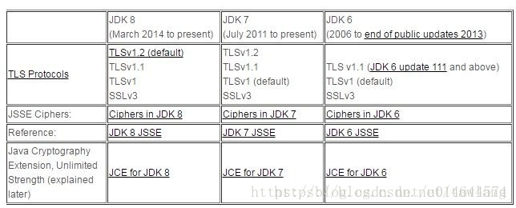
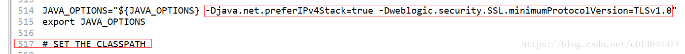

## 访问HTTPS握手失败handshake_failure解决办法

**问题描述**：折腾了很久，查阅大半个百度几乎没解决，有个WebService项目，从JDK7升级到JDK8之后，出现ssl异常信息，浏览器能成功访问wsdl，但是客户端请求时报错Received fatal alert: handshake_failure。

网上有几种解决方案整理如下： 1.部分网友解释：是因为jdk中jce的安全机制导致报的错，要去oracle官网下载对应的jce包替换jdk中的jce包。

jce所在地址： %JAVA_HOME%\jre\lib\security里的local_policy.jar,US_export_policy.jar

JDK7&nbsp; [http://www.oracle.com/technetwork/java/javase/downloads/jce-7-download-432124.html](http://www.oracle.com/technetwork/java/javase/downloads/jce-7-download-432124.html)

JDK8&nbsp; [http://www.oracle.com/technetwork/java/javase/downloads/jce8-download-2133166.html](http://www.oracle.com/technetwork/java/javase/downloads/jce8-download-2133166.html)

2.在请求连接之前加上

```java
System.setProperty("https.protocols", "TLSv1.2,TLSv1.1,SSLv3");
```

3.修改cipherSuites

**解决办法**： 但是以上并没有解决我的问题，后来我是这样做的，可供参考

先了解一下SSL的四次握手其过程如下：

1. 客户端请求建立SSL连接，发送支持的加密方式以及一个随机数client random给服务器； 
2. 服务器选择其中的一种加密方式，并且再加上另外一个随机数server random，和数字证书（其中有公钥），发送给客户端； 
3. 客户端确认这个数字证书是有效的，并且再生成一个新的随机数，将这个随机数用服务器发送给它的数字证书中的公钥进行加密发送给服务器； 
4. 服务器收到客户端的回复，利用自己的私钥进行解密，获得这个随机数，然后通过将前面这三个随机数以及他们协商的加密方式，计算生成一个对称密钥。

至此握手阶段完成，之后的会话他们就通过这个对称密钥进行加密传输。

https握手详细参考： [https://blog.csdn.net/hherima/article/details/52469674](https://blog.csdn.net/hherima/article/details/52469674)

 首先在启动java程序时，新增了调试参数&nbsp; -Djavax.net.debug=all&nbsp; 可以开启加密协议的调试模式。&nbsp; 对比握手成功和握手失败的协议报文，发现握手失败报文 main, WRITE: TLSv1 Handshake, length = 163 main, READ: TLSv1.2 Alert, length = 2 main, RECV TLSv1 ALERT: &nbsp;fatal, handshake_failure 发现了问题，客户端发起了一个TLSv1 握手，此时服务器端却发出了一个TLSv1.2Alert警告，拒绝握手连接。


JDK 版本对TLS的支持情况

JDK8默认使用TLSv1.2 ，JDK7默认使用TLSv1.1

问题定位 ：

猜想可能是由于客户端与服务器所使用的SSL/TLS版本不一致。服务器使用的TLS版本高，而客户端支持的TLS版本低。

提高客户端的TLS版本：将客户端升级JDK到1.8，问题解决。

但是项目已上线不可能要求客户机全部使用JDK8，只有使服务端的支持TLSv1.1

参考： [https://www.cnblogs.com/lsdb/p/7754539.html](https://www.cnblogs.com/lsdb/p/7754539.html)

本项目使用weblogic修改如下：

编缉$DOMAIN_HOME/bin目录下的setDomainEnv.sh，找到"JAVA_OPTIONS="处，对于10.3.6.x及之后的版本在其后追加：

```java
-Djava.net.preferIPv4Stack=true -Dweblogic.security.SSL.minimumProtocolVersion=TLSv1.0
```

对于10.3.6.x之前的版本则追加（这两个是有些区别的，上边是限定SSL的最低使用版本，下边是指定SSL的使用版本）：

```java
-Dweblogic.security.SSL.protocolVersion=TLS1
```




保存退出，重启weblogic即可

顺便附上Axis调用HTTPS webservice接口方法

下载https的证书CER文件，然后根据这个.CER文件生成.trustStore 文件 切换到jdk的bin目录 cd D:\Works\Java\jdk8.0_181\bin 生成.trustStore 文件，密码设置为mima123456 keytool -import -file d:/126.cer -storepass mima123456 -keystore d:/126.trustStore 安装界面提升选择 是或者y

在需要用到的地方加上 System.setProperty("javax.net.ssl.trustStore","d:/126.trustStore"); System.setProperty("javax.net.ssl.trustStorePassword", "mima123456");

```java
public String getUserCount(String day, String record) {
		try {
//			System.setProperty("javax.net.debug","ssl");
			System.setProperty("javax.net.ssl.trustStore", "d:/126.trustStore");
			System.setProperty("javax.net.ssl.trustStorePassword", "密码");
			String endpoint = "https://*.*.*.*:8008/webservice/GetItvUserFormOAS?wsdl";
			Service service = new Service();
			Call call = (Call) service.createCall();
			call.setTargetEndpointAddress(new java.net.URL(endpoint));
			// 方法名
			String operationName = "getUserCount";
			// 名称空间
			String targetNamespace = "http://webservice";
			call.setOperationName(new QName(targetNamespace, operationName));
			// 方法的参数名,参数类型，输入
			call.addParameter(new QName(targetNamespace, "in0"), org.apache.axis.Constants.XSD_STRING, javax.xml.rpc.ParameterMode.IN);
			call.addParameter(new QName(targetNamespace, "in1"), org.apache.axis.Constants.XSD_STRING, javax.xml.rpc.ParameterMode.IN);
			// 方法的返回值类型
			call.setReturnType(org.apache.axis.Constants.XSD_STRING);
			String result = (String) call.invoke(new Object[] { day, record });
			System.out.println(result);
		} catch (Exception e) {
			e.printStackTrace();
		}
		return null;
	}
```


***

 **声明：**本文转载自  [解决 HTTPS握手失败报错："Received fatal alert: handshake_failure"_received fatal alert:handshake-CSDN博客](https://blog.csdn.net/u014644574/article/details/83381303) ，版权归原作者所有。如有侵权，请联系删除。 

