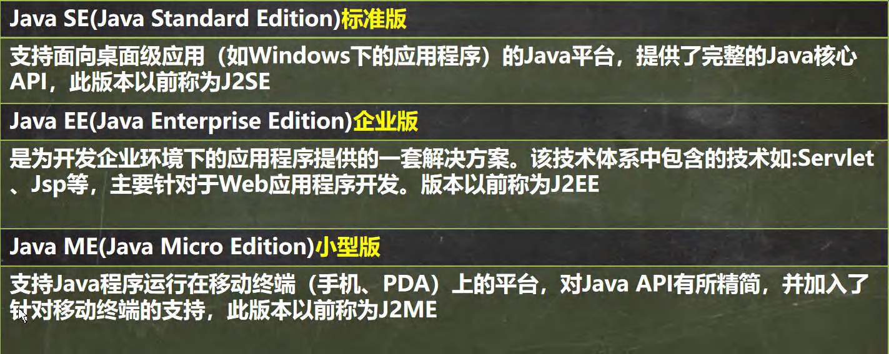
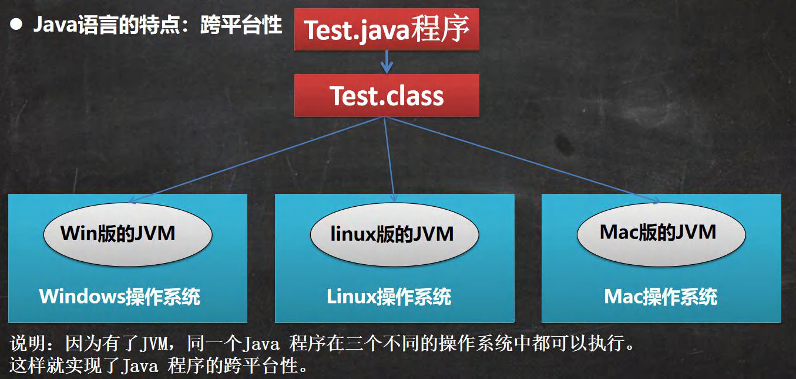
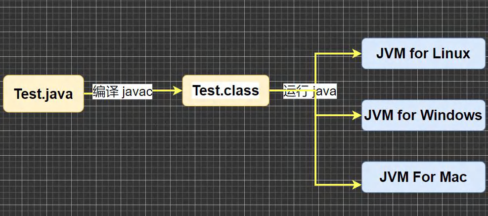
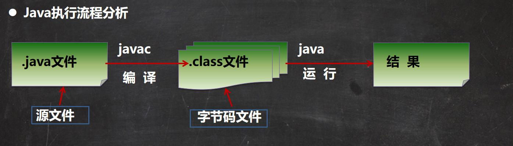
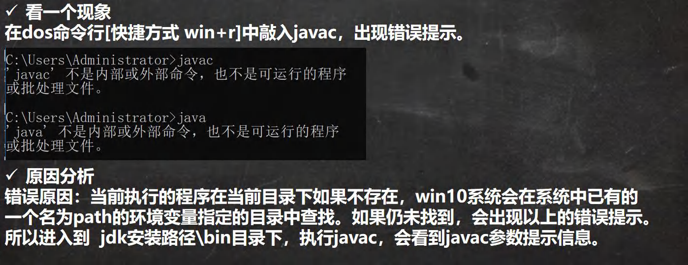
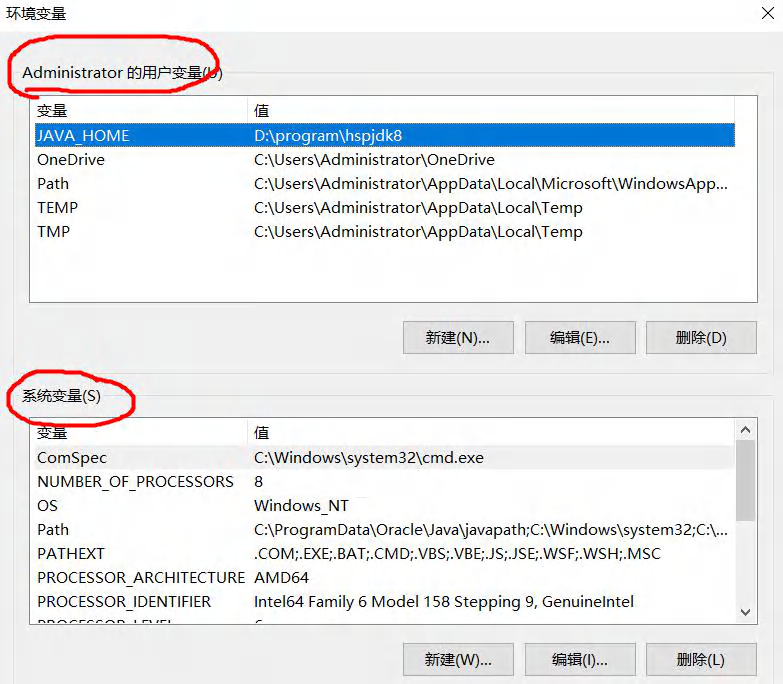

# java概述

[TOC]

## 1. 程序和操作系统

程序员就是和程序打交道的人员，TA通过编写不同指令集（也就是程序）来实现某一个操作或者目的。例如程序员使用java语言编写一个自动下载视频的软件，这里——编写软件的java源代码就是程序员编写的程序，编写的程序经过编译运行和打包形成软件，软件的功能是自动下载视频。

**简言之：程序是一系列有序指令的集合，指挥计算机执行某些操作以实现某些功能或者解决某些问题。**

正如不同国家会使用不同语言，编程语言类型也有不同类型。例如我们需要表达“今晚去吃肯德基”含义的指令，中文和英文的描述听起来就完全不一样，英国人可以说：”Tonight we go to eat kendeji“。程序语言也是如此，目前流行的编程语言很多，例如解释性语言python、java，编译性语言c\c++。语言之间确实有很多区别，编程思想也大同小异。后面主要讲解的是java语言。

**可以说：编程语言类型很多，例如解释性语言python、java，编译性语言c\c++，用法和编程思想大同小异。**

操作系统是什么？他在计算机中是一个”承上启下“的中介，或者说是软件和硬件的一个桥梁，不过都没有完全概括操作系统的作用。操作系统将底层硬件的一些操作统一”包装“起来（**统一化和标准化**），然后将这些”包装“好的操作指令提供给上层软件使用。换句话说，上层软件想操作计算机的底层硬件，必须经过操作系统，那么如果有些非法和危险指令操作系统就能把关（**安全性**）。所以操作系统既像一个知识渊博的教授为晦涩的底层指令实现一层易懂的抽象，又像一个手握大权的首领把关上层软件的操作和整个计算机运行的协调。

由于上层软件看不到底层硬件，只能感受到操作系统整个机器，因此又将操作系统称之为**虚拟机（virtual machine）**。

这里虚拟机并不只是单指操作系统，而是上层对于下层硬件的一层抽象的称呼。这一点的描述很奇怪，可以理解为上面运行的内容不认识不同底层，只能通过一层抽象层来完成自己的操作，这一层抽象便被成为"虚拟"。

为什么解释这么多关于”虚拟“的认识？因为有的编程语言运行时，会涉及到虚拟机的概念，这里的虚拟机和操作系统的“虚拟”不一样。但是我认为这里提到的“虚拟”都是对于下一层抽象的描述。

**总结：操作系统时在光秃秃的底层硬件之上的一层抽象，起到承上启下的桥梁作用。毕竟不同计算机硬件不一样，我们编程人员需要一个统一的标准来编写代码。**

## 2. java概述

### 2.1 java技术体系平台

### 2.2 java特点

1. Java 语言是**面向对象的(oop)**；
2. Java 语言是健壮的。Java 的**强类型机制、异常处理、垃圾的自动收集**等是 Java 程序健壮性的重要保证；
3. Java 语言是**跨平台性**的。
   - 即: 一个编译好的.class 文件可以在多个系统下运行，这种特性称为跨平台
   - Java 语言是**解释性语言**：（还包括javascript,PHP,python）；编译性语言:有c / c++ 。区别是：解释性语言，编译后的代码，不能直接被机器执行,需要解释器来执行； 编译性语言, 编译后的代码, 可 以直接被机器执行,。

### 2.3 Java 运行机制及运行过程

#### 2.3.1 Java 语言的特点：跨平台性

#### 2.3.2 Java 核心机制-Java 虚拟机 [JVM java virtual machine]

1. **JVM 是一个虚拟的计算机，具有指令集并使用不同的存储区域。负责执行指令，管理数据、内存、寄存器，包含在 JDK 中**；
2. 对于不同的平台，有不同的虚拟机。
3. Java 虚拟机机制屏蔽了底层运行平台的差别，实现了“一次编译，到处运行” 。

#### 2.3.3 什么是 JDK，JRE

1. **JDK 的全称(Java Development Kit Java 开发工具包)**， JDK = JRE + java 的开发工具 [java, javac,javadoc,javap 等] 
2. JDK 是提供给 Java 开发人员使用的，其中包含了 java 的开发工具，也包括了 JRE。所以安装了 JDK，就不用在单独 安装 JRE 了。
3. **JRE(Java Runtime Environment Java 运行环境)**  JRE = JVM + Java 的核心类库（类）
4. 包括 Java 虚拟机(JVM Java Virtual Machine)和 Java 程序所需的核心类库等，如果想要运行一个开发好的 Java 程序， 计算机中只需要安装 JRE 即可。

#### 2.3.4 JDK、JRE 和 JVM 的包含关系

1.  JDK = JRE + **开发工具集**（例如 Javac,java 编译工具等) 
2. JRE = JVM + Java SE **标准类库**（java 核心类库）
3. 如果只想运行开发好的 .class 文件 只需要 JRE

## 3 环境变量path

所以出现以上情况，**需要将这里可执行程序所在目录添加到环境变量path中**。环境变量是操作系统中一组动态命名值，用来存储与系统或应用程序相关的信息。这些变量在运行时提供了应用程序和进程需要的配置信息，例如文件路径、操作系统设置、命令参数等。 

在Windows中，环境变量以键值对的形式存在，主要有两种作用范围：

1. **系统环境变量**：对系统中所有用户和程序可用。
2. **用户环境变量**：仅对当前用户有效。

**1. 全局路径配置**

- 许多程序需要访问某些工具或库，但这些工具和库可能位于特定目录中。
- 配置环境变量（如`PATH`），可以使这些工具和库全局可用，无需在每次使用时指定完整路径。
- 例如：
  - 配置Java的`bin`路径后，你可以直接使用`java`和`javac`命令，而不需要输入完整路径（如`C:\Program Files\Java\bin\java.exe`）。

**2. 动态配置程序行为**

- 某些程序会根据环境变量调整行为，例如读取配置文件路径、设置工作目录等。
- 例如：
  - `JAVA_HOME`：指定Java安装目录，许多开发工具（如Maven、Gradle）通过这个变量找到Java。
  - `TEMP` 和 `TMP`：定义临时文件存储的路径，操作系统和某些程序会将临时文件放在这些目录中。

