# java变量和运算符

[TOC]

## 1. java转义字符

在java的字符串语句中，有一些特殊字符无法直接输出原有形态，因此通常会在该字符前面加上`\`来实现特殊的字符打印。当`\`和一些特殊字母例如`t`和`n`组合通常表示一些特殊含义。

如下举例：

```java
在控制台，输入tab键，可以实现命令补全
\t  ：一个制表位，实现对齐的功能
\n：换行符
\\  ：一个\
\"  :一个"
\'  ：一个'
\r  :一个回车
```


## 2. 注释

用于注解说明解释程序的文字就是注释，注释提高了代码的阅读性（可读性）；注释是一个程序员必须要具有的良好编程习惯。将自己的思想通过注释先整理出来，再用代码去体现。

```
1. 单行注释 //
2. 多行注释 /* */
3. 文档注释 /**
```

**其中文档注释比较特别：**

1. 文档注释的内日那个可以被JDK提供的javadoc工具所解析，生成一套以网页文件形式体现的一个说明文档
2. 应用实例：`javadoc -d 文件夹名 -author -version Demo3.java`,其中文件夹名是生成的网页说明文档存放的位置；
3. 使用方法可以参考： [Java 文档注释 | 菜鸟教程](https://www.runoob.com/java/java-documentation.html) 


## 3. DOS和命令行解释器

### 3.1 命令行解释器

**DOS** 是一种古老的操作系统，提供命令行界面用于与系统交互，但功能简单且只支持单任务操作。

**Shell** 是一个命令行解释器，提供与操作系统交互的接口。它接受用户的命令并通过操作系统执行相关的任务。Shell 是一个重要的中介，它允许用户控制操作系统。

**Shell的工作原理：**

- 用户在命令行输入命令。
- Shell 解析用户输入的命令，并调用操作系统的服务（如系统调用、程序执行等）来执行任务。
- Shell 可以执行简单的命令，也可以执行复杂的脚本。

**Shell的种类：**

- **Bash**（Bourne Again Shell）：最常用的 Linux 和 macOS 系统的 Shell，也是 GNU 项目的一部分。

- **PowerShell**：微软开发的 shell，既适用于 Windows 也适用于 Linux 和 macOS。它不仅是一个命令行工具，还具有强大的脚本功能和与 Windows 系统的深度集成。

  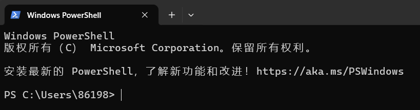

**Windows 的 CMD（Command Prompt，命令提示符）命令窗口** 

CMD 窗口是 Windows 系统中 **cmd.exe** 程序的运行界面。`cmd.exe` 是 Windows 操作系统的 **命令行解释器**，其功能与 DOS 的命令行界面类似。它解析并执行用户输入的命令，提供了一种以文本方式与系统交互的途径。 

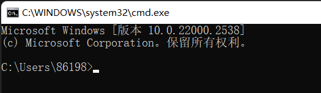


### 3.2 常见命令

```bash
windows下
1. dir 目录路径    // 查看当前目录是有什么内容 dir
// 切换到其他盘下：盘符号 cd : change directory
2. cd  d:\abc2\test200    // 切换到当前盘的其他目录下 (使用相对路径和绝对路径演示), ..\表示上一级目录
3. cd ..     // 切换到上一级
4. tree      // 查看指定的目录下所有的子级目录
5. cls       // 清屏
6. exit      // 退出 DOS

linux下
md     // [创建目录]
rd     // [删除目录]
copy   // [拷贝文件]
del    // [删除文件]
echo   // [输入内容到文件]
type,move   // [剪切]
```


## 4. 变量

### 4.1 变量快速入门

**变量相当于内存中一个数据存储空间**的表示，你可以把变量看做是一个房间的门牌号，通过**门牌号**我们可以找到房间，而通过变量名可以访问到变量(值)。

```java
// 1. 声明变量
int a;
// 2. 赋值
a = 60; //应该这么说:把60赋给a使用System.out.println(a);
// 3.可以一步到位[int a = 60;通常我们是一步完成]
int a = 60;
```

注意事项：

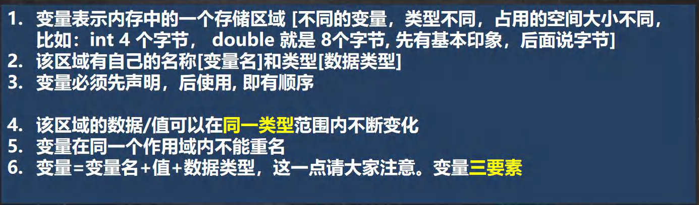


### 4.2 程序中+号的使用

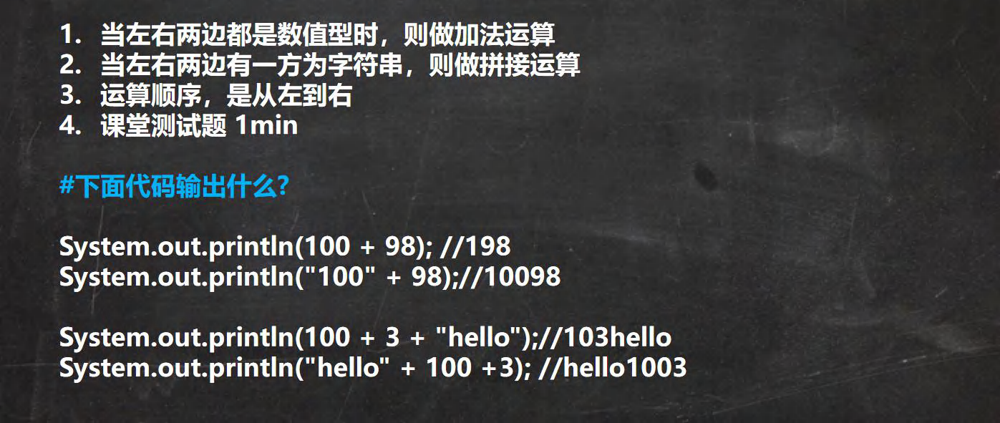


### 4.3 数据类型

**每一种数据都定义了明确的数据类型，在内存中分配了不同大小的内存空间(字节)。**


#### 4.3.1 整数类型

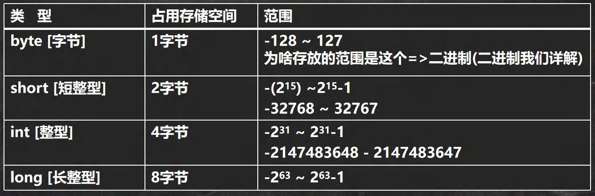

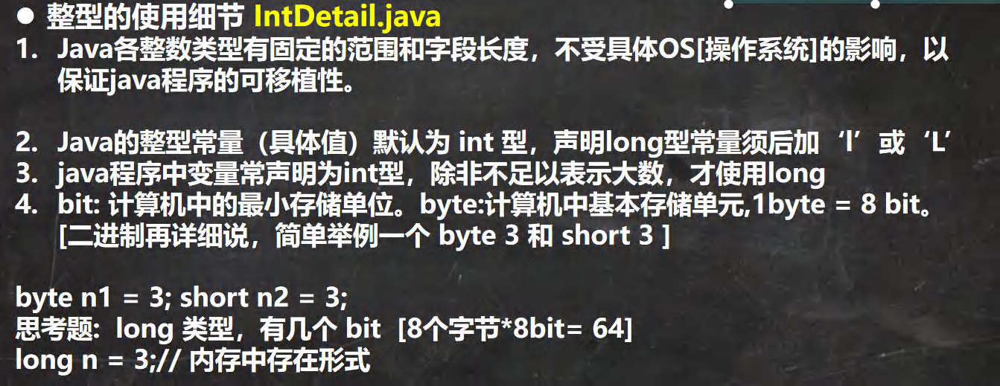

通常一般都是用int。


#### 4.3.2 浮点类型

Java的浮点类型可以表示一个小数，比如123.4，7.8，0.12等等

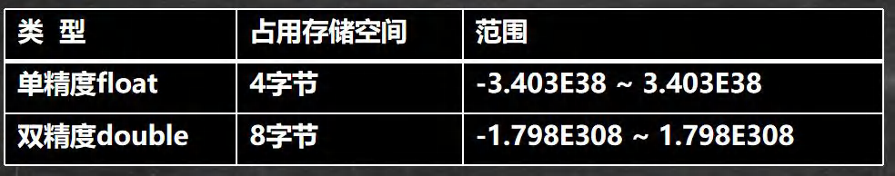

1. 关于浮点数在机器中存放形式的简单说明,浮点数=符号位+指数位+尾数位
2. 尾数部分可能丢失，造成精度损失(小数都是近似值)。

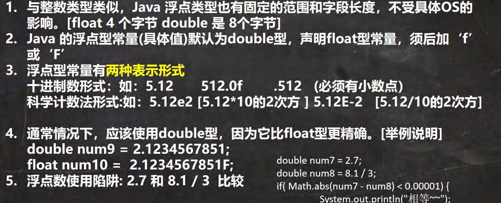

```java
//浮点数使用陷阱: 2.7和 8.1 / 3比较
//看看一段代码
double num11 = 2.7;
double num12 = 2.7; //8.1 / 3;//2.7
System.out.println(num11);//2.7
System.out.println(num12);//接近 2.7的一个小数，而不是 2.7
//得到一个重要的使用点:当我们对运算结果是小数的进行相等判断是，要小心
//应该是以两个数的差值的绝对值，在某个精度范围类判断
if( num11 == num12) {System.out.println("num11 == num12相等");}
//正确的写法 , ctrl + /注释快捷键,再次输入就取消注释
if(Math.abs(num11 - num12) < 0.000001 ) {System.out.println("差值非常小，到我的规定精度，认为相等...");
```


#### 4.3.3 字符类型(char)

字符类型可以表示单个字符,字符类型是char，char是两个字节(可以存放汉字)，多个字符我们用字符串String(我们后面详细讲解String)

```java
//代码
char c1 = 'a';
char c2 = '\t';
char c3 = '韩';
char c4 = 97;
```

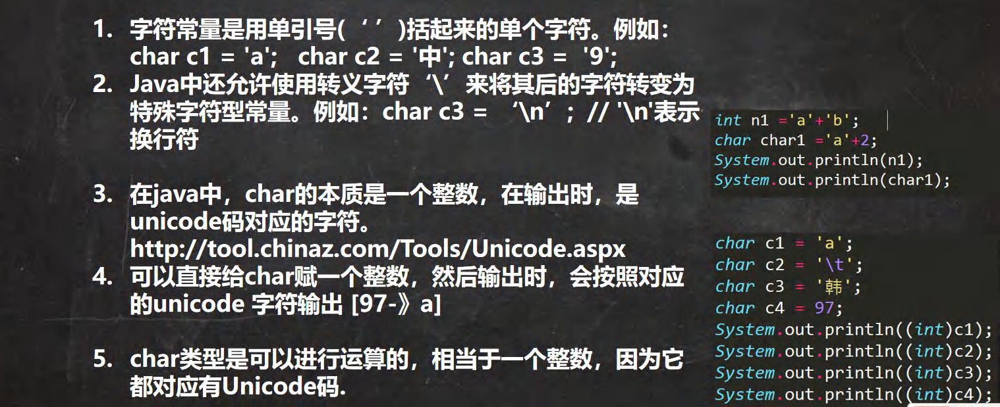

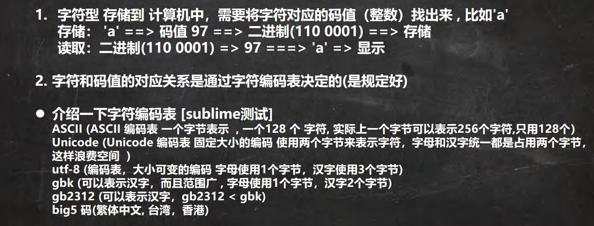


#### 4.3.4 布尔类型：boolean

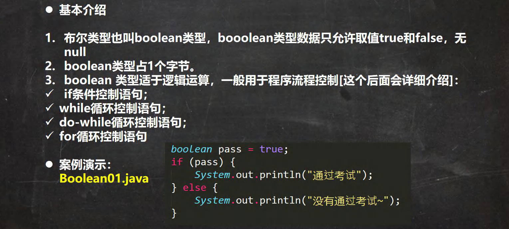


## 5. 基本数据类型转换

### 5.1 自动类型转换

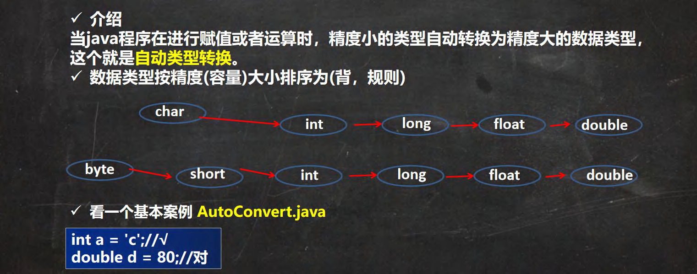

自动类型转换的注意细节

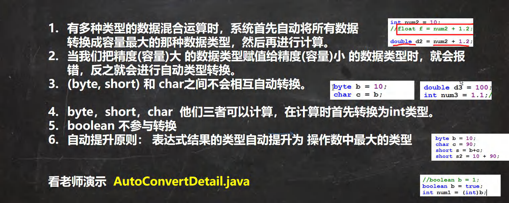


### 5.2 强制类型转换

> 自动类型转换的逆过程，**将容量大的数据类型转换为容量小的数据类型**。使用时要加上强制转换符 ( )，但可能造成**精度降低或溢出**,格外要注意。

案例：

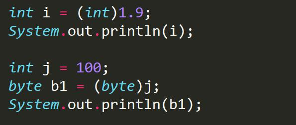

细节说明

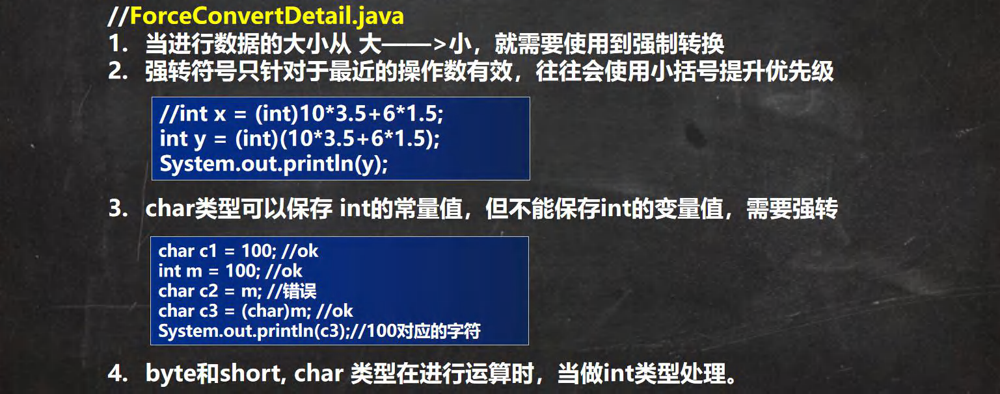

数据类型转换练习题

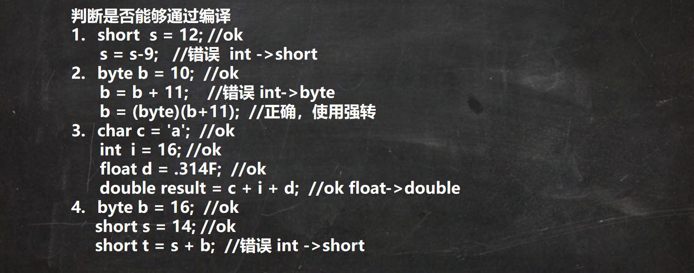


### 5.3 基本数据类型和String类型的转换

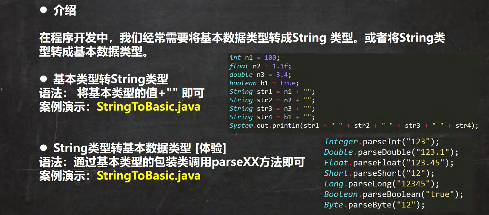


## 6. Java API文档

**API（Application Programming Interface，应用程序编程接口）**是java提供的基本程序接口。中文在线文档：https://www.matools.com

java语言提供了大量的基础类，因此oracle公司也为这些基础类提供了响应的api文档，用于告诉这些开发者如何使用这些类。

java类的组织形式如下：

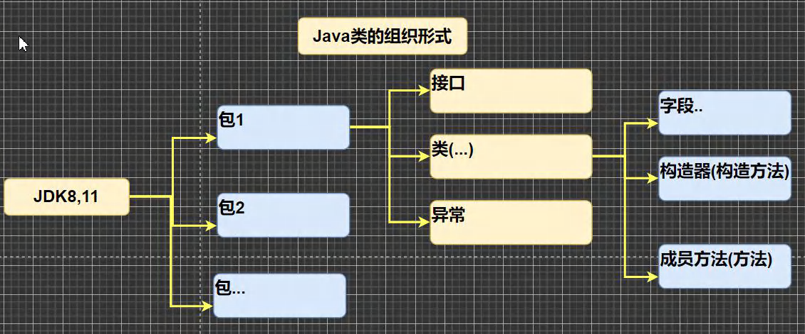


## 7. 字符编码表

1. **ASCII编码：** 一个字节表示一个字符，一共有128个字符，但是实际上一个字节可以表示256个字符，只用了128个。**ASCII码无法表示除了英文之外的文字字符。**
2. **Unicode编码表：**将世界上所有符号都纳入其中，每个符号都有一个独一无二的编码，使用Unicode没有乱码的问题。**但是一个英文字母和一个汉字都占用2个字节，浪费存储空间。同时Unicode兼容Ascii码。**
3. **UTF-8编码表：**互联网桑使用最广的一直Unicode的实现方式（改进）。使用一种变长的编码方式，可以用1-6个字节表示一个符号，根据不同符号而变化字节长度。**字母占一个字节，汉字占3个字节。**


