# java运算符和程序控制结构

[TOC]


## 1. 运算符

> 运算符是一种特殊的符号，用以表示数据的运算、赋值和比较等。

1. 算术运算符

2. 赋值运算符

3. 关系运算符 [比较运算符]

4. 逻辑运算符

5. 位运算符 [需要二进制基础]

6. 三元运算符


### 1.1 算术运算符

> 算术运算符是对数值类型的变量进行运算

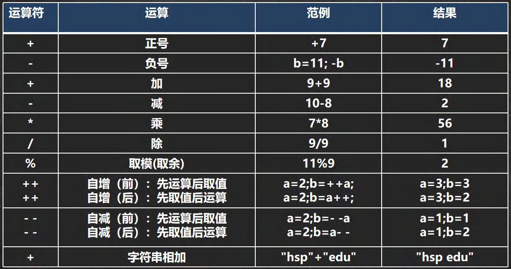

注意事项：

这里的自增和自减需要注意。

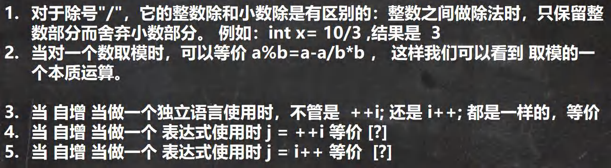

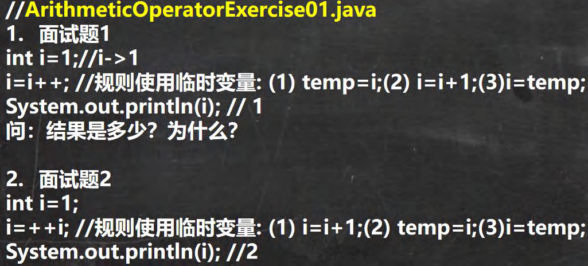


### 1.2 关系运算符

> 关系运算符的结果都是boolean型，也就是要么是true，要么是false；关系表达式经常用在 if结构的条件中或循环结构的条件中

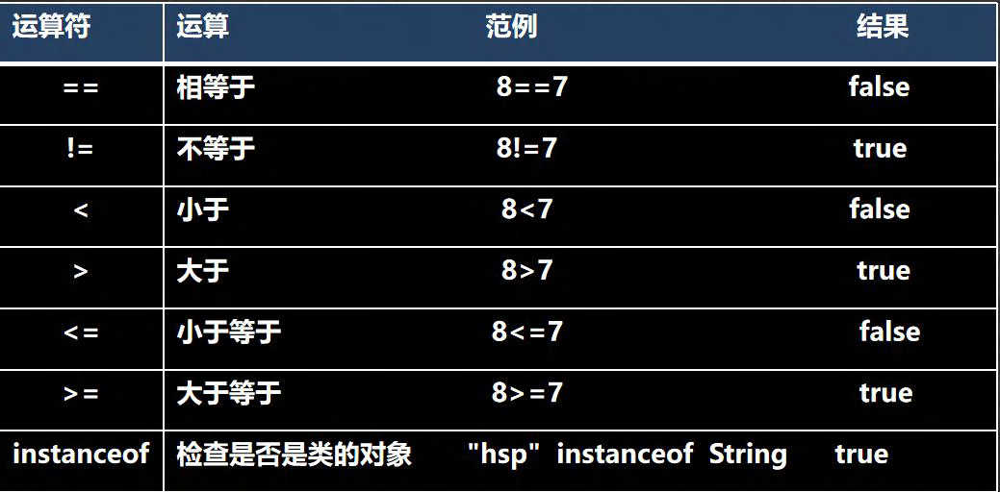

```
1)关系运算符的结果都是 boolean型，也就是要么是 true，要么是 false。
2)关系运算符组成的表达式，我们称为关系表达式。 a > b
3)比较运算符"=="不能误写成"="
```


### 1.3 逻辑运算符

> 用于连接多个条件（多个关系表达式），最终的结果也是一个boolean值。

1. **a&b : &叫逻辑与**：规则：当a和b同时为true ,则结果为true,否则为false
2.  **a&&b : &&叫短路与**：规则：当a和b同时为true ,则结果为true,否则为false
3.  **a|b : |叫逻辑或**，规则：当a和b，有一个为true ,则结果为true,否则为false
4. **a||b : ||叫短路或**，规则：当a和b，有一个为true ,则结果为true,否则为false
5. !**a :叫取反，或者非运算**。当a为true,则结果为false,当 a为false是，结果为true
6.  **a^b:叫逻辑异或**，当 a和b不同时，则结果为true,否则为false

注意：短路和逻辑的区别

1. **&&短路与**：**如果第一个条件为false，则第二个条件不会判断，最终结果为false，效率高**

2. **&逻辑与**：不管第一个条件是否为false，**第二个条件都要判断，效率低**


### 1.4 赋值运算符

>  赋值运算符就是将某个运算后的值，赋给指定的变量。赋值运算顺序是从右到左。

1. **基本赋值运算符`=`** 

   例如 int a = 10;

2. **复合赋值运算符**

   **+=，-=，*=， /=，%=**等 ,重点讲解一个+=，其它的使用是一个道理**a += b;  [等价 a = a + b; ]**


### 1.5 三元运算符

**条件表达式 ?表达式1:表达式2;**

运算规则：

1. 如果条件表达式为**true**，运算后的结果是**表达式1**；

2. 如果条件表达式为**false**，运算后的结果是**表达式2**；

三元运算符可以和if-else转换

```java
int res = a > b ? a++ : --b;
if ( a > b) 
    res = a++;
else 
    res = --b;
```


### 1.6 运算符优先级

运算符有不同的优先级，所谓优先级就是表达式运算中的运算顺序。如右表，上一行运算符总优先于下一行。

只有单目运算符、赋值运算符是从右向左运算的。

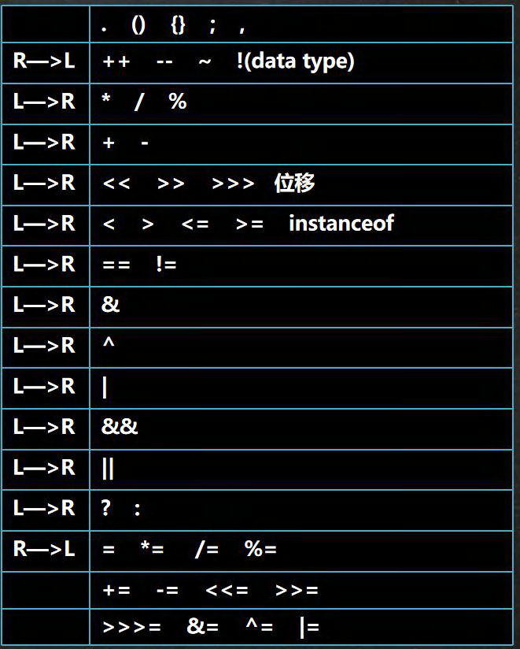


## 2. 标识符

### 2.1 标识符命名规则和规范

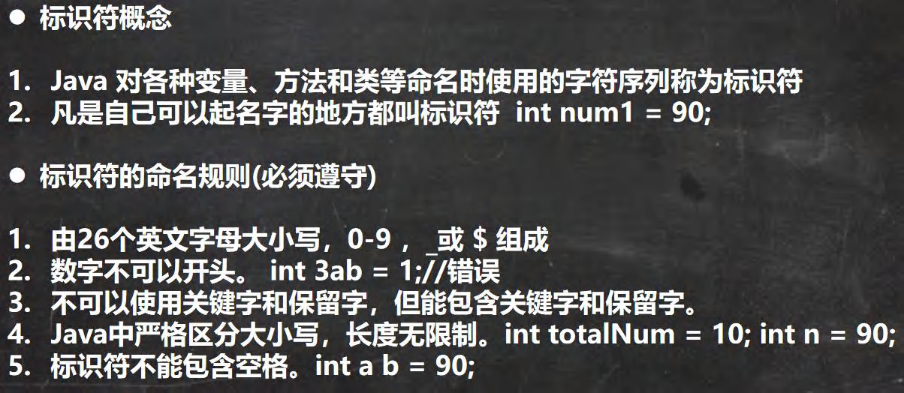

规范：

1. **包名：多单词组成时所有字母都小写**：aaa.bbb.ccc //比如 com.hsp.crm

2. **类名、接口名：多单词组成时，所有单词的首字母大写**：XxxYyyZzz [**大驼峰**]比如：TankShotGame

3. **变量名、方法名：多单词组成时，第一个单词首字母小写，第二个单词开始每个单词首字母大写**：xxxYyyZzz驼峰，简称**驼峰法**

   比如： tankShotGame

4. **常量名：所有字母都大写。多单词时每个单词用下划线连接：XXX_YYY_ZZZ**

   比如：定义一个所得税率TAX_RATE


### 2.2 关键字

> 定义：被Java语言赋予了特殊含义，用做**专门用途的字符串**（单词）特点：关键字中所有字母都为小写

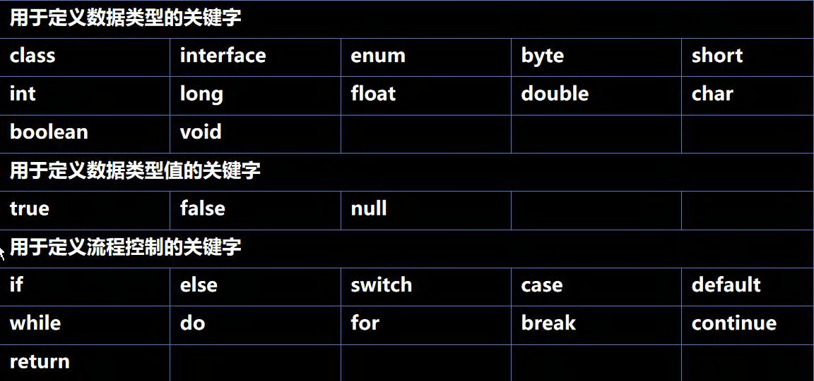

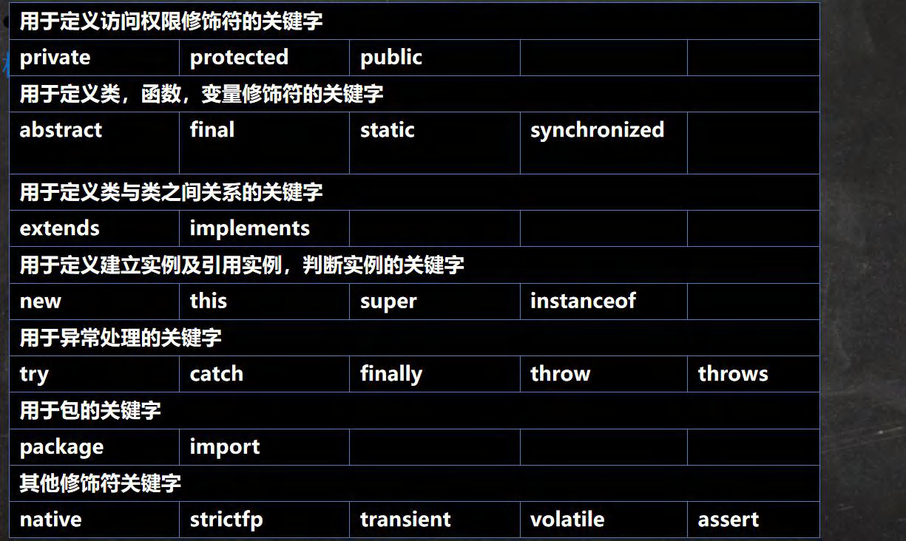


### 2.3 保留字

> Java保留字：现有Java版本**尚未使用**，但**以后版本可能会作为关键字使用**。自己命名标识符时要避免使用这些保留字byValue、cast、future、generic、 inner、operator、outer、 rest、var、goto、const


### 2.4 键盘输入语句

> 在编程中，需要接收用户输入的数据，就可以使用键盘输入语句来获取。Input.java ,需要一个扫描器(对象),就是Scanner

使用步骤：

1. 导入该类的所在包, java.util.*
2. 创建该类对象（声明变量）
3. 调用里面的功能

```java
import java.util.Scanner;//表示把 java.util下的 Scanner类导入
public class Input {
    //编写一个 main方法
    public static void main(String[] args) {
        //演示接受用户的输入
        //步骤
        //Scanner类表示简单文本扫描器，在 java.util包
        //1.引入/导入 Scanner类所在的包
        //2.创建 Scanner对象 , new创建一个对象,体会
        //  myScanner就是 Scanner类的对象
        Scanner myScanner = new Scanner(System.in);
        //3.接收用户输入了，使用相关的方法
        System.out.println("请输入名字");
        //当程序执行到 next方法时，会等待用户输入~~~
        String name = myScanner.next(); 
        //接收用户输入字符串System.out.println("请输入年龄");
        int age = myScanner.nextInt(); //接收用户输入 int
        System.out.println("请输入薪水");
        double sal = myScanner.nextDouble(); //接收用户输入 double
        System.out.println("人的信息如下:");
        System.out.println("名字=" + name+ "年龄=" + age + "薪水=" + sal);
    }
}
```


## 3. 程序控制结构

### 3.1 顺序控制

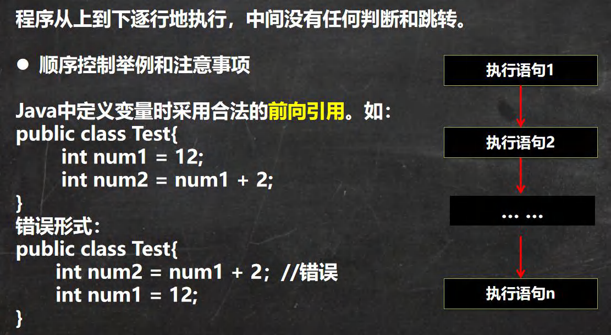


### 3.2 分支控制

1. 单分支 if

2. 双分支 if-else

3. 多分支 

   - if-else if -....-else

   - switch分支：

     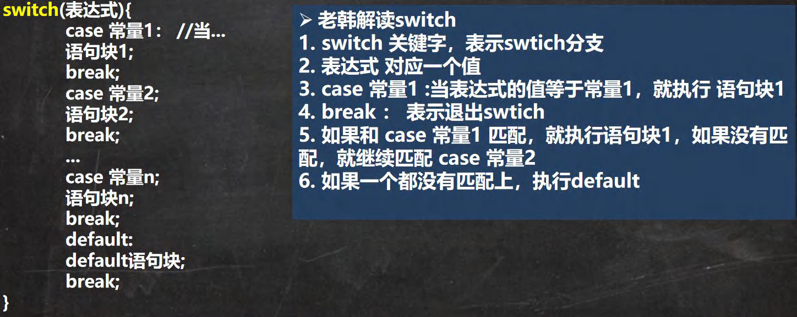

     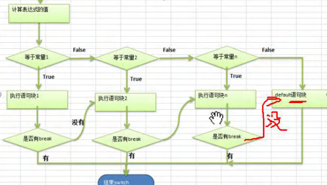

     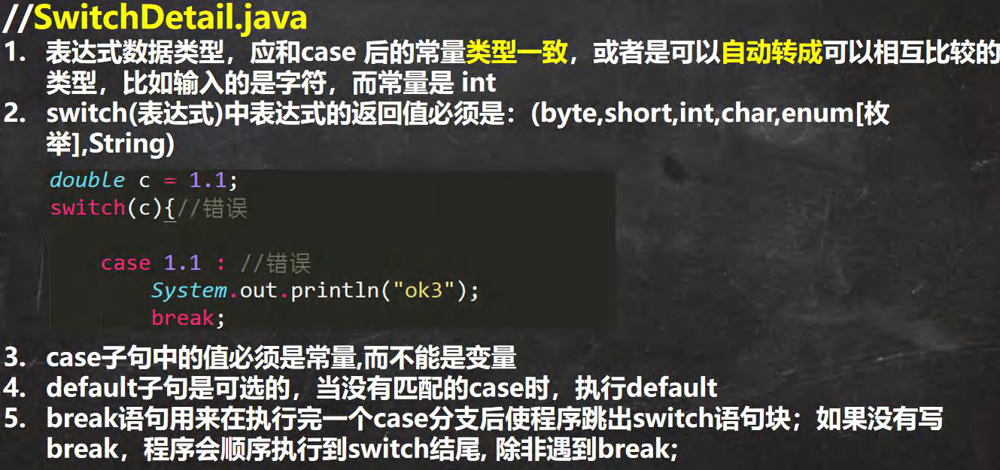


### 3.3 循环控制（重难点）

#### 3.3.1 for循环控制

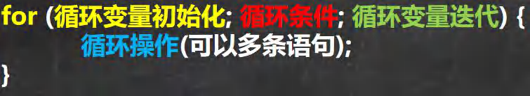

循环初始值可以有**多条初始化语句**，但要求类型一样，并且中间用逗号隔开，循环变量迭代也可以有多条变量迭代 语句，中间用逗号隔开。


#### 3.3.2 while循环

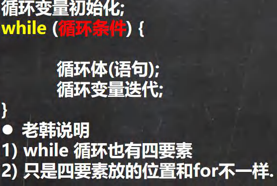

**while 循环是先判断再执行语句。**


#### 3.3.3 do..while 循环控制

```
循环变量初始化;
do{
    循环体(语句);
    循环变量迭代;
}while(循环条件);
```

1. 先执行，再判断，也就是说，一定会至少执行一次 

2. 最后 有一个 分号 ;


#### 3.3.4 多重循环控制(难点! 重点!)

建议多刷几道算法题。

> 实质上，嵌套循环就是把内层循环当成外层循环的循环体。当只有内层循环的循环条件为 false 时，才会完全跳出内 层循环，才可结束外层的当次循环，开始下一次的循环

例如

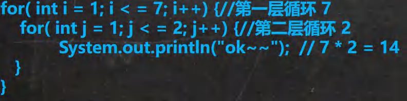

例题：

**经典的打印金字塔** 使用 for 循环完成下面的案例 请编写一个程序，可以接收一个整数,表示层数（totalLevel），打印出金字塔。(Stars.java) [化繁为简, 先死后活]

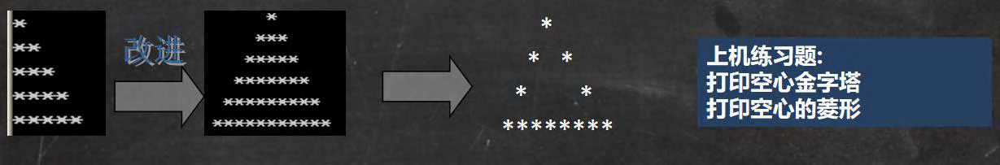

```java
public class Stars {
    //编写一个 main 方法
    public static void main(String[] args) {
        /*
         *
        * *
        * *
        ********
        思路分析
        化繁为简
        1. 先打印一个矩形
        *****
        *****韩顺平循序渐进学 Java 零基础
        第 131页
        *****
        *****
        *****
        2. 打印半个金字塔
        * //第 1 层 有 1 个*
        ** //第 2 层 有 2 个*
        *** //第 3 层 有 3 个*
        **** //第 4 层 有 4 个*
        ***** //第 5 层 有 5 个*
        3. 打印整个金字塔
        * //第 1 层 有 1 个* 2 * 1 -1 有 4=(总层数-1)个空格
        *** //第 2 层 有 3 个* 2 * 2 -1 有 3=(总层数-2)个空格
        ***** //第 3 层 有 5 个* 2 * 3 -1 有 2=(总层数-3)个空格
        ******* //第 4 层 有 7 个* 2 * 4 -1 有 1=(总层数-4)个空格
        ********* //第 5 层 有 9 个* 2 * 5 -1 有 0=(总层数-5)个空格
        4. 打印空心的金字塔 [最难的]
        * //第 1 层 有 1 个* 当前行的第一个位置是*,最后一个位置也是*
        * * //第 2 层 有 2 个* 当前行的第一个位置是*,最后一个位置也是*
        * * //第 3 层 有 2 个* 当前行的第一个位置是*,最后一个位置也是*
        * * //第 4 层 有 2 个* 当前行的第一个位置是*,最后一个位置也是*
        ********* //第 5 层 有 9 个* 全部输出*
        先死后活韩顺平循序渐进学 Java 零基础
        第 132页
        5 层数做成变量 int totalLevel = 5;
        //小伙伴 技术到位，就可以很快的把代码写出
        */
        int totalLevel = 20; //层数
        for(int i = 1; i <= totalLevel; i++) { //i 表示层数
            //在输出*之前，还有输出 对应空格 = 总层数-当前层
            for(int k = 1; k <= totalLevel - i; k++ ) {
            	System.out.print(" ");
            }
            //控制打印每层的*个数
            for(int j = 1;j <= 2 * i - 1;j++) {
            	//当前行的第一个位置是*,最后一个位置也是*, 最后一层全部 *
            	if(j == 1 || j == 2 * i - 1 || i == totalLevel) {
            		System.out.print("*");
            	} else { //其他情况输出空格
        			System.out.print(" ");
        		}
       		}
        	//每打印完一层的*后，就换行 println 本身会换行
        	System.out.println("");
        }
    }
}
```


## 4.跳转控制语句

### 4.1 跳转控制语句-break

> break **语句用于终止某个语句块的执行**，一般使用在 switch 或者循环[for , while , do-while]中

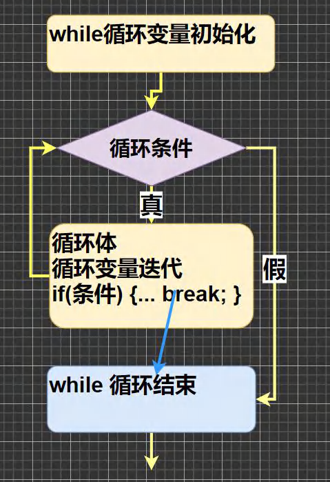

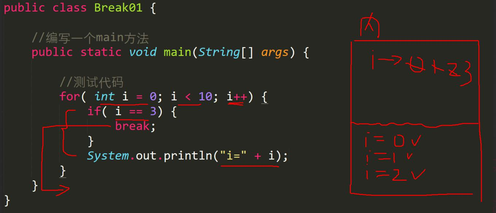


### 4.2 跳转控制语句-continue

> continue **语句用于结束本次循环**，**继续执行下一次循环**

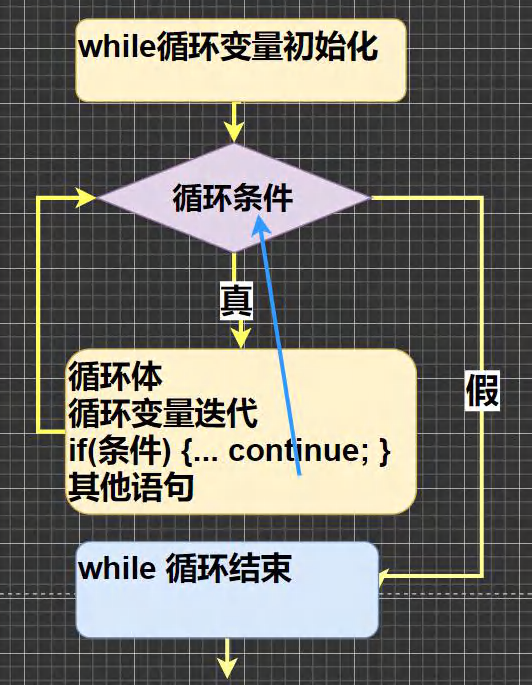

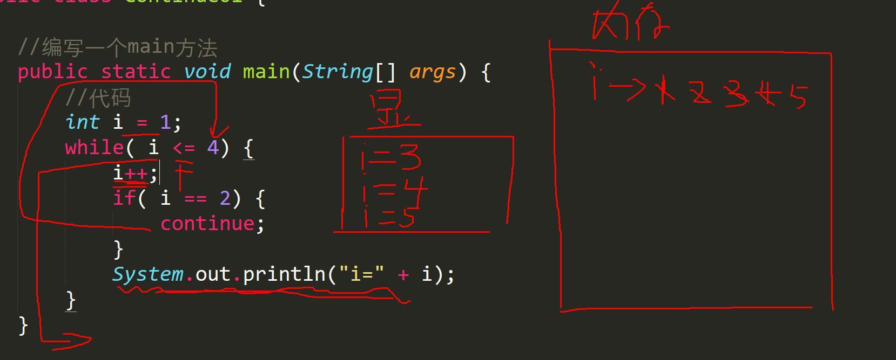


### 4.3 跳转控制语句-return

> return 使用在方法，表示跳出所在的方法(程序)

如果 return 写在 main 方法，退出程序..Return01.java。


