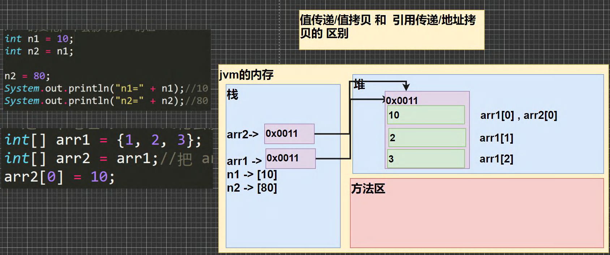
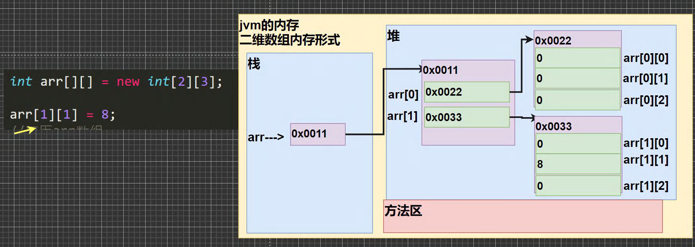
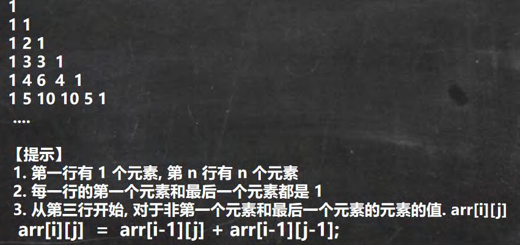

# java数组

[TOC]

## 1. 数组介绍

> 数组可以存放多个同一类型的数据。数组也是一种数据类型，是引用类型。 即：数(数据)组(一组)就是一组数据


## 2. 一维数组使用

```java
// 声明方式
int[] x;
int x[];   // x = null，指向一个空地址

// 动态初始化
int x[] = new int[5];  // 此时x指向了内存的一个地址，x = x[0]

// 静态初始化
int a[] = {1, 2, 3, 4};
```

**这里的x是一个引用类型，他存放的是一个指向固定内存空间的地址。**

**当使用new时，才算是在堆位置开辟了一个固定大小的空间。**


### 2.1 数组赋值机制（内存机制！重要）

1. **基本数据类型赋值，这个值就是具体的数据**，而且相互不影响。 int n1 = 2; int n2 = n1; 

2. **数组在默认情况下是引用传递，赋的值是地址**。 看一个案例，并分析数组赋值的内存图(重点, 难点. )。 //代码 ArrayAssign.java int[] arr1 = {1,2,3}; int[] arr2 = arr1;

   

注意细节：

1. 数组是多个相同类型数据的组合，实现对这些数据的统一管理；
2. 数组中的元素可以是任何数据类型，包括基本类型和引用类型，但是不能混用；
3. **数组创建后，如果没有赋值，有默认值** ，这里和c++有区别。int 0，short 0, byte 0, long 0, float 0.0,double 0.0，char \u0000，boolean false，String null
4. 使用数组的步骤 (1)声明数组并开辟空间 (2)给数组各个元素赋值 (3)使用数组；
5. 数组的**下标是从** 0 **开始的**；
6. 数组下标必须在指定范围内使用，否则报：下标越界异常


## 3. 二维数组

```java
// 声明方式
// 类型[][] 数组名=new 类型[大小][大小]
int[][] a;
int a[][];

// 动态初始化
int a[][] = new int[3][4];

// 静态初始化,这里可以不用每行一样多
int a[][] = {{1,1,1}, {8,8,9}, {100}};
int a[][] = {{4,6},{1,4,5,7},{-2}};

```


### 3.1 二维数组内存机制

**二维数组实际上是由多个一维数组组成的，它的各个一维数组的长度可以相同，也可以不相同**。

比如： map[][] 是 一个二维数组 int map [][] = {{1,2},{3,4,5}} 

由 map[0] 是一个含有两个元素的一维数组 ，map[1] 是一个含有三个元素的一维数组构成，我们也称为列数不等 的二维数组




### 3.2 二维数组遍历案例

1. int arr[][]={{4,6},{1,4,5,7},{-2}}; 遍历该二维数组，并得到和

   ```java
   /*
   int arr[][]={{4,6},{1,4,5,7},{-2}}; 遍历该二维数组，并得到和
   思路
   1. 遍历二维数组，并将各个值累计到 int sum
   */
   int arr[][]= {{4,6},{1,4,5,7},{-2}};
   int sum = 0;
   for(int i = 0; i < arr.length; i++) {
   //遍历每个一维数组
   for(int j = 0; j < arr[i].length; j++) {
       sum += arr[i][j];
   }
   System.out.println("sum=" + sum);
   ```

   

2. 使用二维数组打印一个 10 行杨辉三角

   

   ```java
   /*
   使用二维数组打印一个 10 行杨辉三角
   1
   1 1
   1 2 1
   1 3 3 1
   1 4 6 4 1
   1 5 10 10 5 1
   规律
   1.第一行有 1 个元素, 第 n 行有 n 个元素
   2. 每一行的第一个元素和最后一个元素都是 1
   3. 从第三行开始, 对于非第一个元素和最后一个元素的元素的值. arr[i][j]
   arr[i][j] = arr[i-1][j] + arr[i-1][j-1]; //必须找到这个规律
   */
   int[][] yangHui = new int[12][];
   for(int i = 0; i < yangHui.length; i++) {//遍历 yangHui 的每个元素
       //给每个一维数组(行) 开空间
       yangHui[i] = new int[i+1];
       //给每个一维数组(行) 赋值
       for(int j = 0; j < yangHui[i].length; j++){
           //每一行的第一个元素和最后一个元素都是 1
           if(j == 0 || j == yangHui[i].length - 1) {
           	yangHui[i][j] = 1;
           } else {//中间的元素
          		yangHui[i][j] = yangHui[i-1][j] + yangHui[i-1][j-1];
           }
       }
   }
   //输出杨辉三角
   for(int i = 0; i < yangHui.length; i++) {
       for(int j = 0; j < yangHui[i].length; j++) {//遍历输出该行
       	System.out.print(yangHui[i][j] + "\t");
   }
   System.out.println();//换行.
   ```


