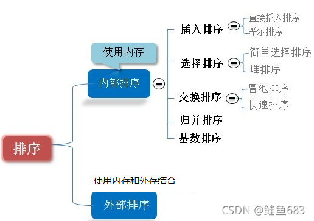
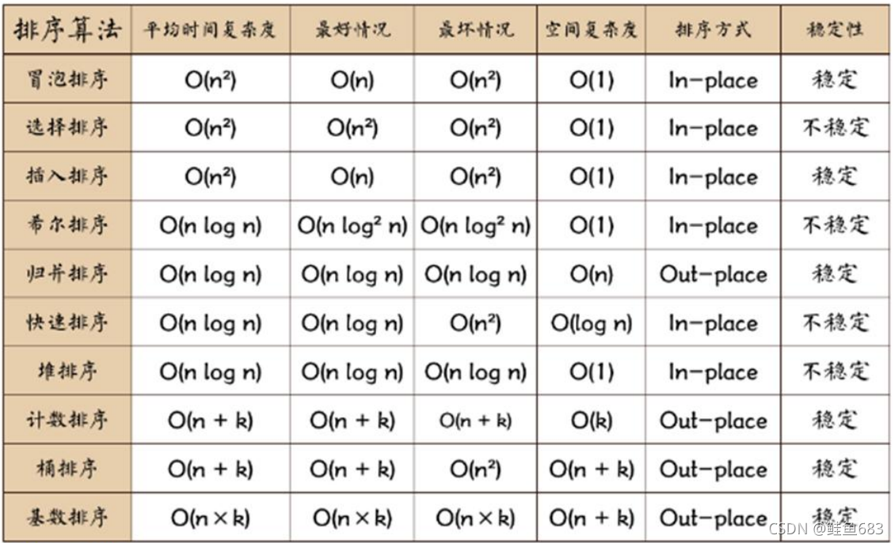
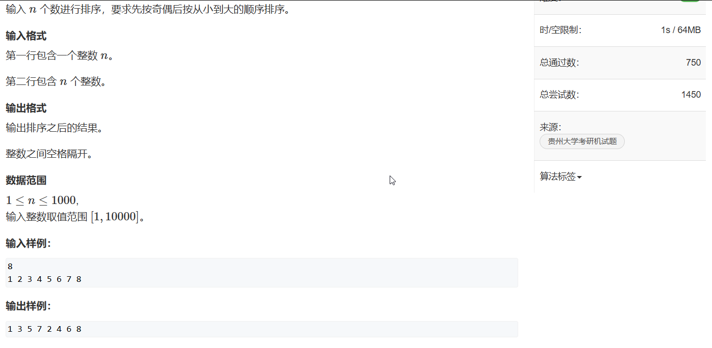
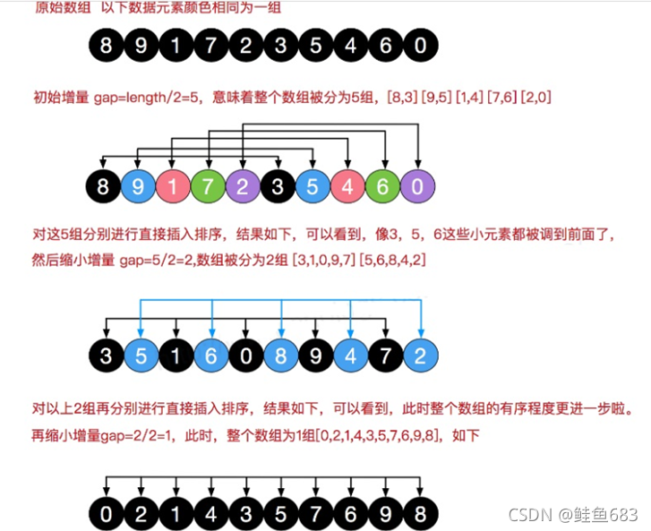

# java排序和查找

[toc]

## 1. 八大排序

>  排序也称排序算法(Sort Algorithm)，排序是将一组数据，依指定的顺序进行排列的过程。 

  

**总体对比**

 


### 1.1 冒泡排序

测试代码的题目链接：  [5334. 冒泡排序 - AcWing题库](https://www.acwing.com/problem/content/5337/) 

**注意acwing中java代码题目的类名必须是Main**



**基本思想：**

- **冒泡排序（Bubble sort）**：通过将序列从前到后遍历，一vi比较相邻元素的值，若发现逆序则交换两个元素，使得值较大的元素逐渐从前移向后部，就像水底的气泡一样逐渐向上冒。
- **优化**：如果一趟排序比较下来没有进行过交换，就说明序列有序，此时直接停止比较（跳出循环），从而减少不必要的比较。

代码特点：

- **两层for循环**；
- 外层循环是遍历的趟数，到**数组元素的倒数第二个为止**；
- **内存循环用于将最大或者最小的数组元素运输到最后**，所以跟外层循环息息相关。

**代码：**

```java
public static void bubbleSort(int[] arr, int num) {
        boolean flag = false;
        for (int i = 0; i < num - 1; i++) {
            for (int j = 0; j < num - i - 1; j++) {
                if (arr[j] > arr[j + 1]) {
                    // 曾经交换过，需要标记
                    flag = true;
                    // 交换数组位置
                    int temp = arr[j];
                    arr[j] = arr[j + 1];
                    arr[j + 1] = temp;
                }
            }
            // 判断这里内部的一趟是否交换过
            if (flag) {
                flag = false;
            }else{
                break;
            }
        }
    }
```


### 1.2 选择排序

测试代码的题目链接： [5332. 选择排序 - AcWing题库](https://www.acwing.com/file_system/file/content/whole/index/content/10768557/) 

**基本思想：**

- **每次选择剩下序列中的最小值/最大值，和该序列的第一个元素交换位置。**

- 例如：

  第一次从arr[0]~arr[n-1] 中选取最小值，与arr[0]交换，
  第二次从arr[1]~ arr[n-1]中选取最小值，与arr[1]交换，
  第三次从arr[2]~ arr[n-1]中选取最小值，与arr[2]交换，…，
  第i次从arr[i-1]~ arr[n-1]中选取最小值，与arr[i-1]交换，…,
  第n-1次从arr[n-2]~arr[n-1]中选取最小值，与arr[n-2]交换，

- **总共通过n-1次**，得到一个按排序码从小到大排列的有序序列。


**代码：**

```java
import java.util.Scanner;

public class SelectSort {
    public static void main(String[] args) {
        // 变量定义
        int arr[] = new int[1005];
        int num;
        Scanner myScanner = new Scanner(System.in);

        //输入
        num = myScanner.nextInt();
        for (int i = 0; i < num; i++) {
            arr[i] = myScanner.nextInt();
        }

        //排序
        selectSort(arr, num);
        
        // 输出
        for (int i = 0; i < num; i++) {
            System.out.print(arr[i] + " ");
        }
        myScanner.close();

    }

    // 方法名和变量名用小驼峰命名法
    /**
     * 选择排序：每次将后面序列的最大值或者最小值和当前位置的元素交换
     * @param arr
     * @param num
     */
    public static void selectSort(int[] arr, int num) {

        for (int i = 0; i < num - 1; i++) {
            int tempIndex = i;
            for (int j = i + 1; j < num; j++) {
                if (arr[tempIndex] > arr[j]) {
                    tempIndex = j;
                }
            }
            if (tempIndex != i) {
                int temp = arr[i];
                arr[i] = arr[tempIndex];
                arr[tempIndex] = temp;
            }
        }
    }
}

```


### 1.3 直接插入排序

测试题目： [5333. 插入排序 - AcWing题库](https://www.acwing.com/file_system/file/content/whole/index/content/10768558/) 

**基本思想：**

将序列看作一个有序表和一个无序表，**开始时有序表只有一个元素，无序表有n-1个元素。**排序过程中每次取出无序表的第一个元素，将该元素从右到左依次和有序表的元素比较，直到将该元素放到有序表中一个合适位置为止，在此过程中可以将有序表不断后移。

**代码：**

```java
import java.util.Scanner;

public class InsertionSort {
    public static void main(String[] args) {
        // 定义变量
        int arr[] = new int[1005];
        int num;
        Scanner myScanner = new Scanner(System.in);

        // 输入数据
        num = myScanner.nextInt();
        for (int i = 0; i < num; i++) {
            arr[i] = myScanner.nextInt();
        }

        // 排序
        insertionSort(arr, num);    

        // 输出
        for (int i = 0; i < num; i++) {
            System.out.print(arr[i] + " ");
        }
        myScanner.close();

    }

    /**
     * 直接插入排序：
     * 将序列看作一个有序列表和一个无序列表，
     * 每次取出无序列表的第一个元素，放到有序列表的合适位置
     * @param arr
     * @param num
     */
    public static void insertionSort(int[] arr, int num) {
        for (int i = 1; i < num; i++) {
            int j = i - 1;
            int temp = arr[i];
            while(j >= 0 && temp < arr[j]){
                arr[j + 1] = arr[j];
                j--;
            }
            arr[j + 1] = temp;
        }
    }
}

```


### 1.4 希尔排序

**基本思想：**

希尔排序也是**插入排序**的一种，他是简单插入排序改进后的更高效的排序，**又称为缩小增量排序。**

**希尔排序将序列的下标按照一定增量分组，根据分组进行直接插入排序。随着增量的减小，每组的元素个数变多，直到增量变为1，序列实现有序。**

**时间复杂度：**
希尔排序的时间复杂度不好计算，因为gap的取值方法很多，导致很难去计算，因此在好些树中给出的希尔排序的时间复杂度都不固定： **有学者通过大量的试验统计，得出结果为：O(n1.25) - O(1.6\*n1.25)**

**空间复杂度：O(1)**

  


**代码：**

```java
public class ShellSort {
    /**
     * 希尔排序
     * 又称缩小增量排序，通过分组+直接插入排序实现
     * 其中分组的增量：arr.length / 2, 直到增量为1
     * 排序稳定性：不稳定
     * @param arr
     */
    public static void shellSort(int[] arr) {
        for (int i = arr.length / 2; i > 0; i /= 2) {   // 希尔排序的增量
            // 给每个分组用上插入排序
            for (int j = 0; j + i < arr.length; j += i) {
                int temp = arr[j + i];
                int k = j;
                while(k >= 0 && temp < arr[k]){
                    arr[k + i] = arr[k];
                    k -= i;
                }
                arr[k + i] = temp;
            }
            
        }
    }
}

```


### 1.5 快速排序

题目链接：

**基本思想：**

快速排序是冒泡排序的一种改进，**本质是分治思想的实现。**

**通过一次排序将序列分割成两个部分**，其中一部分数据都比另外一部分的数据小。**然后再按照这个步骤分别对两个部分进行快速排序**，整个排序过程可以**递归**进行，一次达到整个数据变成有序序列。

**具体步骤：**

1. **首先设定一个分界值**，通过该分界值将数组分成左右两部分，通常分界值是最左边或者最右边的元素；

2. **将大于分界值的数据集中到数组右边，小于等于分界值的数据集中到数组的左边**。此时，左边部分中各元素都小于或等于分界值，而右边部分中各元素都大于或等于分界值。

3. 然后，**左边和右边的数据可以独立排序**。对于左侧的数组数据，又可以取一个分界值，将该部分数据分成左右两部分，同样在左边放置较小值，右边放置较大值。右侧的数组数据也可以做类似处理。

4. 重复上述过程，可以看出，这是一个**递归定义**。

**代码：**

```java


```


