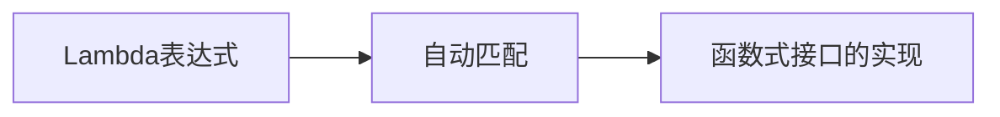

# Lambda表达式简化策略模式（小白友好版）

## 一、Lambda表达式基础认知

Lambda是Java 8引入的**匿名函数**，可以理解为一种极简的写方法的方式：

### 传统写法 vs Lambda写法

```java
// 传统接口实现
PaymentStrategy alipay = new PaymentStrategy() {
    @Override
    public void pay(int amount) {
        System.out.println("支付宝支付：" + amount);
    }
};

// Lambda写法
PaymentStrategy alipay = (amount) -> System.out.println("支付宝支付：" + amount);
```

## 二、用Lambda改造策略模式

### 1. 原始策略模式回顾

首先看我们之前的策略接口和实现：

```java
// 策略接口
public interface PaymentStrategy {
    void pay(int amount);
}

// 具体策略类
public class AlipayStrategy implements PaymentStrategy {
    @Override
    public void pay(int amount) {
        System.out.println("支付宝支付：" + amount);
    }
}

// 使用方式
PaymentStrategy strategy = new AlipayStrategy();
strategy.pay(100);
```

### 2. Lambda简化版

当接口只有一个方法时（函数式接口），可以直接用Lambda：

```java
// 不需要AlipayStrategy类了！
PaymentStrategy alipay = (amount) -> {
    System.out.println("支付宝支付：" + amount);
};

alipay.pay(100); // 使用方式不变
```

## 三、完整示例：计算器案例

### 1. 定义策略接口
```java
@FunctionalInterface // 标记为函数式接口
public interface CalculateStrategy {
    int calculate(int a, int b);
}
```

### 2. 上下文类
```java
public class Calculator {
    private CalculateStrategy strategy;
    
    public void setStrategy(CalculateStrategy strategy) {
        this.strategy = strategy;
    }
    
    public int execute(int a, int b) {
        return strategy.calculate(a, b);
    }
}
```

### 3. 客户端使用
```java
public class Client {
    public static void main(String[] args) {
        Calculator calculator = new Calculator();
        
        // 加法策略
        calculator.setStrategy((a, b) -> a + b);
        System.out.println("10 + 5 = " + calculator.execute(10, 5));
        
        // 乘法策略 
        calculator.setStrategy((a, b) -> a * b);
        System.out.println("10 * 5 = " + calculator.execute(10, 5));
        
        // 复杂策略（多行代码）
        calculator.setStrategy((a, b) -> {
            System.out.println("正在执行自定义计算...");
            return a * a + b * b;
        });
        System.out.println("特殊运算 = " + calculator.execute(3, 4));
    }
}
```

### 4. 输出结果
```
10 + 5 = 15
10 * 5 = 50
正在执行自定义计算...
特殊运算 = 25
```

## 四、Lambda语法详解

### 1. 基本结构
```java
(参数) -> { 方法体 }
```

### 2. 简化规则
| 情况       | 标准写法                 | 简化写法       |
| ---------- | ------------------------ | -------------- |
| 单个参数   | `(a) -> {...}`           | `a -> {...}`   |
| 单行方法体 | `(a,b) -> {return a+b;}` | `(a,b) -> a+b` |
| 无参数     | `() -> {...}`            | 不能省略       |

### 3. 计算器案例的Lambda演进

```java
// 完整写法
calculator.setStrategy((int a, int b) -> {
    return a + b;
});

// 简化参数类型
calculator.setStrategy((a, b) -> {
    return a + b;
});

// 单行进一步简化
calculator.setStrategy((a, b) -> a + b);
```

## 五、为什么可以这样用？

因为`CalculateStrategy`是**函数式接口**（只有一个抽象方法），Lambda表达式会自动匹配：



## 六、实际应用场景

### 1. 排序策略
```java
List<String> names = Arrays.asList("Alice", "Bob", "Charlie");

// 按长度排序
names.sort((s1, s2) -> s1.length() - s2.length());

// 按字母倒序
names.sort((s1, s2) -> s2.compareTo(s1));
```

### 2. 线程策略
```java
// 传统写法
new Thread(new Runnable() {
    @Override
    public void run() {
        System.out.println("线程运行");
    }
}).start();

// Lambda写法
new Thread(() -> System.out.println("线程运行")).start();
```

## 七、注意事项

1. **接口类型限制**：
   - 只能用于**只有一个抽象方法**的接口
   - 可以用`@FunctionalInterface`注解标记

2. **变量访问**：
   ```java
   int base = 10;
   calculator.setStrategy(a -> a + base); // 可以访问final或等效final的局部变量
   ```

3. **调试困难**：
   - Lambda没有明确的类名和方法名
   - 复杂逻辑还是建议用传统类实现

## 八、回到策略模式

使用Lambda后，策略模式的三种实现方式对比：

| 实现方式   | 优点             | 缺点     | 适用场景     |
| ---------- | ---------------- | -------- | ------------ |
| 传统类实现 | 结构清晰，可复用 | 代码量大 | 复杂策略     |
| 枚举实现   | 集中管理策略     | 不够灵活 | 有限已知策略 |
| Lambda实现 | 简洁直观         | 难以复用 | 简单临时策略 |

建议根据策略的复杂度选择合适的实现方式！