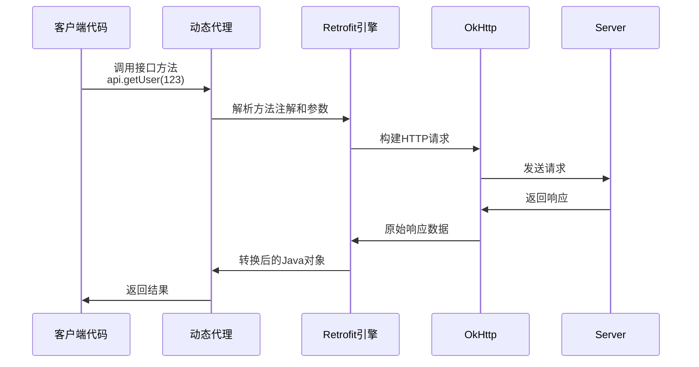

# Retrofit 核心机制详解笔记（面向小白）

## 一、Retrofit 基础认知

### 1. Retrofit 是什么？
- 一个**类型安全**的 HTTP 客户端库
- 将 HTTP API 转换成 Java/Kotlin 接口
- 底层实际使用 OkHttp 进行网络请求

### 2. 核心优势
- 用接口方法代替手动构建 HTTP 请求
- 自动处理 JSON 转换
- 支持同步/异步调用
- 高度可定制（拦截器、转换器等）

## 二、关键代码段解析

```java
IOpenAiApi openAiApi = new Retrofit.Builder()
        .baseUrl("https://api.example.com/")
        .client(okHttpClient)
        .addCallAdapterFactory(RxJava2CallAdapterFactory.create())
        .addConverterFactory(JacksonConverterFactory.create())
        .build()
        .create(IOpenAiApi.class);
```

### 3. 分步拆解

#### 步骤1：构建配置（Builder 模式）
| 方法调用                  | 作用             | 类比                          |
| ------------------------- | ---------------- | ----------------------------- |
| `baseUrl()`               | 设置API根地址    | 设定快递公司的总部地址        |
| `client()`                | 配置HTTP客户端   | 选择快递运输车辆（OkHttp）    |
| `addCallAdapterFactory()` | 设置响应包装方式 | 选择送货方式（普通/RxJava等） |
| `addConverterFactory()`   | 设置数据转换器   | 配备货物打包/拆包工具         |

#### 步骤2：构建 Retrofit 实例（build()）
- 冻结所有配置
- 创建不可变的 Retrofit 对象
- 类似"快递公司注册完成"

#### 步骤3：创建接口实例（create()）
- **动态代理**黑科技：
  ```java
  // 伪代码示意
  public <T> T create(Class<T> service) {
      return (T) Proxy.newProxyInstance(
          service.getClassLoader(),
          new Class<?>[] { service },
          (proxy, method, args) -> {
              // 将方法调用转换为HTTP请求
              // 发送请求并返回处理后的响应
          });
  }
  ```

## 三、动态代理深度图解

### 4. 代理工作流程


### 5. 接口方法 ↔ HTTP 请求映射规则
通过注解实现转换：
```java
public interface IOpenAiApi {
    // 对应 POST /v1/chat/completions
    @POST("/v1/chat/completions")
    Call<Response> createChat(@Body Request request);
    
    // 对应 GET /v1/models/{modelId}
    @GET("/v1/models/{modelId}")
    Call<Model> getModel(@Path("modelId") String id);
}
```

## 四、核心组件详解

### 6. Converter（转换器）
- **作用**：处理数据格式转换
- 常用实现：
  - `JacksonConverterFactory`：JSON ↔ 对象
  - `GsonConverterFactory`
  - `ScalarsConverterFactory`：原始字符串

### 7. CallAdapter（调用适配器）
- **作用**：定制返回值类型
- 常见用法：
  - 默认返回 `Call<T>`
  - `RxJava2CallAdapterFactory` 支持返回 `Observable<T>`
  - 也可以自定义适配器

### 8. 配置项对照表

| 配置方法                | 可选值示例                 | 必要性         |
| ----------------------- | -------------------------- | -------------- |
| baseUrl()               | "https://api.example.com/" | 必须           |
| client()                | OkHttpClient实例           | 可选（有默认） |
| addConverterFactory()   | Jackson/Gson转换器         | 必须至少一个   |
| addCallAdapterFactory() | RxJava适配器               | 可选           |

## 五、常见疑问解答

### Q1：为什么接口不需要实现类？
- Retrofit 在运行时通过动态代理**自动生成**实现
- 所有方法调用都会被拦截并转换为HTTP操作

### Q2：注解是如何被处理的？
- Retrofit 在创建代理时：
  1. 解析方法上的注解（如 @GET）
  2. 解析参数注解（如 @Path）
  3. 构建对应的 Request 对象

### Q3：线程模型是怎样的？
- 默认情况下：
  - `enqueue()`：异步（回调在OkHttp线程池）
  - `execute()`：同步（调用线程阻塞）
- 通过 RxJava 等适配器可以实现线程切换

## 六、实践建议

### 1. 调试技巧
- 添加日志拦截器：
  ```java
  new OkHttpClient.Builder()
      .addInterceptor(new HttpLoggingInterceptor()
          .setLevel(HttpLoggingInterceptor.Level.BODY))
  ```

### 2. 最佳实践
- 接口设计原则：
  - 每个API方法应专注单一功能
  - 使用明确的HTTP方法注解
  - 合理使用参数注解（@Query/@Path等）

### 3. 扩展方向
- 自定义 Converter：处理特殊数据格式
- 自定义 CallAdapter：支持协程等新特性
- 添加统一拦截器：实现认证、重试等逻辑

## 七、学习路线建议
1. 先掌握基础用法（同步/异步调用）
2. 理解 Converter 工作原理
3. 研究 CallAdapter 机制
4. 最后深入动态代理实现原理

建议配合官方文档和源码阅读：
- [Retrofit 官方文档](https://square.github.io/retrofit/)
- OkHttp 交互流程
- Java 动态代理机制