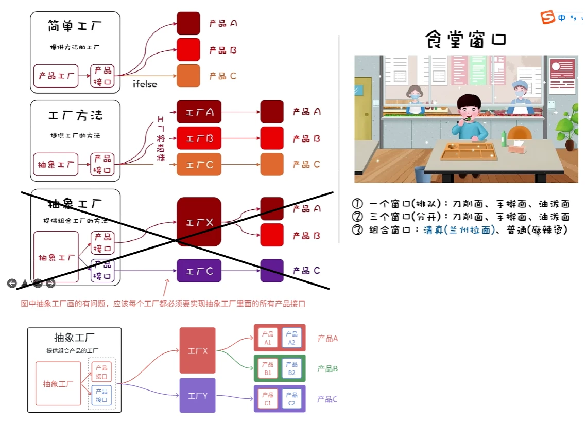

# 抽象工厂模式

### 1. **设计模式概述**

设计模式是面向对象编程中关于如何解决某类问题的通用解决方案。设计模式分为三类：

- **创建型模式**：涉及对象创建的模式。
- **结构型模式**：涉及类和对象的组合的模式。
- **行为型模式**：关注对象之间的交互。

抽象工厂模式属于创建型模式，用于创建一系列相关或相互依赖的对象，而无需明确指定具体类。

### 2. **抽象工厂模式**

抽象工厂模式的核心目的是提供一个接口，允许客户端在不需要知道具体类的情况下，创建一系列相关对象。通常，它会包含一个抽象工厂类和多个具体工厂类，每个具体工厂类负责创建具体的产品对象。

**抽象工厂模式的组成：**

- **AbstractFactory（抽象工厂）**：定义创建一系列产品的方法。
- **ConcreteFactory（具体工厂）**：实现抽象工厂接口，负责创建具体的产品对象。
- **AbstractProduct（抽象产品）**：定义一系列产品的接口。
- **ConcreteProduct（具体产品）**：实现具体产品接口，代表具体的产品对象。
- **Client（客户端）**：通过抽象工厂接口来使用产品，无需关注具体产品的实现。

  


### 3. **抽象工厂模式的优点**

- **易于扩展**：如果新增一种产品系列，只需要增加相应的具体工厂和具体产品，而不需要修改原有代码。
- **产品系列一致性**：可以保证同一产品系列中的对象能够配合工作，避免出现不兼容的情况。

### 4. **抽象工厂模式的应用场景**

- 当需要在多个产品系列中进行切换时。
- 当系统的产品种类繁多，且产品之间需要有一定的协作关系时。
- 当需要在不修改系统代码的情况下，增加新的产品系列时。

### 5. **抽象工厂模式的实现示例**

假设你有一个产品系列——`Windows`和`Mac`操作系统下的按钮和文本框：

- **抽象产品类**：`Button`（按钮）和`TextBox`（文本框）。
- **具体产品类**：`WindowsButton`、`MacButton`、`WindowsTextBox`、`MacTextBox`。
- **抽象工厂类**：`GUIFactory`，定义了创建按钮和文本框的方法。
- **具体工厂类**：`WindowsFactory`、`MacFactory`，分别负责创建与平台相关的按钮和文本框。

### 6. **代码示例**

```java
// 抽象产品
interface Button {
    void render();
}

interface TextBox {
    void render();
}

// 具体产品
class WindowsButton implements Button {
    public void render() {
        System.out.println("Rendering Windows Button");
    }
}

class MacButton implements Button {
    public void render() {
        System.out.println("Rendering Mac Button");
    }
}

class WindowsTextBox implements TextBox {
    public void render() {
        System.out.println("Rendering Windows TextBox");
    }
}

class MacTextBox implements TextBox {
    public void render() {
        System.out.println("Rendering Mac TextBox");
    }
}

// 抽象工厂
interface GUIFactory {
    Button createButton();
    TextBox createTextBox();
}

// 具体工厂
class WindowsFactory implements GUIFactory {
    public Button createButton() {
        return new WindowsButton();
    }
    public TextBox createTextBox() {
        return new WindowsTextBox();
    }
}

class MacFactory implements GUIFactory {
    public Button createButton() {
        return new MacButton();
    }
    public TextBox createTextBox() {
        return new MacTextBox();
    }
}

// 客户端
class Client {
    private Button button;
    private TextBox textBox;

    public Client(GUIFactory factory) {
        button = factory.createButton();
        textBox = factory.createTextBox();
    }

    public void renderUI() {
        button.render();
        textBox.render();
    }
}

// 使用例子
public class Main {
    public static void main(String[] args) {
        GUIFactory factory = new WindowsFactory();  // 选择Windows工厂
        Client client = new Client(factory);
        client.renderUI();
        
        factory = new MacFactory();  // 选择Mac工厂
        client = new Client(factory);
        client.renderUI();
    }
}
```

### 7. **抽象工厂模式的缺点**

- 如果产品系列过多，类的数量会迅速增加，导致代码膨胀。
- 需要对产品系列的修改，可能会导致代码的扩展困难。

### 总结

抽象工厂模式适用于在多个产品系列之间进行切换的场景，并且能有效地保证产品之间的一致性。通过该模式，客户端只关心抽象工厂提供的接口，而不需要关注具体产品的实现。尽管它能提高代码的扩展性和可维护性，但也需要权衡其带来的复杂性，尤其在产品种类极多时。

这篇文章对于理解抽象工厂模式的理论、应用场景和代码实现都进行了详细讲解，是学习设计模式的一个很好的资源。