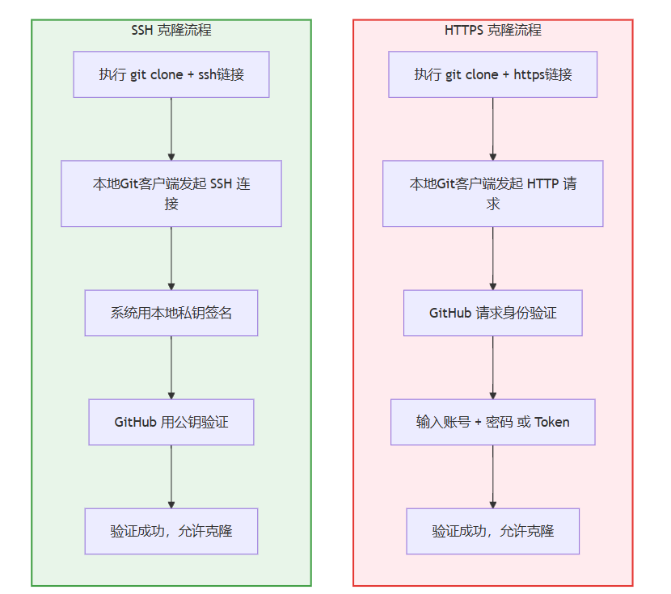
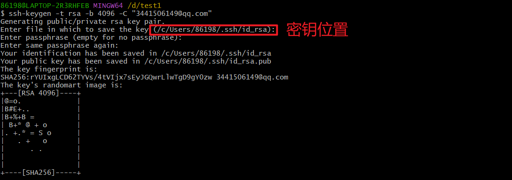
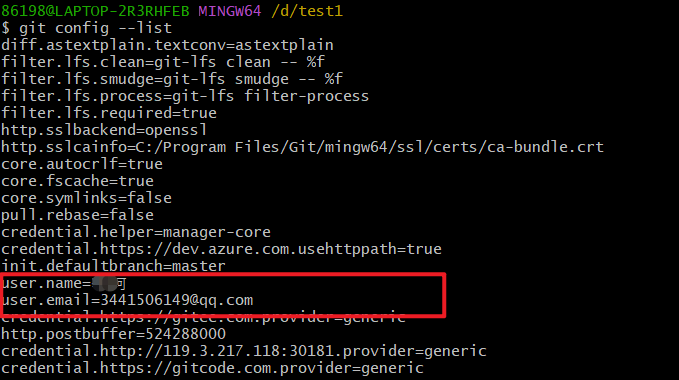
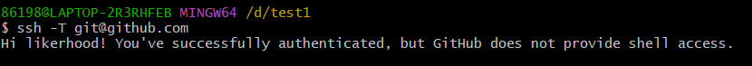

#  Git 使用 SSH 登录与克隆项目 

[toc]

## 1. 什么是ssh密钥

 **SSH（Secure Shell）密钥**是一种用于**进行安全通信的加密密钥对**。它由一对相关的密钥构成：私钥和公钥。**私钥储存在本地机器上，而公钥则可以在服务器上进行配置**。当你与远程服务器建立连接时，SSH密钥将用于验证您的身份，确保只有授权用户才能访问。 

**公钥像“锁”，私钥像“钥匙”**。使用时类似：你寄了一把锁（公钥）给 远程服务器，它装在仓库门上，你以后拿钥匙（私钥）开门就行。

**SSH是一种网络协议**，用于计算机之间的加密登录。如果一个用户从本地计算机，使用SSH协议登录另一台远程计算机，我们就可以认为，**这种登录是安全的，即使被中途截获，密码也不会泄露。**最早的时候，互联网通信都是明文通信，一旦被截获，内容就暴露无疑。1995年，芬兰学者Tatu Ylonen设计了SSH协议，将登录信息全部加密，成为互联网安全的一个基本解决方案，迅速在全世界获得推广，目前已经成为Linux系统的标准配置。


## 2. https和ssh链接github/gitee方式差异

平常使用 Git clone 命令需要身份验证，在网站上有多种克隆命令，包括https和ssh的方式。 

如果你用过 HTTPS 的方式，应该很熟悉，每次你拉取代码或者推送代码的时候，都会提示你输入账号和密码。

1. HTTP 协议本身是无状态的， **不具备身份验证机制**（除了输入用户名密码）；

2. 所以 GitHub 会弹出提示：**“请验证你是谁”**；

3. 如果这个仓库是私有的，GitHub 还要确认你**是否有权限拉取代码**。

相比之下，ssh方式优势：

🔐 安全：相比用户名+密码，SSH 提供了加密验证，避免明文密码泄露。

🧰 自动化：支持免密登录，适合脚本化、自动化拉取代码。

🔄 持久：公钥配置后长期有效，不用每次都输账号密码。




## 3.  怎么配置 SSH 

### 3.1 步骤一：生成SSH密钥对

1. 打开[Git](https://geek-docs.com/git/git-top-articles/1000100_git_index.html) Bash终端（如果没有安装，请先下载和安装[Git](https://geek-docs.com/git/git-top-articles/1000100_git_index.html) for Windows）。

2. 进入命令提示符，输入以下命令并按回车键：

   ```bash
   ssh-keygen -t rsa -b 4096 -C "your_email@example.com"
   ```

3. 系统将要求您选择密钥的存储位置和文件名，并设置密码（密码可选）,建议直接选择默认（回车换行即可）。

4. 然后，系统将生成SSH密钥对并将其存储在您指定的位置。




### 3.2 将公钥添加到远程服务器

一旦生成了SSH密钥对，我们需要将公钥添加到远程服务器上，以便进行身份验证。这个过程与您正在使用的代码托管平台有关。让我们以GitHub为例进行说明：

1. 首先，登录到您的GitHub帐户，并转到“Settings”。
2. 点击“SSH and GPG keys”，然后选择“New SSH key”。
3. 在“Key”字段中，复制并粘贴您的公钥。您可以使用以下命令将公钥复制到剪贴板。

4. 点击“Add SSH key”以完成添加。

windows系统下默认密钥位置在`C:\Users\86198\.ssh`(请根据自己电脑确定)。


然后用记事本打开，将公钥复制到git网站。


### 3.3 配置本地git信息

1. 打开Git Bash终端。
2. 运行以下命令设置Git本地信息：

```bash
git config                  #查看本机是否配置了个人信息
git config --global user.name “name”     #定义全局的用户名
git config --global user.email “qwer@qq.com”  #定义全局的邮件地址
git config --list               #查看配置信息
```

3. 如图，这里配置好之后：

   


### 3.4 测试SSH连接

1. 在Git Bash终端中，运行以下命令测试SSH连接：

   ```bash
   ssh -T git@github.com
   ```

2. 如果已经成功配置并添加了SSH密钥，那么您将收到一个欢迎消息，表明您与远程服务器的连接已建立。

   


## 4. 总结

| 项目             | HTTPS                               | SSH               |
| ---------------- | ----------------------------------- | ----------------- |
| 协议             | HTTP                                | SSH               |
| 身份验证方式     | 用户名 + 密码 / Token               | 私钥 + 公钥       |
| 是否每次输入密码 | 是（除非配置了 Credential Manager） | 否，自动验证      |
| 安全性           | 一般（需 Token）                    | 高（非对称加密）  |
| 操作方式         | 复制链接 → 输入密码                 | 复制 SSH 链接即可 |

