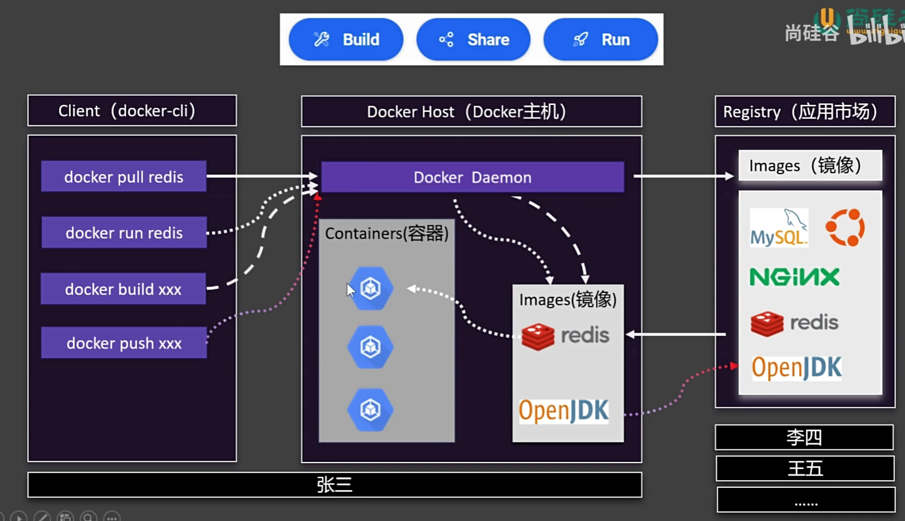
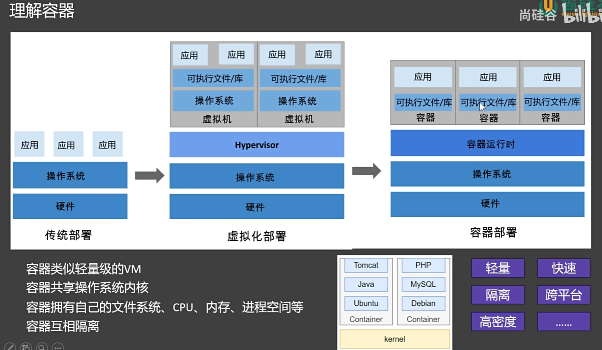
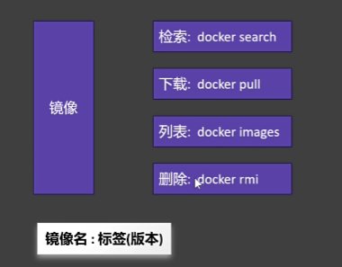
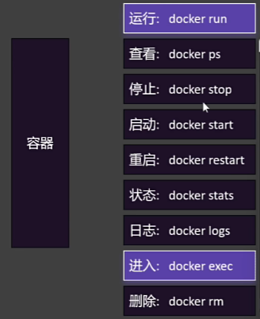
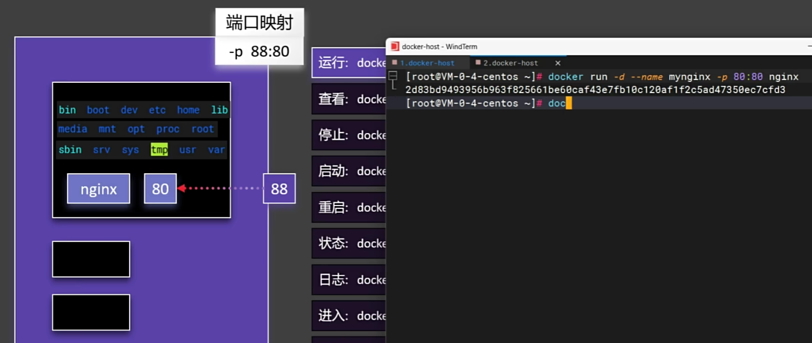
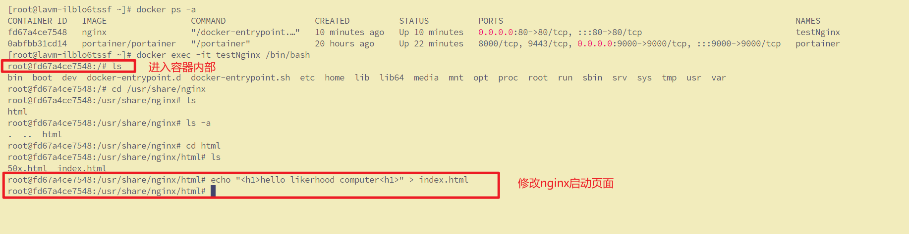
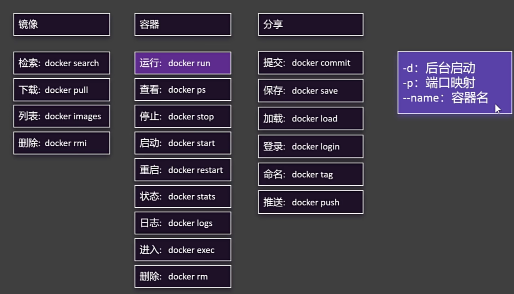
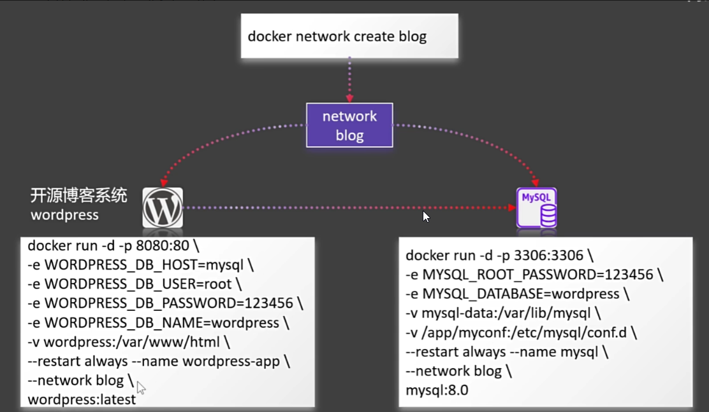
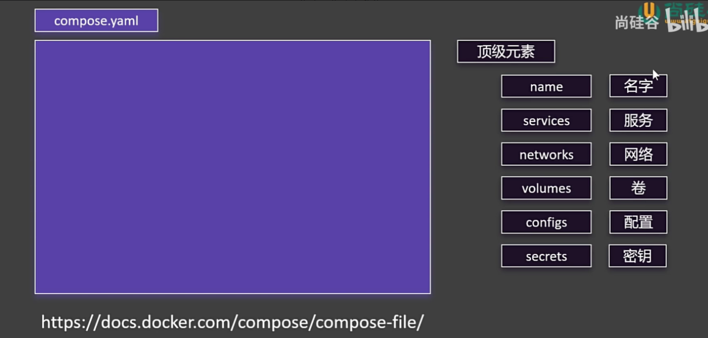
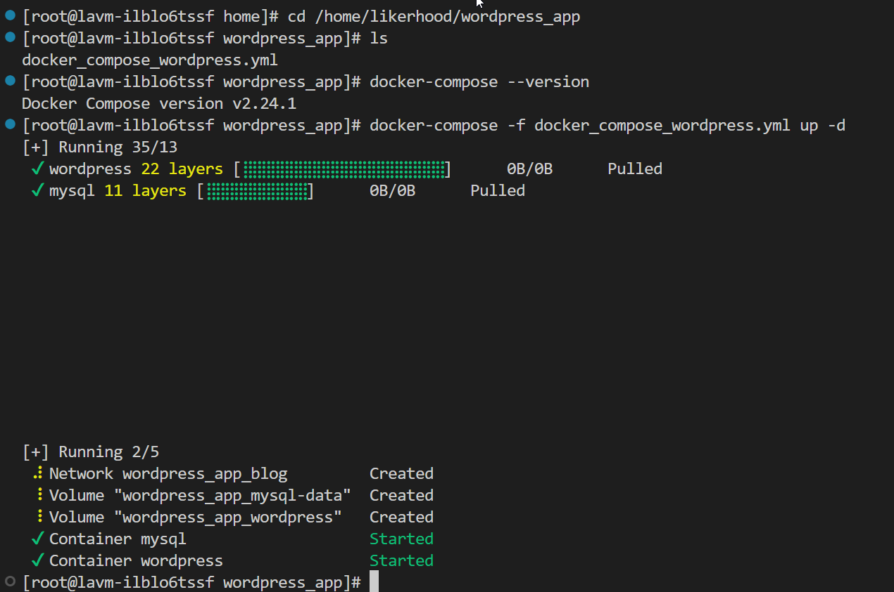

#  docker基础

 Docker 是一个**开源的容器化平台**，它可以让开发者打包、分发和运行应用程序，确保无论在哪里运行，应用都能保持一致的环境。具体来说，Docker 提供了一种轻量级的方式来隔离和运行应用及其所有依赖，类似于“容器”中运行软件。

**Docker 是一种工具，它让你将应用和依赖打包成一个可以随时随地运行的容器。** 它解决了环境一致性、快速部署和资源隔离的问题。

**使用docker便于快速构建（build）、分享（share）、运行（run）软件和项目。**

## 1. docker架构和容器化



### **1.1 主要组件**

1. **Client (docker-cli)**

   - 这是**用户与 Docker 交互的界面**。用户通过命令行工具（`docker-cli`）发送命令，告诉 Docker 做哪些操作。
   - 主要命令包括：
     - **`docker pull`**：从 **Registry**（镜像仓库）拉取镜像。
     - **`docker run`**：启动一个新的容器。
     - **`docker build`**：根据 Dockerfile 构建新的镜像。
     - **`docker push`**：将本地镜像推送到镜像仓库。

2. **Docker Host (Docker 主机)**

   - Docker 主机是运行 Docker 引擎和容器的物理或虚拟机，也就是安装了docker的电脑。

3. **Docker Daemon**

   - Docker Daemon 是 Docker 引擎的核心部分，负责与 Docker 客户端通信，管理容器和镜像的创建、运行、停止等操作。
   - **它接收来自 Docker 客户端的请求，执行相应的操作，并返回结果。**

4. **Containers (容器)**

   - **容器是运行时环境，它是一个轻量级、可移植、自给自足的软件包，包含应用及其所有依赖项。**

   - 容器在 Docker 主机上运行，容器可以通过 Docker Daemon 管理。

   - 容器是基于 Docker 镜像创建的。

     

5. **Registry (应用市场)**

   - **Docker 镜像仓库，存放 Docker 镜像**。用户可以从这里拉取镜像或将镜像推送到这里。
   - 官方的 Docker Hub 是一个公共的 Registry，也可以使用私有的镜像仓库。
   - **常见镜像**：如 MySQL、Redis、Nginx、OpenJDK 等。

6. **Image(镜像)**

   - 镜像是一个包含程序运行必要依赖的环境和代码的只读文件，是一种文件存储形式。
   - 它就像是一个软件的 “模板” 或者 “快照”，**其中封装了运行该软件所需的所有内容，包括操作系统、运行时库、应用程序代码等。**
   - **镜像相当于软件的运行环境，容器是镜像的实例。**


## 2. docker安装

### 2.1 centOS服务器安装docker

#### 2.1.1 安装docker

* [Docker | 小傅哥 bugstack 虫洞栈](https://bugstack.cn/md/road-map/docker.html) 
* [视频讲解-手把手教学](https://www.bilibili.com/video/BV1Sy411z7pt?spm_id_from=333.788.videopod.sections&vd_source=4df08d069d45f57cba1a350ccb2bbd75)

```bash
# 1. 更新yum到最新版本
sudo yum update

# 2. 安装Docker所需的依赖包
sudo yum install -y yum-utils device-mapper-persistent-data lvm2

# 3. 设置Docker的yum的源
sudo yum-config-manager --add-repo https://download.docker.com/linux/centos/docker-ce.repo

# 4. 查看仓库所有Docker版本，后面可以指定较新版本的docker安装
yum list docker-ce --showduplicates | sort -r

# 5. 安装docker
sudo yum install -y docker-ce-25.0.5 docker-ce-cli-25.0.5 containerd.io

# 6. 安装docker-compose
	# 指定路径【推荐】
sudo curl -L https://gitee.com/fustack/docker-compose/releases/download/v2.24.1/docker-compose-linux-x86_64 -o /usr/local/bin/docker-compose
	# 设置权限
sudo chmod +x /usr/local/bin/docker-compose

# 7. 启动Docker并添加开机自启动
sudo systemctl start docker
systemctl enable docker
sudo systemctl restart docker

# 8. 设置国内源
sudo mkdir -p /etc/docker
sudo tee /etc/docker/daemon.json <<-'EOF'
{
"registry-mirrors": [
  "https://docker.1panel.live",
  "https://dc.j8.work",
  "https://docker.m.daocloud.io",
  "https://dockerproxy.com",
  "https://docker.mirrors.ustc.edu.cn",
  "https://docker.nju.edu.cn"
]
}
EOF
sudo systemctl daemon-reload
sudo systemctl restart docker

```


#### 2.1.2 docker常见命令

```bash
# 1. 查看 Docker 版本
docker --version

# 2. 卸载 Docker
sudo yum remove docker \
                  docker-client \
                  docker-client-latest \
                  docker-common \
                  docker-latest \
                  docker-latest-logrotate \
                  docker-logrotate \
                  docker-selinux \
                  docker-engine-selinux \
                  docker-engine
 
# 3. Docker 常用命令
docker --help				#Docker帮助
docker --version			#查看Docker版本
docker search <image>		#搜索镜像文件，如：docker search mysql
docker pull <image>		#拉取镜像文件， 如：docker pull mysql
docker images				#查看已经拉取下来的所以镜像文件
docker rmi <image>		#删除指定镜像文件
docker run --name <name> -p 80:8080 -d <image>		#发布指定镜像文件
docker ps					#查看正在运行的所有镜像
docker ps -a				#查看所有发布的镜像
docker rm <image>			#删除执行已发布的镜像

```


#### 2.1.3 启动portainer

- [Portainer | 小傅哥 bugstack 虫洞栈](https://bugstack.cn/md/road-map/portainer.html) 

```bash
# 1. 拉取最新的 Portainer
docker pull portainer/portainer

# 2. 安装和启动 这里设置的端口是9000
docker run -d --restart=always --name portainer -p 9000:9000 -v /var/run/docker.sock:/var/run/docker.sock portainer/portainer

# 3. 在服务器的安全组添加9000端口
# 4. 通过公网ip:9000访问，注册账户
# 5. 若超时，请重启portainer
docker restart portainer
```


### 2.3 windows 安装docker

【TODO】


## 3. 挂载和映射

### 3.1 挂载（Mounting）

在 Docker 中，挂载是将**宿主机上的文件或目录与容器内的文件或目录建立关联的过程**。如果没有挂载，容器关闭数据就会消失。挂载后容器可以访问宿主机上的文件，宿主机也可以看到容器对挂载文件所做的更改。挂载主要有以下两种常见类型：

- **绑定挂载（Bind Mounts）**：直接将宿主机上的文件或目录挂载到容器内。宿主机上的路径可以是任意有效的路径。
- **卷挂载（Volumes）**：卷是 Docker 管理的一种数据存储机制，由 Docker 在宿主机上的特定位置（通常在`/var/lib/docker/volumes`）创建和管理。卷可以在多个容器之间共享，并且在容器删除后，卷的数据仍然可以保留。

### 3.2 挂载命令行操作

#### 3.2.1 绑定挂载（Bind Mounts）

- **`docker run` 命令创建容器时进行绑定挂载**		

  ```bash
  docker run -v /host/path:/container/path image_name
  ```
  - `-v` 或 `--volume`：用于指定挂载信息。
  - `/host/path`：宿主机上的文件或目录路径。
  - `/container/path`：容器内的文件或目录路径。

  示例：将宿主机的 `/home/user/data` 目录挂载到容器的 `/app/data` 目录。

  ```bash
  docker run -v /home/user/data:/app/data nginx
  ```

- **`docker create` 结合 `docker start` 方式创建并启动容器时进行绑定挂载**

  ```bash
  docker create -v /host/path:/container/path image_name
  docker start container_id
  ```


#### 3.2.2 卷挂载（Volumes）

- **创建卷**

  ```bash
  docker volume create my_volume
  ```

- **查看所有卷**

  ```bash
  docker volume ls
  ```

- **删除卷**

  ```bash
  docker volume rm my_volume
  ```

- **使用卷挂载创建容器**

  ```bash
  docker run -v my_volume:/container/path image_name
  ```

  示例：使用名为 `my_volume` 的卷挂载到容器的 `/app/volume_data` 目录。

  ```bash
  docker run -v my_volume:/app/volume_data nginx
  ```

  

### 3.3 映射（Port Mapping）

**端口映射是将宿主机的端口与容器内的端口进行关联的操作。**

由于容器有自己独立的网络命名空间，默认情况下容器内的服务只能在容器内部访问。

通过端口映射，我们可以将容器内服务监听的端口映射到宿主机的某个端口上，从而使得外部网络可以通过宿主机的 IP 地址和映射的端口来访问容器内的服务。


### 3.4 映射命令行操作

- **`docker run` 命令创建容器时进行端口映射**

  ```bash
  docker run -p host_port:container_port image_name
  ```
  - `-p` 或 `--publish`：用于指定端口映射信息。
  - `host_port`：宿主机上的端口。
  - `container_port`：容器内服务监听的端口。

  示例：将容器内的 `80` 端口映射到宿主机的 `8080` 端口。

  ```bash
  docker run -p 8080:80 nginx
  ```


## 4. docker compose

### **4.1  什么是 Docker Compose？**
- Docker Compose 是一个工具，用于定义和运行多个 Docker 容器的应用。
- 它通过一个 YAML 文件（通常叫 `docker-compose.yml`）来配置多个服务（容器），并可以一键启动、停止和管理这些服务。
- 适合用来管理复杂的多容器应用，比如一个 Web 应用需要数据库、缓存、后端服务等。

---

### **4.2  Docker Compose 的核心概念**
1. **服务（Service）**：
   - 一个服务对应一个容器，比如一个 Web 服务器、一个数据库。
   - 在 `docker-compose.yml` 中，每个服务都有自己的配置。

2. **项目（Project）**：
   - 一个项目是由多个服务组成的完整应用。
   - Docker Compose 会根据项目名称来管理这些服务。

3. **YAML 文件**：
   - Docker Compose 使用 `docker-compose.yml` 文件来定义服务、网络、卷等。
   - YAML 是一种易读的配置文件格式。

---

### **4.3 Docker Compose 的基本命令**
以下是一些常用的 Docker Compose 命令：

| 命令                   | 说明                                                         |
| ---------------------- | ------------------------------------------------------------ |
| `docker-compose up`    | 启动所有服务（后台运行加 `-d` 参数）。                       |
| `docker-compose down`  | 停止并删除所有服务、网络和卷。                               |
| `docker-compose start` | 启动已存在的服务。                                           |
| `docker-compose stop`  | 停止运行中的服务。                                           |
| `docker-compose ps`    | 查看当前项目的容器状态。                                     |
| `docker-compose logs`  | 查看服务的日志（加 `-f` 可以实时查看）。                     |
| `docker-compose build` | 构建或重新构建服务的镜像。                                   |
| `docker-compose exec`  | 进入某个运行中的容器（例如：`docker-compose exec web bash`）。 |

---

### **4.4 Docker Compose 文件示例**
以下是一个简单的 `docker-compose.yml` 文件示例：

```yaml
version: '3'  # 指定 Docker Compose 的版本
services:      # 定义服务
  web:        # 服务名称（自定义）
    image: nginx:latest  # 使用的镜像
    ports:
      - "80:80"  # 端口映射（主机端口:容器端口）
    volumes:
      - ./html:/usr/share/nginx/html  # 挂载本地目录到容器
  db:         # 另一个服务
    image: mysql:5.7
    environment:
      MYSQL_ROOT_PASSWORD: example  # 设置环境变量
```

---

### **4.5 Docker Compose 的使用步骤**
1. 安装 Docker 和 Docker Compose：
   
- 确保已经安装了 Docker 和 Docker Compose（可以通过 `docker-compose --version` 检查）。
  
2. 编写 `docker-compose.yml` 文件：
   
- 根据你的应用需求，定义服务、网络、卷等。
  
3. 启动服务：
   - 在 `docker-compose.yml` 文件所在目录运行：
     ```bash
     docker-compose up
     ```

4. 管理服务：
   - 使用 `docker-compose logs` 查看日志。
   - 使用 `docker-compose down` 停止服务。

---

### **4.6 Docker Compose 的常用配置**
以下是一些常见的配置项：

| 配置项        | 说明                                                 |
| ------------- | ---------------------------------------------------- |
| `image`       | 指定使用的镜像。                                     |
| `build`       | 指定 Dockerfile 路径，用于构建镜像。                 |
| `ports`       | 端口映射（主机端口:容器端口）。                      |
| `volumes`     | 挂载主机目录或卷到容器。                             |
| `environment` | 设置环境变量。                                       |
| `depends_on`  | 定义服务依赖关系（例如：`web` 服务依赖 `db` 服务）。 |
| `networks`    | 定义自定义网络。                                     |
| `restart`     | 设置容器重启策略（例如：`always`、`on-failure`）。   |


## 5. 网络

### 5.1 为什么可以自定义网络？

Docker 允许用户自定义网络，主要是为了提供更灵活和强大的网络管理能力。以下是自定义网络的一些主要优势：

1. **隔离性**：自定义网络可以将不同的应用或服务隔离开来，避免它们之间的干扰。例如，你可以为每个应用创建一个独立的网络，确保它们之间的通信是隔离的。

2. **服务发现**：在自定义网络中，Docker 提供了内置的 DNS 服务，使得容器可以通过服务名称（如 `db` 或 `web`）来相互访问，而不需要知道对方的 IP 地址。

3. **灵活性**：自定义网络允许你根据需要配置不同的网络驱动（如 `bridge`、`overlay` 等），以适应不同的使用场景。

4. **安全性**：通过自定义网络，你可以更好地控制容器之间的通信，限制不必要的网络访问，从而提高安全性。

### 5.2 为什么两个容器可以使用同一个网络？

当两个容器连接到同一个自定义网络时，它们可以直接通过容器名称进行通信。这是因为 Docker 在同一个网络内提供了以下功能：

1. **DNS 解析**：Docker 为每个容器分配了一个唯一的名称，并在网络内提供了一个内置的 DNS 服务。这意味着你可以通过容器名称（如 `db` 或 `web`）来访问其他容器，而不需要知道它们的 IP 地址。

2. **网络隔离**：连接到同一个网络的容器可以相互通信，而不会受到其他网络的干扰。这确保了网络内的通信是安全和隔离的。

3. **简化配置**：通过将多个容器连接到同一个网络，你可以简化网络配置，避免复杂的 IP 地址管理和端口映射。

### 5.3 示例详解

让我们通过一个具体的例子来说明这些概念：

#### 1. **创建自定义网络**
```bash
docker network create my_app_network
```
- 这个命令创建了一个名为 `my_app_network` 的自定义网络。这个网络将用于连接 `web` 和 `db` 两个容器。

#### 2. **启动容器并连接到网络**
```bash
docker run -d --name db --network my_app_network mysql
docker run -d --name web --network my_app_network -p 80:80 my_web_app
```
- **`db` 容器**：这是一个 MySQL 数据库容器，连接到 `my_app_network` 网络。
- **`web` 容器**：这是一个 Web 应用容器，也连接到 `my_app_network` 网络，并将容器的 80 端口映射到宿主机的 80 端口。

#### 3. **容器通信**
- 由于 `web` 和 `db` 容器都连接到同一个网络 `my_app_network`，它们可以通过容器名称相互访问。例如，`web` 容器可以通过 `db` 这个名称来访问 MySQL 数据库，而不需要知道 `db` 容器的 IP 地址。

#### 4. **查看和管理网络**
- **查看网络**：
  ```bash
  docker network ls
  ```
  这个命令列出所有的 Docker 网络，包括你创建的 `my_app_network`。

- **查看网络详情**：
  ```bash
  docker network inspect my_app_network
  ```
  这个命令显示 `my_app_network` 的详细信息，包括连接的容器和它们的 IP 地址。

- **删除网络**：
  ```bash
  docker network rm my_app_network
  ```
  这个命令删除 `my_app_network` 网络。注意，删除网络前需要确保没有容器连接到该网络。

**通过自定义网络，可以更好地管理容器之间的通信和隔离。**

将多个容器连接到同一个网络可以简化配置，并通过 Docker 的内置 DNS 服务实现容器之间的便捷通信。


## 6. docker compose

### **6.1 什么是 Docker Compose？**
- Docker Compose 是一个工具，用于定义和运行多个 Docker 容器的应用。
- 它通过一个 YAML 文件（通常叫 `docker-compose.yml`）来配置多个服务（容器），并可以一键启动、停止和管理这些服务。
- 适合用来管理复杂的多容器应用，比如一个 Web 应用需要数据库、缓存、后端服务等。

---

### **6.2 Docker Compose 的核心概念**
1. **服务（Service）**：
   - 一个服务对应一个容器，比如一个 Web 服务器、一个数据库。
   - 在 `docker-compose.yml` 中，每个服务都有自己的配置。

2. **项目（Project）**：
   - 一个项目是由多个服务组成的完整应用。
   - Docker Compose 会根据项目名称来管理这些服务。

3. **YAML 文件**：
   - Docker Compose 使用 `docker-compose.yml` 文件来定义服务、网络、卷等。
   - YAML 是一种易读的配置文件格式。

---

### **6.3 Docker Compose 的基本命令**
以下是一些常用的 Docker Compose 命令：

| 命令                   | 说明                                                         |
| ---------------------- | ------------------------------------------------------------ |
| `docker-compose up`    | 启动所有服务（后台运行加 `-d` 参数）。                       |
| `docker-compose down`  | 停止并删除所有服务、网络和卷。                               |
| `docker-compose start` | 启动已存在的服务。                                           |
| `docker-compose stop`  | 停止运行中的服务。                                           |
| `docker-compose ps`    | 查看当前项目的容器状态。                                     |
| `docker-compose logs`  | 查看服务的日志（加 `-f` 可以实时查看）。                     |
| `docker-compose build` | 构建或重新构建服务的镜像。                                   |
| `docker-compose exec`  | 进入某个运行中的容器（例如：`docker-compose exec web bash`）。 |

---

### **6.4 Docker Compose 文件示例**
以下是一个简单的 `docker-compose.yml` 文件示例：

```yaml
version: '3'  # 指定 Docker Compose 的版本
services:      # 定义服务
  web:        # 服务名称（自定义）
    image: nginx:latest  # 使用的镜像
    ports:
      - "80:80"  # 端口映射（主机端口:容器端口）
    volumes:
      - ./html:/usr/share/nginx/html  # 挂载本地目录到容器
  db:         # 另一个服务
    image: mysql:5.7
    environment:
      MYSQL_ROOT_PASSWORD: example  # 设置环境变量
```

---

### **6.5 Docker Compose 的使用步骤**
1. 安装 Docker 和 Docker Compose：
   
- 确保已经安装了 Docker 和 Docker Compose（可以通过 `docker-compose --version` 检查）。
  
2. 编写 `docker-compose.yml` 文件：
   
- 根据你的应用需求，定义服务、网络、卷等。
  
3. 启动服务：
   - 在 `docker-compose.yml` 文件所在目录运行：
     ```bash
     docker-compose up
     ```

4. 管理服务：
   - 使用 `docker-compose logs` 查看日志。
   - 使用 `docker-compose down` 停止服务。

---

### **6.6 Docker Compose 的常用配置**
以下是一些常见的配置项：

| 配置项        | 说明                                                 |
| ------------- | ---------------------------------------------------- |
| `image`       | 指定使用的镜像。                                     |
| `build`       | 指定 Dockerfile 路径，用于构建镜像。                 |
| `ports`       | 端口映射（主机端口:容器端口）。                      |
| `volumes`     | 挂载主机目录或卷到容器。                             |
| `environment` | 设置环境变量。                                       |
| `depends_on`  | 定义服务依赖关系（例如：`web` 服务依赖 `db` 服务）。 |
| `networks`    | 定义自定义网络。                                     |
| `restart`     | 设置容器重启策略（例如：`always`、`on-failure`）。   |


## 7. dockerfile打包镜像

### **7.1 Dockerfile 示例**

假设你有一个 Java 应用程序 `app.jar`，你可以创建一个 Dockerfile 来构建镜像：

```Dockerfile
# 使用基础镜像
FROM openjdk:11-jre-slim

# 设置工作目录
WORKDIR /app

# 将本地的 app.jar 复制到镜像中的 /app 目录
COPY app.jar /app/app.jar

# 暴露端口（如果需要）
EXPOSE 8080

# 设置启动命令
CMD ["java", "-jar", "app.jar"]
```

---

### **7.2 Dockerfile 指令详解**

#### **1. `FROM`**
- **作用**：指定基础镜像。
- **示例**：
  ```Dockerfile
  FROM openjdk:11-jre-slim
  ```
  - 这里使用了 `openjdk:11-jre-slim` 作为基础镜像，它是一个轻量级的 Java 11 运行环境。

#### **2. `WORKDIR`**
- **作用**：设置工作目录，后续的命令都会在这个目录下执行。
- **示例**：
  ```Dockerfile
  WORKDIR /app
  ```
  - 将工作目录设置为 `/app`。

#### **3. `COPY`**
- **作用**：将文件或目录从主机复制到镜像中。
- **示例**：
  ```Dockerfile
  COPY app.jar /app/app.jar
  ```
  - 将主机当前目录下的 `app.jar` 文件复制到镜像的 `/app` 目录中。

#### **4. `EXPOSE`**
- **作用**：声明容器运行时监听的端口。
- **示例**：
  ```Dockerfile
  EXPOSE 8080
  ```
  - 声明容器会监听 8080 端口。

#### **5. `CMD`**
- **作用**：设置容器启动时执行的命令。
- **示例**：
  ```Dockerfile
  CMD ["java", "-jar", "app.jar"]
  ```
  - 容器启动时会执行 `java -jar app.jar`。

---

### **7.3 构建镜像**

1. **编写 Dockerfile**：
   
- 将上述 Dockerfile 内容保存为 `Dockerfile` 文件。
  
2. **构建镜像**：
   - 在 Dockerfile 所在目录运行以下命令：
     ```bash
     docker build -t my-java-app .
     ```
   - `-t my-java-app`：指定镜像名称为 `my-java-app`。
   - `.`：表示当前目录是构建上下文。

3. **查看镜像**：
   - 运行以下命令查看构建的镜像：
     ```bash
     docker images
     ```

---

### **7.4 运行容器**
1. **启动容器**：
   - 使用以下命令启动容器：
     ```bash
     docker run -d -p 8080:8080 my-java-app
     ```
   - `-d`：后台运行容器。
   - `-p 8080:8080`：将主机的 8080 端口映射到容器的 8080 端口。

2. **访问应用**：
   
   - 如果应用是一个 Web 服务，可以通过 `http://localhost:8080` 访问。

### 7.5 总结
- **Dockerfile**：定义镜像构建步骤。
- **构建镜像**：`docker build -t 镜像名 .`
- **运行容器**：`docker run -d -p 主机端口:容器端口 镜像名`


## 8. docker练习

[docker hub 官网](https://hub.docker.com)


### 8.1 练习一

**启动一个nginx，将他的首页改为自己的页面，发布出去，让所有人都可以用。**

1. 下载镜像

   

   ```bash
   # 1. docker search 镜像名
   docker search nginx
   
   # 2. 看镜像的全部版本需要在docker hub查看，注意看官方版本
   
   # 3. 下载最新版nginx
   docker pull nginx
   
   # 4. 下载指定版本的nginx
   docker pull nginx:1.26.0
   
   # 5. 查看所有镜像
   docker images
   
   # 6. 删除镜像
   docker rmi nginx:latest
   ```

2. 启动容器

   

   ```bash
   # 1. 运行容器
   docker run nginx
   docker run -d --name testNginx -p 80:80 ngnix  # 在后台运行nginx，取名为testNginx
   
   # 2. 查看运行的容器
   docker ps
   
   # 3. 查看全部容器
   docker ps -a
   
   # 4. 启动容器，后面是容器名或者id前三位
   docker start c37
   
   # 5. 删除容器 后接容器名或者id前三位
   docker rm c37
   ```

   - `docker run`细节

     

     **这里容器都是有自己一个小型的操作系统，而我们通常是访问主机的端口，因此需要将主机端口和容器对应的端口做一个映射，这样才能访问到容器。**

3. 修改页面

   ```bash
   # 6. 进入容器
   docker exec -it testNginx /bin/bash  # 以命令行交互的方式，相当于进入这个容器的操作系统中
   
   # 7. 修改页面
   cd /usr/share/nginx/html
   echo "<h1>hello world</h1>"
   ```

   `docker exec`细节

   

4. 保存镜像

   ```bash
   # 8. 提交镜像
   # 从一个正在运行的容器创建一个新的镜像
   # 新镜像会被存储在本地的 Docker 镜像库中。本地 Docker 镜像库就像是一个本地的仓库，存储着你在本地创建或拉取的所有 Docker 镜像。
   docker commit -"update index.html"  testNginx myNginx:v1.0
   
   # 9. 保存镜像
   # 用于将本地 Docker 镜像库中的一个或多个镜像保存为一个归档文件（通常是 .tar 文件）。这个归档文件可以用于在不同的 Docker 环境中传输和共享镜像。
   docker save -o myNginx.tar myNginx:v1.0
   
   # 10. 加载镜像
   docker load -i myNginx.tar
   ```

   

5. 分享社区

   **由于docker hub没办法登录，所以就选择在阿里云创建一个仓库。如果这里不指定仓库，应该是默认dockerhub，但是登录不了所以没办法。**

    [容器镜像服务](https://cr.console.aliyun.com/cn-hangzhou/instance/repositories) 

   ```bash
   # 11. 登录账号，然后输入docker hub账号密码
   docker login
   
   # 这里选择在阿里云创建镜像仓库，然后使用
   docker login --username=likerhood2003 crpi-g9jqtepjw2vbkozq.cn-hangzhou.personal.cr.aliyuncs.com
   
   # 12. 镜像重命名
   docker tag [ImageId] crpi-g9jqtepjw2vbkozq.cn-hangzhou.personal.cr.aliyuncs.com/likerhood2003/镜像名:版本号
   
   # 13. 将镜像推送到远程仓库
   docker push crpi-g9jqtepjw2vbkozq.cn-hangzhou.personal.cr.aliyuncs.com/likerhood2003/镜像名:版本号
   ```

   


### 8.2 练习二

**使用docker compose 来启动wordpress**

#### 8.2.1 命令行实现




这个文件内容展示了如何使用 Docker 来部署一个基于 WordPress 的开源博客系统，并配置 MySQL 数据库。以下是对每个部分的详细讲解：

1. **创建 Docker 网络**

```bash
docker network create blog
```
- **目的**：创建一个名为 `blog` 的自定义 Docker 网络。这个网络将用于连接 WordPress 容器和 MySQL 容器，使它们能够相互通信。
- **作用**：通过自定义网络，容器之间可以通过容器名称进行通信，而不需要知道对方的 IP 地址。

2. **启动 WordPress 容器**

```bash
docker run -d -p 8080:80 \
-e WORDPRESS_DB_HOST=mysql \
-e WORDPRESS_DB_USER=root \
-e WORDPRESS_DB_PASSWORD=123456 \
-e WORDPRESS_DB_NAME=wordpress \
-v wordpress:/var/www/html \
--restart always --name wordpress-app \
--network blog \
wordpress:latest
```
- **参数解释**：
  - `-d`：在后台运行容器（detached mode）。
  - `-p 8080:80`：将容器的 80 端口映射到宿主机的 8080 端口，这样可以通过 `http://localhost:8080` 访问 WordPress。
  - `-e`：设置环境变量。
    - `WORDPRESS_DB_HOST=mysql`：指定 MySQL 数据库的主机名为 `mysql`（即 MySQL 容器的名称）。
    - `WORDPRESS_DB_USER=root`：指定数据库用户为 `root`。
    - `WORDPRESS_DB_PASSWORD=123456`：指定数据库密码为 `123456`。
    - `WORDPRESS_DB_NAME=wordpress`：指定数据库名称为 `wordpress`。
  - `-v wordpress:/var/www/html`：将 WordPress 的数据目录挂载到 Docker 卷 `wordpress`，以便持久化存储。
  - `--restart always`：设置容器在 Docker 重启时自动启动。
  - `--name wordpress-app`：为容器指定名称为 `wordpress-app`。
  - `--network blog`：将容器连接到 `blog` 网络。
  - `wordpress:latest`：使用最新版本的 WordPress 镜像。

3. **启动 MySQL 容器**

```bash
docker run -d -p 3306:3306 \
-e MYSQL_ROOT_PASSWORD=123456 \
-e MYSQL_DATABASE=wordpress \
-v mysql-data:/var/lib/mysql \
-v /app/myconf:/etc/mysql/conf.d \
--restart always --name mysql \
--network blog \
mysql:8.0
```
- **参数解释**：
  - `-d`：在后台运行容器。
  - `-p 3306:3306`：将容器的 3306 端口映射到宿主机的 3306 端口，这样可以通过 `localhost:3306` 访问 MySQL 数据库。
  - `-e`：设置环境变量。
    - `MYSQL_ROOT_PASSWORD=123456`：设置 MySQL 的 root 用户密码为 `123456`。
    - `MYSQL_DATABASE=wordpress`：创建一个名为 `wordpress` 的数据库。
  - `-v mysql-data:/var/lib/mysql`：将 MySQL 的数据目录挂载到 Docker 卷 `mysql-data`，以便持久化存储。
  - `-v /app/myconf:/etc/mysql/conf.d`：将宿主机的 `/app/myconf` 目录挂载到容器的 `/etc/mysql/conf.d` 目录，用于自定义 MySQL 配置。
  - `--restart always`：设置容器在 Docker 重启时自动启动。
  - `--name mysql`：为容器指定名称为 `mysql`。
  - `--network blog`：将容器连接到 `blog` 网络。
  - `mysql:8.0`：使用 MySQL 8.0 版本的镜像。

4. **总结**

- **网络**：通过创建 `blog` 网络，WordPress 和 MySQL 容器可以在同一个网络内通信，WordPress 容器可以通过 `mysql` 这个名称访问 MySQL 数据库。
- **持久化存储**：使用 Docker 卷 (`wordpress` 和 `mysql-data`) 来持久化存储 WordPress 和 MySQL 的数据，确保数据在容器重启或删除后不会丢失。
- **环境变量**：通过环境变量配置 WordPress 和 MySQL 的连接信息，使得容器之间的通信更加灵活和安全。


#### 8.2.2 使用docker compose运行实现

**Docker Compose 的作用**

- **自动化管理**：Docker Compose 会根据 `docker-compose.yml` 文件中的配置，自动拉取镜像、创建容器、设置网络和卷，并启动所有服务。
- **依赖管理**：通过 `depends_on` 配置，Docker Compose 会确保 MySQL 容器先启动，然后再启动 WordPress 容器。




**yml文件**

```yml
version: '3'
services:
  mysql:
    container_name: mysql
    image: mysql:8.0
    ports:
      - "3366:3306"  # 主机端口:容器端口（MySQL 默认端口是 3306）
    environment:
      MYSQL_ROOT_PASSWORD: 123456
      MYSQL_DATABASE: wordpress
    volumes:
      - mysql-data:/var/lib/mysql  # 持久化 MySQL 数据
      - ./myconf:/etc/mysql/conf.d  # 挂载自定义配置文件
    restart: always
    networks:
      - blog

  wordpress:
    container_name: wordpress
    image: wordpress:latest
    ports:
      - "8080:80"  # 主机端口:容器端口（WordPress 默认端口是 80）
    environment:
      WORDPRESS_DB_HOST: mysql
      WORDPRESS_DB_USER: root
      WORDPRESS_DB_PASSWORD: 123456
      WORDPRESS_DB_NAME: wordpress
    volumes:
      - wordpress:/var/www/html  # 持久化 WordPress 数据
    restart: always
    depends_on:
      - mysql  # 确保 MySQL 先启动
    networks:
      - blog

volumes:
  mysql-data:  # MySQL 数据卷
  wordpress:   # WordPress 数据卷

networks:
  blog:  # 自定义网络
```


**启动命令行**

```bash
docker-compose -f docker_compose_wordpress.yml up -d
```


**删除容器及其卷**

```bash
docker-compose -f docker_compose_wordpress.yml down -v
```


**运行结果**




