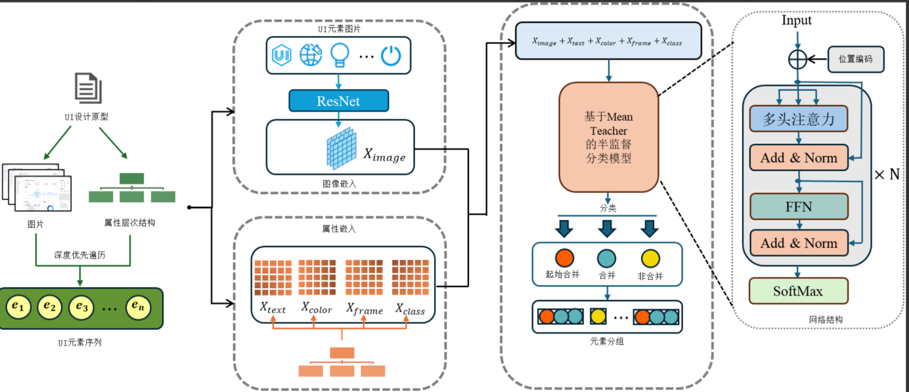
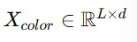
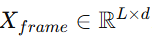
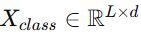

# 资料阅读笔记整理

[TOC]

## 1. 研究背景与创新点简述

### 1.1 背景：自动代码生成+UI设计原型的碎片化和重叠元素分类

如何根据UI设计原型图片，高效自动生成前端代码。应用的技术应该是图像分割、分类和代码生成。

#### 1.1.1  UI设计原型的碎片化和重叠问题： 

在自动化代码生成中，**UI设计原型中的碎片化和重叠元素**是一个重要问题。这些元素如果直接用于生成代码，可能会影响生成代码的效率和质量。

比如，一个复杂的UI设计可能包含许多重叠的小按钮、边框或者分割线，这些元素在代码生成时需要被正确分组和分类，以确保最终的代码逻辑简洁、清晰。

#### 1.1.2  基于端到端分类的现有基线 ：

当前的研究中，基于**端到端分类模型**的方法被认为是效果最佳的（即直接通过输入原始设计，模型自动完成对UI元素的分类和分组）。

但进一步的研究受到限制，原因在于**标注数据集的稀缺性**：UI设计相关的标注数据集数量少，且标注过程复杂。

### 1.2  本文的研究贡献 

#### 1.2.1 半监督学习方法【？！】：

- 为了解决标注数据稀缺的问题，本文提出了一种基于半监督学习的训练方法
  - 半监督学习指的是结合**少量标注数据**和**大量未标注数据**进行模型训练，从而降低对大量标注数据的依赖。
  - 这使得研究门槛降低，同时也为模型在有限数据条件下的高效学习提供了可能性。

#### 1.2.2  新型元素嵌入方式【？！】：

- 为了进一步提升模型效果，本文提出了一种**新型元素嵌入方式**
  - 可能是通过引入更加先进的表示方法，将UI元素的特征进行更高效的编码，使得模型能够更准确地理解和分类这些元素。
  - 这种优化使模型结构更高效，分类和分组的性能也有所提高。

### 1.3 创新点

> 本文采用端到端的UI元素分类技术，结合了高效的半监督学习框架Mean Teacher，不仅极大减少了对大规模人工数据标注的依赖，而且显著提升了模型在UI设计原型自动解析和元素识别方面的性能。这种方法不仅降低了人力成本，加快了项目迭代速度，还通过自动化代码生成提高了开发效率，并减少了手动编码错误。此外，它促进了设计到开发的快速转化，鼓励了个性化设计和产品创新，同时提高了工作流程的效率和最终产品的质量和一致性。

 本文的创新点在于通过**构建小型高质量数据集**和**半监督学习方法**，在数据稀缺的情况下，成功训练出了一个高质量的UI元素分类模型。通过这种方式，不仅有效提升了分类性能，还降低了数据标注的成本，为后续的研究提供了有价值的资源和方法。 

**1. 结合半监督学习**：有效利用未标注数据，降低对数据标注的依赖。

**2. 优化模型结构**：通过新型元素嵌入方式提升模型性能。

**3. 性能显著提升**：特别是在数据稀缺的情况下，实验结果展示了其方法的显著优越性。

这些成果可以直接应用于**UI设计工具和自动化代码生成系统中，比如将设计图快速转化为高效的前端代码。** 

## 2. UI设计原型图与自动化代码生成关系

### 2.1 什么是设计原型图

推荐阅读： [原型图是什么？5分钟带你了解原型图！](https://www.mockplus.cn/blog/post/1630) 

设计原型是软件开发中一种**直观可视化的工具**，通过它可以展示产品的界面布局和交互逻辑。它帮助团队在开发前明确产品的功能和外观，比如页面结构、按钮布局、用户交互路径等。 

在实际开发中，原型可以作为桥梁，将产品创意（想法）转化为实际的代码实现。

尤其是结合**自动化代码生成技术**时，**原型的界面和交互逻辑可以直接转化为可执行代码，从而节省开发时间。**

### 2.2  自动化代码生成的挑战 

**碎片化元素**：

- 指的是设计中一些过**于细小、零散的视觉元素**，比如：
  - 页面中独立的装饰性小图标；
  - 重叠的多层布局，比如一段文字被按钮或图片覆盖。
- 这些碎片化元素如果没有被合理分组，会导致以下问题：
  - **视觉不一致**：生成的界面看起来杂乱无章，用户体验差。
  - **开发复杂性增加**：生成的代码难以维护，开发者很难分清哪些是关键元素，哪些是装饰元素。
  - **交互冲突**：比如点击某个按钮时，可能触发了不必要的事件。
  - **性能下降**：大量无用或重复的元素会拖慢界面加载速度。

**重叠元素**：

- 指的是设计中**某些UI元素在空间上存在重叠**，比如：
  - 一个按钮与装饰图标重叠；
  - 文本内容被图片遮挡。
- 重叠会导致自动生成的代码逻辑变得复杂：
  - 不清楚哪个元素应该被用户优先交互；
  - 或者生成的代码可能会因为层级关系错误而导致功能异常。

### 2.3 **元素分组的重要性**

> 将设计原型中属于同一组件的分散元素进行有效整合。这一环节被称为“碎片元素分组问题”，它对于后续的代码生成至关重要[10]

- **什么是元素分组？**

  - 元素分组是指**将页面中碎片化或重叠的UI元素进行分类、归纳和组织**，从而形成明确的组件或结构化布局。
  - **比如：一个按钮的背景图案、图标和文字可以被分组为一个整体按钮组件，而不是单独的三个独立元素。**

- **为什么分组是关键？**

  - 提高界面的可维护性
    - 分组后的组件结构更清晰，方便后续的开发和维护。
    - 开发者可以直接修改某个组件，而不用担心破坏整个页面布局。
  - 提升交互的清晰度
    - 分组可以明确哪些是核心交互元素，哪些是装饰性元素，避免用户混淆或交互冲突。
  - 性能优化
    - 分组后可以减少重复元素的渲染，提高页面的加载速度。

  

### 2.4 碎片化和重叠问题的成因

- 设计过程中的问题
  - 缺乏整体规划
    - 一些设计师在设计初期并没有明确的布局规范，导致页面中的元素显得杂乱。
    - 比如：按钮、图标、背景图案没有统一的样式或位置，导致自动生成代码时难以提取规律。
  - 对用户行为理解不足
    - 如果设计师不了解用户的操作习惯，就可能在界面中放置多余的装饰性元素，或者安排不合理的交互逻辑。
  - 设计工具的限制
    - 一些设计工具不能很好地处理UI元素的分组和分层，导致设计文件在导出时出现碎片化的问题。
    - 比如：设计工具生成的文件中每一个小装饰图标都被单独存储，无法自动整合为一个组件。

## 3. 问题挑战——缺少高质量的UI元素分类数据集 

>为了应对这些挑战，许多研究工作[10,11,12,13,14]聚焦于开发智能分组方法，通过**分析视觉语义和构建视图层次，将碎片化元素和重叠元素有效地组织成逻辑清晰、易于管理的组**。UI检测技术在此过程中发挥着重要作用，它能够识别界面中的元素并为后续的分类和组织提供基础数据。
>
>基于对UI元素进行端到端分类的模型[14]在所有基线中取得了最佳的结果，其关键在于对UI碎片化元素的准确分类。然而，这一过程**受限于标注数据集的稀缺性**。为解决这一问题，**本文创新性地构建了小型但高质量的UI元素分类标注数据集，并引入了半监督学习方法，巧妙地将少量标注数据与大量未标注数据融合，利用模型预测结果作为一致性正则化手段，有效提升了在有限标注数据条件下的分类性能。**

**半监督学习方法**：

- 除了依赖标注数据，本文还引入了**半监督学习**方法，这是一种结合标注数据和未标注数据的学习方法。具体来说，半监督学习利用少量标注数据和大量未标注数据共同训练模型，借助未标注数据中的潜在信息来提升模型的分类性能。

**一致性正则化**：

- **技术**：在半监督学习中，**一致性正则化**是一个常用技巧。其核心思想是，在模型训练过程中，尽管有些数据未标注，但通过模型预测出的结果应当与输入数据的变换（如图像的轻微修改、噪声等）保持一致。如果一个输入数据的某种扰动对预测结果没有显著影响，那么模型在该样本上的预测就是可信的。
- **作用**：通过将未标注数据的预测结果作为一种正则化手段，模型能够从有限的标注数据中学习到更多的规律，进而提升分类性能。

**融合少量标注数据与大量未标注数据**

- **融合方法**：通过半监督学习，本文巧妙地将**少量标注数据与大量未标注数据融合**在一起。标注数据为模型提供了正确的标签信息，而未标注数据则通过一定的机制（如预测生成伪标签）帮助模型在标签信息不足的情况下仍然能够有效学习。
- 具体而言，**未标注数据通过模型的预测结果被“伪标注”，并且这些伪标注数据也被作为训练的一部分参与进来。**这样，模型在训练时不仅学习标注数据的信息，还能够从未标注数据中获取潜在的结构信息。

## 4. 具体研究思路和方法

> 如图1所示，本文模型包括三个部分：(1)数据预处理——从UI原型文件中提取元素的特征并生成UI元素数据集；(2)元素分类——对UI元素进行端到端分类；(3)半监督学习——使用少量标注数据和大量未标注数据进行训练。本文模型结合了端到端分类方法和半监督学习方法，不需要对大量数据集进行人工标注，使用少量标注数据即可达到非常优秀的分类效果，使得UI元素分类的门槛大大降低。

## 5. 数据集处理

> 为了有效提取各图层中的元素信息，我们采用了深度优先遍历方法，并导出图像文件以及记录每个元素属性的JSON文件。经过这一信息提取过程，每个数据都包含三个核心文件：原型图文件、元素堆叠图文件以及元素属性文件。
>
> 为了获取更广泛的数据样本，我们在OurSketch网站上爬取了1000多个Sketch原型文件。经过数据预处理后，我们最终获得了1230个可用的数据，为后续的研究和分析提供了坚实的基础。

 在本文中，数据预处理包括生成UI元素数据集，提取UI元素的多模态特征，并将这些特征进行嵌入，最终构建一个适合分类任务的训练数据集。 

### 5.1 原型图数据集 

 **UI设计原型**：UI原型文件是应用程序或网站的设计蓝图，展示了软件或应用程序的用户界面。原型文件通常以JSON格式存储，描述了界面中的每个元素的位置、大小、颜色等属性。 

 **Sketch原型文件**：本文提到的原型文件是由**Sketch**（一种流行的UI设计工具）创建的，Sketch文件包含了UI元素的层级结构，多个图层嵌套在一起。每个图层可以包含多个UI元素，表示界面上的不同组件。SketchTool是一款命令行工具，它能帮助解析和操作这些文件，导出其中的UI元素数据。 

 **深度优先遍历**：在提取UI元素数据时，本文采用了深度优先遍历（DFS）的方式。这种方法类似于树的前序遍历，可以确保每个图层及其元素都被全面检查，并导出元素的详细信息。 

 **数据爬取与预处理**：为获取更多的UI元素数据，研究者爬取了1000多个Sketch原型文件，经过处理后得到了1230个有效数据点。这为后续的UI元素分类和分析提供了坚实的基础。 

UI原型文件+爬虫爬取的1000个Sketch原型文件   ------>  深度优先遍历提取UI元素数据（确保每个图层及其元素被全面检查） -------->  每个数据点包括**原型图文件、元素堆叠图文件和元素属性文件**

### 5.2  数据标注 

 **标注策略**：数据标注是UI元素分类的关键步骤之一，然而，标注大量数据是非常耗时且成本高昂的。为了应对这一挑战，本文采用了精细化的标注策略：选取了100个原型图数据进行专业标注。 

**标注类别**：每个UI元素被分配了一个标签，标签的种类包括、和。标注的目的是为了帮助模型识别UI元素在界面中的逻辑关系。具体来说：

- **起始合并**：每个合并组的第一个元素被标记为“起始合并”。

- **合并**：属于同一合并组的其他元素被标记为“合并”。

- **非合并**：不属于任何合并组的元素标记为“非合并”。

 **专业审核**：在标注完成后，作者（前端开发人员）对标注结果进行了详细审核，确保标注数据的高质量和准确性。 

### 5.3  特征嵌入 

 特征嵌入是将UI元素的各种特征转化为机器学习模型可以处理的向量形式。这些特征可以是图像、文本、颜色、框架等。 

#### 5.3.1 图像嵌入

- **图像编码**：UI元素的图像是进行分类和分析的一个重要信息来源。传统的做法是将UI图像块（包含元素和背景信息）进行编码，但这样会存在重叠元素带来的冗余信息，影响模型的分类精度。因此，本文选择了**独立编码每个元素的图像**，而不是将元素放入可能包含冗余信息的整体图像块中。
- **图像处理**：所有元素图像被统一调整为尺寸为 **3×64×64** 像素的大小，这样能够保证训练数据的一致性，并有效提升训练效率。
- **ResNet-50模型**：为了提取图像的特征，本文采用了**ResNet-50**模型，这是一个深度卷积神经网络（CNN），常用于图像分类任务。ResNet的设计特点使得它能更好地处理深层网络中的梯度消失问题，从而提取出更加有效的图像特征。
- **输出特征**：通过对ResNet-50模型的调整，最终输出一个 **二维张量** 其中每一行表示一个UI元素的视觉特征。

#### 5.3.2  属性嵌入 

**文本嵌入**：UI元素的文本描述（如按钮文字、标签等）是理解和组织UI元素的重要信息。本文使用了模型的预训练分词器进行文本的处理。RoBERTa相较于BERT，具有更强的多语言处理能力，能够更好地处理Unicode字符和专业领域的术语。

**颜色嵌入**：UI元素的颜色信息被表示为RGB（红、绿、蓝）和透明度（Alpha）。颜色被标准化到[0, 1]之间，并通过**全连接层**进行处理，生成一个 **二维张量**   表示元素的颜色特征。

**框架嵌入**：UI元素的边框信息（如位置和尺寸）也被转化为特征。边框信息通常以 **[x, y, w, h]** 形式表示，其中 (x, y) 是左上角坐标，(w, h) 是宽度和高度。边框信息经过**最小-最大归一化**后，通过全连接层转化为 **二维张量**  。

**类标签嵌入**：每个UI元素都有一个类别标签（如按钮、文本框等）。这些标签被转化为 **嵌入矩阵**  ，以便模型能够识别元素所属的类别。

## 6. 数据集构成

数据集的构成分为三类：**标注数据集**和**未标注数据集**。

- **标注数据集**：这些数据集中的原型图已经被人工标注了UI元素的类别（如“合并”、“非合并”等），可以用来进行监督学习（Supervised Learning）。
- **未标注数据集**：这些原型图的UI元素没有被标注，它们可以用于半监督学习（Semi-Supervised Learning），用于帮助模型学习更加泛化的特征。

### 6.1 数据集A：强监督学习数据集 

**数据来源**：从标注过的100个原型图中，进行80%作为训练集，20%作为测试集的划分。

**训练集与测试集的比例**：训练集包含80个原型图，测试集包含20个原型图。

### 6.2  数据集B：小型半监督学习数据集 

**数据来源**：标注数据集与未标注数据集的结合。

**训练集划分**：训练集由80个标注过的原型图和一部分未标注数据组成。

- **标注数据**和**未标注数据**的比例为 **7:1**，即标注数据占训练集的7成，未标注数据占3成。

- **测试集**的划分与数据集A相同，仍然是从标注数据中随机选取80%作为训练集，20%作为测试集。

### 6.3  数据集C：半监督学习数据集 

**数据来源**：数据集C包含所有的标注数据和未标注数据。

- **标注数据**：从标注过的100个原型图中，按80%:20%分割成训练集和测试集。

- **未标注数据**：从900个未标注的原型图中取出全部数据作为训练集的未标注部分。

- **训练集**包含标注数据和未标注数据的组合，测试集包含标注数据。

**数据集A**：适用于**强监督学习**，主要使用标注数据，划分成训练集和测试集，用于训练和评估模型的性能。

**数据集B**：适用于**小型半监督学习**，结合了标注数据和未标注数据，其中标注数据占80%，未标注数据占20%，并且测试集保持不变。

**数据集C**：适用于**半监督学习**，同时包含了标注数据和大量未标注数据，未标注数据比重较大，训练集包含大部分未标注数据，适用于半监督学习的任务。

## 推荐链接阅读

 [原型图是什么？5分钟带你了解原型图！](https://www.mockplus.cn/blog/post/1630) 

## 暂时的问题

1. 这里的端到端分类模型是起到一个什么作用？
2. 这里的新数据集有什么特点，是有什么分类点，什么文字，类型之类的。

