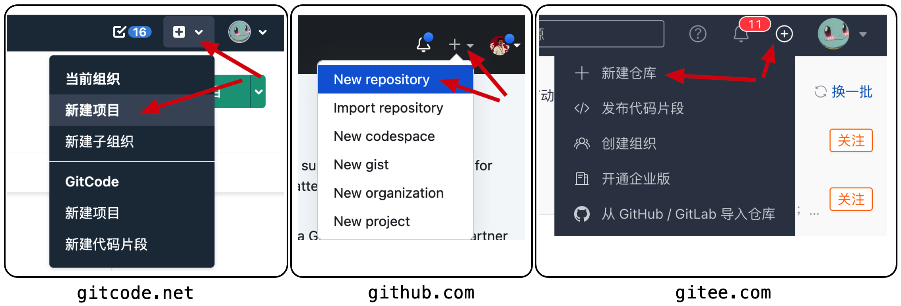
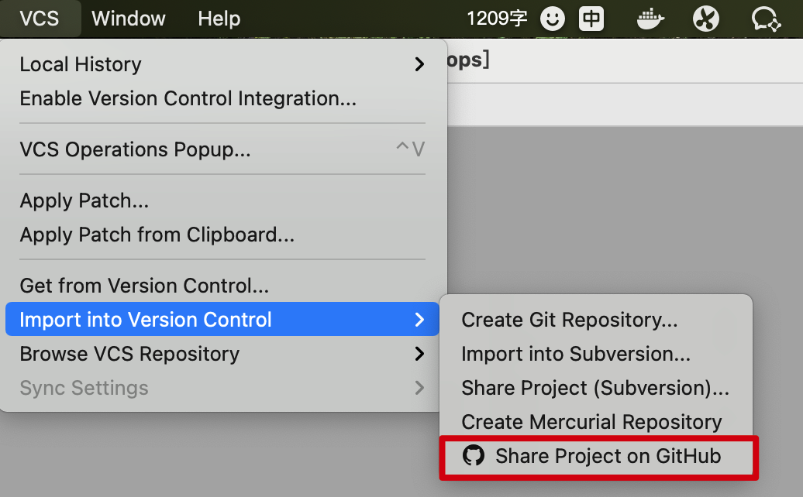
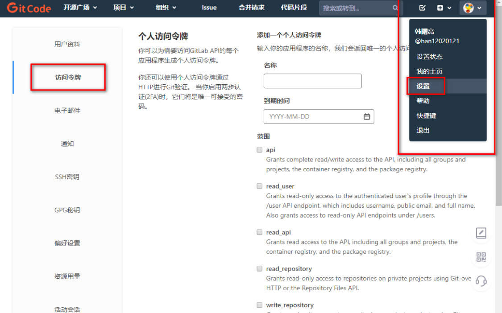

# dev-ops学习笔记

## 1. git创建仓库和连接

1. **创建仓库**

   

2. **代码提交**

   - **方式1**；你可以先在 gitcode 创建一个仓库，之后在 IDEA 中从仓库拉取，**或者用 git clone 地址 的方式拉取代码，在通过 IntelliJ IDEA 打开，之后再里面创建代码就可以提交了**。

   - **方式2**；像 IntelliJ IDEA 中可以把本地创建好的代码仓库，**通过 VCS 工具 Share 到 Github 仓库中**，这个时候是可以自动创建出一个原创仓库地址的。

     

   - **方式3**；因为本身本地代码和远程仓库，大部分时候就是没有谁先谁后的。希望只要是本地有这套代码，就可以随时 PUSH 到一个新创建的仓库中。**如图点击 Create Git Repository 创建一个本地仓库，之后 Command + Shift + K 填写远程仓库地址即可**。

3. **注意事项**

   1. git连接远程仓库时，输入的密码是个人访问令牌。

       点击右侧头像 , 然后选择 " 设置 " , 在设置界面的 " 访问令牌 " 可以生成 " 个人访问令牌 " , 此处生成的 个人访问令牌 可以作为上面的 GitCode 提交代码时的密码使用 ; 

      