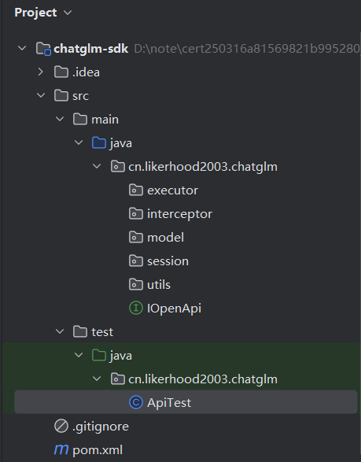
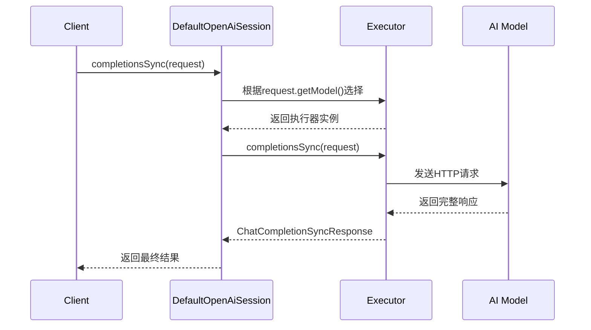
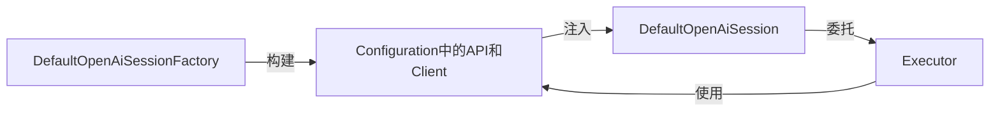
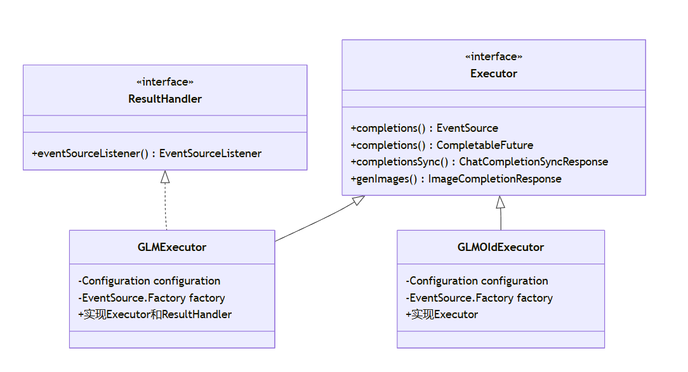
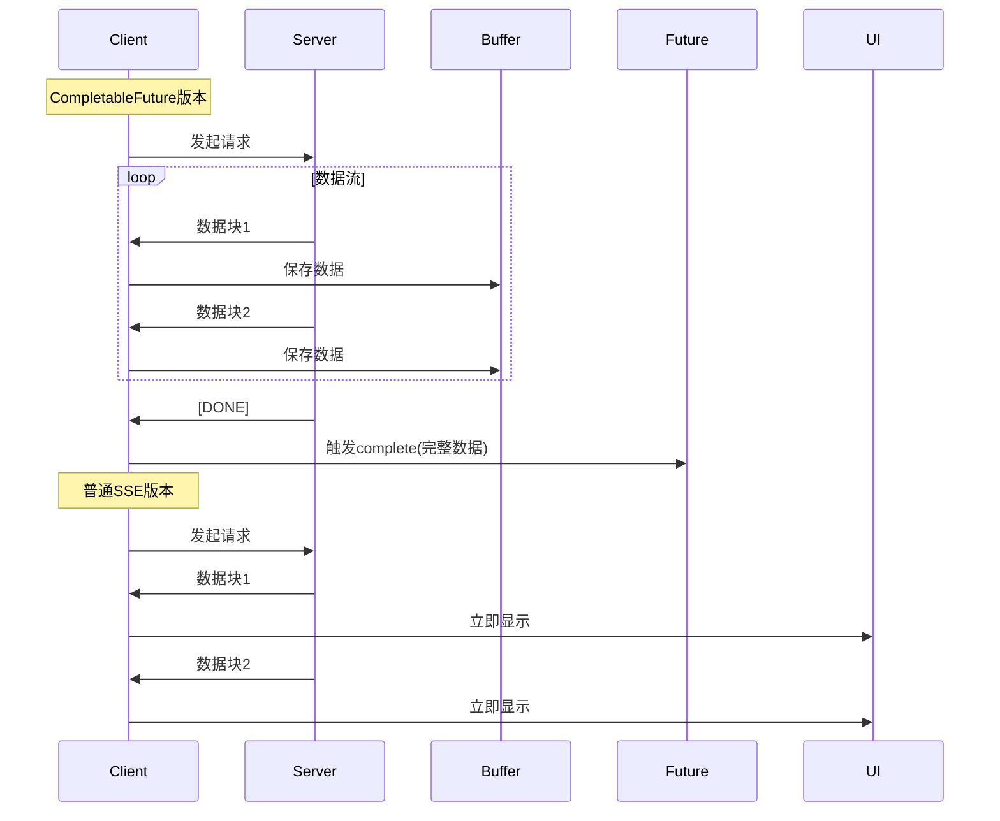
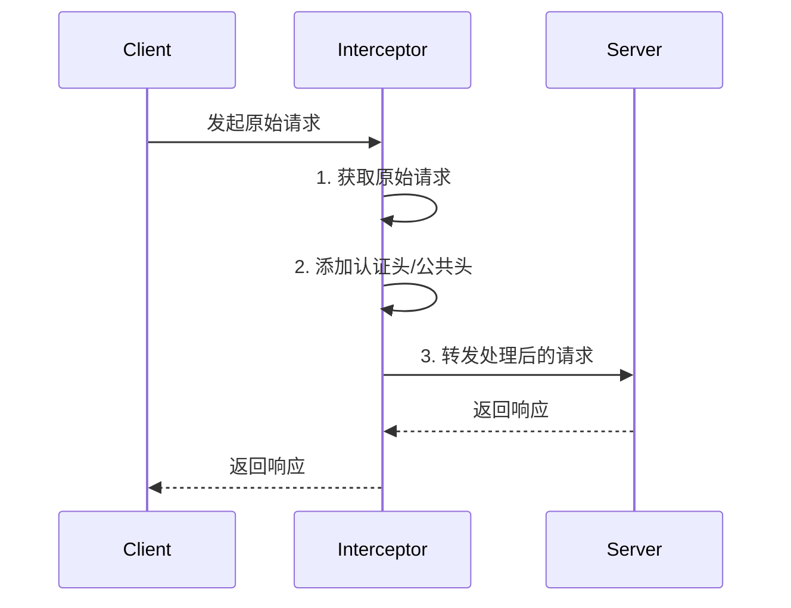

# chatglm-sdk项目构建

[toc]


## 总览


## 1. maven构建配置

maven构建项目的资源配置文件是 **pom.xml**

1. `<properties>`定义项目各种属性，在项目其他部分可以通过${属性名}的方式引用这些属性值

   ```xml
   <properties>
       <java.version>1.8</java.version>
       <project.build.sourceEncoding>UTF-8</project.build.sourceEncoding>
       <maven.compiler.source>1.8</maven.compiler.source>
       <maven.compiler.target>1.8</maven.compiler.target>
       <retrofit2.version>2.9.0</retrofit2.version>
       <slf4j.version>2.0.6</slf4j.version>
       <maven-javadoc-plugin.version>3.2.0</maven-javadoc-plugin.version>
       <maven-source-plugin.version>3.2.1</maven-source-plugin.version>
       <maven-gpg-plugin.version>1.6</maven-gpg-plugin.version>
       <maven-checksum-plugin.version>1.10</maven-checksum-plugin.version>
   </properties>
   ```

2. `<dependencies>` 引入的jar包资源的版本

   ```xml
   <dependencies>		
   		<dependency>
               <groupId>org.slf4j</groupId>
               <artifactId>slf4j-api</artifactId>
               <version>${slf4j.version}</version>
           </dependency>
           <dependency>
               <groupId>org.slf4j</groupId>
               <artifactId>slf4j-simple</artifactId>
               <version>${slf4j.version}</version>
           </dependency>
           <dependency>
               <groupId>com.squareup.okhttp3</groupId>
               <artifactId>okhttp-sse</artifactId>
               <version>3.14.9</version>
           </dependency>
       ...
   </dependencies>
   ```

3. ` <build> `用于定义 **构建过程中的所有配置**  ，包括：

   - **插件管理**：指定编译、测试、打包等生命周期阶段使用的插件。
   - **资源处理**：配置源代码、资源文件的路径和过滤规则。
   - **目录结构**：自定义源码目录、输出目录等（覆盖默认约定）。

   ```xml
   <build>
       <plugins>
           <plugin>
               <groupId>org.apache.maven.plugins</groupId>
               <artifactId>maven-surefire-plugin</artifactId>
               <version>2.12.4</version>
               <configuration>
                   <skipTests>true</skipTests>
               </configuration>
           </plugin>
       </plugins>
   </build>
   ```


## 2. 项目结构

```
chatglm-sdk-java/
│
├─ src/
│  ├─ main/
│  │  └─ java/
│  │     └─ cn/
│  │        └─ bugstack/
│  │           └─ chatglm/
│  │              │
│  │              ├─ model/                # 数据模型包，定义了所有与API交互的请求、响应、枚举等
│  │              │    ├─ ChatCompletionRequest.java         # 对话请求参数模型
│  │              │    ├─ ChatCompletionResponse.java        # 对话流式响应模型
│  │              │    ├─ ChatCompletionSyncResponse.java    # 对话同步响应模型
│  │              │    ├─ EventType.java                     # 事件类型枚举（如add、finish
│  │              │    ├─ ImageCompletionRequest.java        # 图片生成请求参数模型
│  │              │    ├─ ImageCompletionResponse.java       # 图片生成响应模型
│  │              │    ├─ Model.java                         # 支持的模型枚举
│  │              │    ├─ Role.java                      # 对话角色枚举（如user、assistant）
│  │              │    └─ ...                                # 其他与API数据相关的类
│  │              │
│  │              ├─ session/          # 会话与配置相关，负责API配置、会话工厂、会话对象等
│  │              │    ├─ Configuration.java              # API配置类，管理host、密钥、超时等
│  │              │    ├─ OpenAiSession.java              # 会话接口，定义对话、图片等API方法
│  │              │    ├─ OpenAiSessionFactory.java       # 会话工厂接口
│  │              │    └─ defaults/
│  │              │         └─ DefaultOpenAiSessionFactory.java # 默认会话工厂实现
│  │              │         └─ DefaultOpenAiSession.java        # 默认会话实现，封装具体API
│  │              │
│  │              ├─ executor/              # 执行器包，封装不同模型的请求实现
│  │              │    ├─ Executor.java                        # 执行器接口
│  │              │    ├─ aigc/
│  │              │    │    ├─ GLMExecutor.java                # 新版GLM模型执行器
│  │              │    │    └─ GLMOldExecutor.java             # 旧版GLM模型执行器
│  │              │    └─ result/
│  │              │         └─ ResultHandler.java              # 结果处理器接口
│  │              │
│  │              ├─ interceptor/           # 网络拦截器包
│  │              │    └─ OpenAiHTTPInterceptor.java     # 请求拦截器，自动加token、设置请求头
│  │              │
│  │              ├─ utils/                 # 工具类包
│  │              │    └─ BearerTokenUtils.java               # Token生成与缓存工具
│  │              │
│  │              └─ IOpenAiApi.java        # Retrofit接口定义，声明所有API路径和方法
│  │
│  └─ test/
│     └─ java/
│        └─ cn/
│           └─ bugstack/
│              └─ chatglm/
│                 └─ test/
│                     └─ ApiTest.java       # 测试用例，演示各种模型和API调用方式
│
├─ pom.xml                                   # Maven项目配置文件，声明依赖和构建信息
└─ README.md                                 # 项目说明文档
```




​	


## 3. 代码梳理

### 3.1 OpenAi发送请求的接口

  ```java
IOpenAPi.java

package cn.bugstack.chatglm;

import cn.bugstack.chatglm.model.*;
import io.reactivex.Single;
import retrofit2.http.Body;
import retrofit2.http.POST;
import retrofit2.http.Path;

public interface IOpenAiApi {

    String v3_completions = "api/paas/v3/model-api/{model}/sse-invoke";
    String v3_completions_sync = "api/paas/v3/model-api/{model}/invoke";

    @POST(v3_completions)
    Single<ChatCompletionResponse> completions(@Path("model") String model, @Body ChatCompletionRequest chatCompletionRequest);

    @POST(v3_completions_sync)
    Single<ChatCompletionSyncResponse> completions(@Body ChatCompletionRequest chatCompletionRequest);

    String v4 = "api/paas/v4/chat/completions";

    String cogview3 = "api/paas/v4/images/generations";

    @POST(cogview3)
    Single<ImageCompletionResponse> genImages(@Body ImageCompletionRequest imageCompletionRequest);

}

  ```

- @POST(...) 注解用于声明 HTTP POST 请求的路径。
- Single<...> 是 RxJava 的响应式类型，适合异步处理。
- completions(@Body ...) 方法用于发起同步对话请求，参数是请求体，返回对话响应。
- 服务器返回的 JSON 会自动反序列化为 ChatCompletionSyncResponse ，你可以直接拿来用。


### 3.2 model部分

定义关于网络请求中关于openai模型请求体和响应体的对象包装

- ChatCompletionRequest 、 ChatCompletionResponse 、 ChatCompletionSyncResponse ：用于对话类接口的请求和响应。
- ImageCompletionRequest 、 ImageCompletionResponse ：用于图片生成接口的请求和响应。
- EventType 、 Model 、 Role ：用于枚举和类型约束，保证参数和返回值的规范性。
这些 model 类是整个 SDK 的数据基础，负责与 API 的请求和响应结构一一对应，方便你在业务代码中进行类型安全的调用和处理。


#### 3.2.1 Model.java

用枚举类定义相关模型的编码和模型信息。


#### 3.2.2 Role.java

枚举类定义这条消息的产生者是什么角色，包括用户，ai助手和系统。


#### 3.2.3 EventType.java

- EventType 是流式对话接口返回数据的类型标识。
- 你在监听模型返回数据时，需要根据 EventType 判断当前收到的数据属于哪种类型，并做相应处理。
- 当你用流式方式（如 SSE）请求 GLM 模型时，服务器不会一次性返回完整的结果，而是会 分多次推送数据 。每次推送的数据类型不同，需要用 EventType 来区分和处理。
   具体含义
  - add ：增量数据。每收到一次 add ，就代表模型生成了一部分新内容（比如一段文本）。
  - finish ：结束。所有内容推送完毕，流式响应结束。
  - error ：错误。请求过程中发生了异常或错误。
  - interrupted ：中断。对话被中断（如超时、手动终止等）。

```java
@AllArgsConstructor
@Getter
public enum EventType {

    add("add", "增量"),
    finish("finish", "结束"),
    error("error", "错误"),
    interrupted("interrupted", "中断"),

    ;
    private final String code;
    private final String info;

}
```


#### 3.2.4 ChatCompletionRequest.java

##### 1.注解

```java
@Data
@Slf4j
@JsonInclude(JsonInclude.Include.NON_NULL)
@Builder
@NoArgsConstructor
@AllArgsConstructor

@JsonProperty("request_id")
```
 1. **@Data （Lombok 提供）**

    - 自**动为类生成 getter/setter、toString、equals、hashCode 方法。**

    * 适用于 POJO 数据类，极大减少样板代码。 

2. **@Slf4j （Lombok 提供）**

   - **自动为类生成一个名为 log 的日志记录器（Logger）对象。**

   - 直接用 **log.info(...) 、 log.error(...) 等方法进行日志输出，无需手动声明 Logger。** 

 3.  **@JsonInclude(JsonInclude.Include.NON_NULL) （Jackson 提供）**

    - 控制 JSON 序列化行为。

    - 作用：**当对象序列化为 JSON 时， 只包含非 null 的字段 ，null 字段会被自动忽略。**

    - 请求体更简洁，避免传递无意义的 null 字段。

 4. @**Builder （Lombok 提供）**

    - 为类自动生成 **Builder 模式**的代码。

    - 用 **ChatCompletionRequest.builder().model(...).messages(...).build()** 这种链式方式构建对象，代码更优雅、可读性更好。

 5. **@JsonProperty("request_id")**

    -  是 Jackson 提供的注解，用于 指定 Java 字段在序列化为 JSON 时对应的 key 名称 。
    - **默认情况下，Java 字段名和 JSON 字段名是一样的，比如 requestId 会被序列化为 "requestId" 。**
    - **使用 @JsonProperty("request_id") 后，这个字段在 JSON 里会变成 "request_id" ，而不是 "requestId" 。**
    - 这样做的好处是可以让 Java 代码风格（驼峰命名）和后端/接口要求的 JSON 风格（下划线命名）保持一致。


##### 2. 代码讲解

**ChatCompletionRequest 类是用来封装一次对话请求的所有参数，最终会被序列化为 JSON，通过 HTTP 请求发送给后端大模型服务。**

json数据如下：

```json
{
  "model": "glm-4",
  "messages": [
    {
      "role": "user",
      "content": "请帮我查一下今天北京的天气。"
    }
  ],
  "tools": [
    {
      "type": "web_search",
      "web_search": {
        "enable": true,
        "search_query": "北京天气"
      }
    }
  ],
  "tool_choice": "auto"
}
```


响应数据json如下：

```json
{
    "choices": [
        {
            "finish_reason": "stop",
            "index": 0,
            "message": {
                "content": "根据您提供的信息，今天北京的天气情况如下：\n- 日期：2025年04月19日\n- 白天天气：多云\n- 最高气温：21摄氏度\n- 白天风向：西南风\n- 白天风力：<3级\n- 夜间天气：晴\n- 最低气温：11摄氏度\n- 夜间风向：西南风\n- 夜间风力：<3级\n- 当前气温：20.4摄氏度\n- 当前风向：北风\n- 当前风力：1级\n- 湿度：45%\n- 空气质量：38\n\n请注意，这些信息是基于您提供的参考数据，如果需要最新和最准确的天气信息，建议查询当地的气象服务。",
                "role": "assistant"
            }
        }
    ],
    "created": 1745043790,
    "id": "20250419142304b01904e34d674480",
    "model": "glm-4",
    "request_id": "20250419142304b01904e34d674480",
    "usage": {
        "completion_tokens": 154,
        "prompt_tokens": 392,
        "total_tokens": 546
    }
}
```


##### 3. 嵌套类

- messages ：新模型用，推荐用法，兼容 OpenAI 风格。
- prompt ：老模型用，兼容历史接口。

1. **Prompt**

- 作用 ：表示一条对话消息（如用户或助手的发言）。
- 字段 ： role （角色）， content （内容）。
- 嵌套类 ：
  - PromptBuilder ：构造者模式，便于链式构建 Prompt 对象。
    - 支持 content(String) 和 content(Content) 两种方式。
  - Content ：多模态内容结构，支持文本、图片等。
    - 字段： type （内容类型）， text （文本）， imageUrl （图片对象）。
    - Type （enum）：内容类型枚举（text、image_url）。
    - ImageUrl ：图片内容的 url 封装。
2. **Tool**

- 作用 ：描述大模型可调用的外部工具（如函数、知识库、联网搜索）。
- 字段 ： type （工具类型）， function ， retrieval ， webSearch 。
- 嵌套类 ：
  - Type （enum）：工具类型枚举（function、retrieval、web_search）。
  - Function ：函数工具的详细描述。
    - 字段： name （函数名）， description （描述）， parameters （参数 Json Schema）。
  - Retrieval ：知识库检索工具的详细描述。
    - 字段： knowledgeId （知识库ID）， promptTemplate （检索模板）。
  - WebSearch ：联网搜索工具的详细描述。
    - 字段： enable （是否启用）， searchQuery （自定义搜索内容）。
3. **结构层级图**

```plaintext
ChatCompletionRequest
├── Prompt
│   ├── PromptBuilder
│   └── Content
│       ├── Type (enum)
│       └── ImageUrl
└── Tool
    ├── Type (enum)
    ├── Function
    ├── Retrieval
    └── WebSearch
```

- Prompt 相关嵌套类用于描述对话消息及其多模态内容。
- Tool 相关嵌套类用于描述模型可用的外部工具及其详细参数。


#### 3.2.5 ChatCompletionResponse.java

流式websearch请求体：

```json
{
  "model": "glm-4",
  "messages": [
    {
      "role": "user",
      "content": "openai是什么？请给我相关网页链接。"
    }
  ],
  "tools": [
    {
      "type": "web_search",
      "web_search": {
        "enable": true,
        "search_query": "openai是什么",
        "search_result": true
      }
    }
  ],
  "tool_choice": "auto"
}
```


响应体：

```json
{
    "choices": [
        {
            "finish_reason": "stop",
            "index": 0,
            "message": {
                "content": "OpenAI是一个位于美国的人工智能研究实验室，由营利性组织OpenAI LP和非营利性组织OpenAI Inc组成。它成立于2015年底，由硅谷的多位杰出人物共同创立，包括山姆·阿尔塔曼和伊隆·马斯克等。该组织的宗旨是推动和发展友好的人工智能，以利于整个人类社会。\n\n以下是与OpenAI相关的网页链接：\n- OpenAI官网: https://openai.com/\n- OpenAI API接口: https://openai.com/api/\n\n请注意，有些内容或服务可能因为地区限制而无法在中国大陆直接访问。",
                "role": "assistant"
            }
        }
    ],
    "created": 1745066639,
    "id": "202504192043523289269557954cf4",
    "model": "glm-4",
    "request_id": "202504192043523289269557954cf4",
    "usage": {
        "completion_tokens": 124,
        "prompt_tokens": 2840,
        "total_tokens": 2964
    },
    "web_search": [
        {
            "content": "介绍\nOpenAI（开放人工智能）是美国一个人工智能研究实验室，由营利组织 OpenAI LP 与母公司非营利组织 OpenAI Inc 所组成，目的是促进和发展友好的人工智能，使人类整体受益。OpenAI成立于2015年底，总部位于加利福尼亚州旧金山，组织目标是通过与其他机构和研究者的自由合作”，向公众开放专利和研究成果。创始人山姆·柯曼以及伊隆·马斯克的动机是出于对强人工智能潜在风险的担忧。]至2018年，OpenAI的总部坐落于旧金山的米慎区，与伊隆·马斯克的另一座公司Neuralink在同一办公室大楼。\n历史\n2015年底，OpenAI成立，总部位于加利福尼亚州旧金山，组织目标是通过与其他机构和研究者的自由合作”，向公众开放专利和研究成果。[5][6]\n2016年，OpenAI宣称将制造通用”机器人，希望能够预防人工智能的灾难性影响，推动人工智能发挥积极作用。[10]\n2019年3月1日成立OpenAI LP子公司，目的为营利所用。[11]\n2019年7月22日微软投资OpenAI 10亿美元，双方将携手合作替Azure云端平台服务开发人工智能技术。2020年6月11日宣布了GPT-3语言模型，微软于2020年9月22日获取独家授权。[12][13]\n2022年11月30日，OpenAI发布了一个名为ChatGPT的自然语言生成式模型[14]，它以对话方式进行交互。在研究预览期间，用户注册并登陆后可免费使用ChatGPT。[15]但是该项目对一些包括中国大陆、香港在内的地区暂不可用。\n2023年3月2日，OpenAI发布了官方ChatGPT AP",
            "link": "http://www.ppmy.cn/news/972750.html",
            "refer": "ref_1",
            "title": "openai 介绍"
        }
    ]
}
```


所以根据这里类似的增加json嵌套。


#### 3.2.6 ImageCompletionRequest.java

根据文字描述画图，请求体类，其中请求体json：[参考](https://open.bigmodel.cn/dev/api/image-model/cogview)

```json
{
  "model": "cogview-3",
  "prompt": "日落下的城市风景"
}
```

响应体json：

```json
{
    "created": 1745069585,
    "data": [
        {
            "url": "https://sfile.chatglm.cn/testpath/09ed8d6b-7310-543b-b575-31797354020f_0.png"
        }
    ]
}
```


代码讲解：

```java
@Data
@Builder
@NoArgsConstructor
@AllArgsConstructor
@JsonInclude(JsonInclude.Include.NON_NULL)
public class ImageCompletionRequest {

    /**
     * 模型；24年1月发布了 cogview-3 生成图片模型
     */
    private Model model = Model.COGVIEW_3;

    /**
     * 所需图像的文本描述
     */
    private String prompt;

    public String getModel() {
        return model.getCode();
    }

    public Model getModelEnum() {
        return model;
    }

    // 便于返回合适的json
    @Override
    public String toString() {
        Map<String, Object> paramsMap = new HashMap<>();
        paramsMap.put("model", model.getCode());
        paramsMap.put("prompt", prompt);
        try {
            // 将map对象转换为json
            return new ObjectMapper().writeValueAsString(paramsMap);
        } catch (JsonProcessingException e) {
            throw new RuntimeException(e);
        }
    }

}


```


#### 3.2.7  ImageCompletionResponse.java

```java
@Data
public class ImageCompletionResponse {

    /**
     * 请求创建时间，是以秒为单位的Unix时间戳。
     */
    private Long created;

    private List<Image> data;

    @Data
    public static class Image{
        private String url;
    }

}
```


### 3.3 session部分

**统一创建和管理会话对象。**


#### 3.3.1 Configuration.java

**配置类，负责存储 API 地址、密钥、HTTP 客户端、执行器映射等全局配置。**

1. 存储api网络地址、apikey以及分割；

2. 定义了sse工厂，将okhttp放入sse创建工厂，后续其他地方使用只需要传入请求体request和监听器listener实现特定输出；

   ```java
   // 创建SSE监听器
   EventSourceListener listener = new EventSourceListener() {
       @Override
       public void onEvent(EventSource eventSource, String id, String type, String data) {
           // 处理服务器推送的数据
       }
   };
   
   // 使用配置创建工厂
   EventSource.Factory factory = configuration.createRequestFactory();
   
   // 创建SSE连接
   Request request = new Request.Builder()
       .url("https://api.example.com/stream")
       .build();
       
   EventSource eventSource = factory.newEventSource(request, listener);
   ```

3. 定义相关http配置；

4. 使用map实现了模型和执行器的对应，其实就是区分旧glm模型和新glm模型

   - **该设计非常巧妙，我们可以在这里配置其他的模型**
   - 定义一个configuration之后，这里实例化的所有执行器都是用同一个configuration，相当于不同厨师（executor）都拥有中央厨房（configuration）的钥匙。


#### 3.3.2 OpenAiSession / DefaultOpenAiSession

**OpenAiSession 接口是 ChatGLM SDK 的核心服务接口，定义了与大模型交互的各种方式。**

1. 流式对话 (SSE)

   ```
   EventSource completions(ChatCompletionRequest request, EventSourceListener listener)
   ```

   - 使用 Server-Sent Events 技术实现实时流式响应

   - 适合需要逐字显示结果的聊天场景

   - 通过 EventSourceListener 回调处理数据

2. 异步对话

   ```
   CompletableFuture<String> completions(ChatCompletionRequest request)
   ```

   - 返回 Future 对象实现非阻塞调用

   - 适合需要异步处理的场景

3. 同步对话

   ```
   ChatCompletionSyncResponse completionsSync(ChatCompletionRequest request)
   ```

   - 传统同步请求方式

   - 直接返回完整响应

4. 图片生成

   ```
   ImageCompletionResponse genImages(ImageCompletionRequest request) 
   ```

   - 专门处理图片生成类请求

   - 返回包含图片URL的响应对象

5. 配置获取

   ```
   Configuration configuration()
   ```

   - 提供访问当前配置的能力

##### 1. 初始化阶段
```java
private final Configuration configuration;
private final Map<Model, Executor> executorGroup;

public DefaultOpenAiSession(Configuration configuration, Map<Model, Executor> executorGroup) {
    this.configuration = configuration;  // 注入全局配置
    this.executorGroup = executorGroup;  // 注入模型执行器映射表
}
```
- **配置加载**：接收 `Configuration` 对象（包含 API 密钥、超时设置等）
- **执行器注册**：接收预构建的 `Model -> Executor` 映射表
- **不可变设计**：所有字段用 `final` 修饰保证线程安全

---

##### 2. 请求处理通用流程（以同步请求为例）
```java
public ChatCompletionSyncResponse completionsSync(ChatCompletionRequest request) throws Exception {
    // 步骤1：路由选择执行器
    Executor executor = executorGroup.get(request.getModel());
    
    // 步骤2：校验执行器
    if (null == executor) throw new RuntimeException(...);
    
    // 步骤3：委托执行器处理
    return executor.completionsSync(request);
}
```

##### 流程图示：


---

##### 3. 三种请求模式对比

| 请求类型      | 方法签名                                           | 执行特点         | 适用场景             |
| ------------- | -------------------------------------------------- | ---------------- | -------------------- |
| **流式(SSE)** | `EventSource completions(请求, 监听器)`            | 实时分片返回     | 聊天对话、长文本生成 |
| **异步**      | `CompletableFuture<String> completions(请求)`      | 非阻塞回调       | 后台批量处理         |
| **同步**      | `ChatCompletionSyncResponse completionsSync(请求)` | 阻塞等待完整结果 | 简单问答、调试       |

---

##### 4. 图片生成特殊流程
```java
public ImageCompletionResponse genImages(ImageCompletionRequest request) {
    // 使用 modelEnum 而非 model 字段进行路由
    Executor executor = executorGroup.get(request.getModelEnum());
    // ...校验与委托...
}
```
- **特殊路由**：使用 `getModelEnum()` 而非 `getModel()`
- **专用接口**：返回 `ImageCompletionResponse` 包含图片URL等专用字段

---

##### 5. 配置获取
```java
public Configuration configuration() {
    return configuration; // 直接返回注入的配置
}
```
- **用途**：允许外部查看当前配置
- **典型场景**：动态调整超时时间等参数

---

##### 关键设计亮点
1. **路由委派模式**：只负责选择执行器，不处理具体逻辑
2. **异常处理统一**：所有方法都抛出 `Exception` 
3. **线程安全**：无状态设计 + final 字段
4. **扩展性强**：新增模型只需扩展 `executorGroup` 映射表

这种设计完美遵循了"单一职责"和"开闭原则"，是工业级SDK的典型实现方式。


#### 3.3.3 OpenAiSessionFactory / DefaultOpenAiSessionFactory 

**会话工厂接口及实现，负责创建 OpenAiSession 实例**

1. **配置初始化**：接收全局配置对象
2. **HTTP客户端构建**：配置OkHttp客户端
3. **API服务创建**：初始化Retrofit服务
4. **执行器组装**：创建模型执行器映射表
5. **会话实例化**：最终生成可用的会话对象

##### 1. 构造阶段
```java
private final Configuration configuration;

public DefaultOpenAiSessionFactory(Configuration configuration) {
    this.configuration = configuration; // 注入配置
}
```
- 接收预配置的`Configuration`对象
- 配置包含API地址、密钥、超时等参数

##### 2.日志配置
```java
HttpLoggingInterceptor httpLoggingInterceptor = new HttpLoggingInterceptor();
httpLoggingInterceptor.setLevel(configuration.getLevel());
```
- 根据配置设置日志级别
- 支持NONE/BASIC/HEADERS/BODY四种级别

##### 3. HTTP客户端构建
```java
OkHttpClient okHttpClient = new OkHttpClient.Builder()
    .addInterceptor(httpLoggingInterceptor) // 日志拦截器
    .addInterceptor(new OpenAiHTTPInterceptor(configuration)) // 认证拦截器
    .connectTimeout(configuration.getConnectTimeout(), TimeUnit.SECONDS)
    .writeTimeout(configuration.getWriteTimeout(), TimeUnit.SECONDS)
    .readTimeout(configuration.getReadTimeout(), TimeUnit.SECONDS)
    .build();

configuration.setOkHttpClient(okHttpClient); // 回写配置
```
- 配置三大超时参数
- 添加两类拦截器
- 构建线程安全的客户端实例

##### 4. Retrofit API服务
```java
IOpenAiApi openAiApi = new Retrofit.Builder()
    .baseUrl(configuration.getApiHost()) // 基础地址
    .client(okHttpClient) // 配置客户端
    .addCallAdapterFactory(RxJava2CallAdapterFactory.create()) // RxJava支持
    .addConverterFactory(JacksonConverterFactory.create()) // JSON转换
    .build().create(IOpenAiApi.class);

configuration.setOpenAiApi(openAiApi); // 回写配置
```
- 配置API主机地址
- 支持响应式编程
- 使用Jackson处理JSON

##### 5. 执行器初始化
```java
HashMap<Model, Executor> executorGroup = configuration.newExecutorGroup();
```
- 调用配置类的方法创建执行器映射表
- 每个模型对应专属执行器

##### 6. 会话创建
```java
return new DefaultOpenAiSession(configuration, executorGroup);
```
- 最终生成配置完备的会话实例
- 组合了所有必要组件


**最终对话流程**




### 3.4 executor部分







### 3.5 Interceptor拦截器

OkHttp的拦截器(Interceptor)实现，主要用于在HTTP请求发出前添加认证头和其他公共头信息。

**核心功能**

这是一个标准的OkHttp拦截器，主要完成：
1. **认证处理**：添加JWT Bearer Token
2. **统一头信息**：设置Content-Type等公共头
3. **请求预处理**：在请求发出前进行统一处理

**执行流程**



**代码解析**

```java
public Response intercept(Chain chain) throws IOException {
    // 1. 获取原始请求
    Request original = chain.request();
    
    // 2. 构建新请求(添加头信息)
    Request request = original.newBuilder()
            .header("Authorization", "Bearer " + getToken(apiKey, apiSecret)) // JWT认证
            .header("Content-Type", "application/json") // 固定内容类型
            .header("User-Agent", "Mozilla/4.0") // 模拟浏览器
            .build();
    
    // 3. 继续执行请求链
    return chain.proceed(request);
}
```

**关键设计点**

1.**认证令牌生成**

```java
BearerTokenUtils.getToken(apiKey, apiSecret)
```
- 使用API Key和Secret生成JWT令牌
- 符合智谱AI的认证规范

2.**请求头处理**

| 头信息        | 作用             | 必要性 |
| ------------- | ---------------- | ------ |
| Authorization | Bearer Token认证 | 必需   |
| Content-Type  | 声明JSON格式     | 必需   |
| User-Agent    | 模拟浏览器请求   | 可选   |

3.**拦截器模式优势**

1. **解耦**：认证逻辑与业务代码分离
2. **统一管理**：所有请求自动添加头信息
3. **可扩展**：方便添加新的预处理逻辑

当OkHttpClient发送请求时：

1. 拦截器自动触发
2. 添加必要的认证头
3. 确保所有请求符合API规范

典型配置方式

```java
OkHttpClient client = new OkHttpClient.Builder()
        .addInterceptor(new OpenAiHTTPInterceptor(config))
        .build();
```

