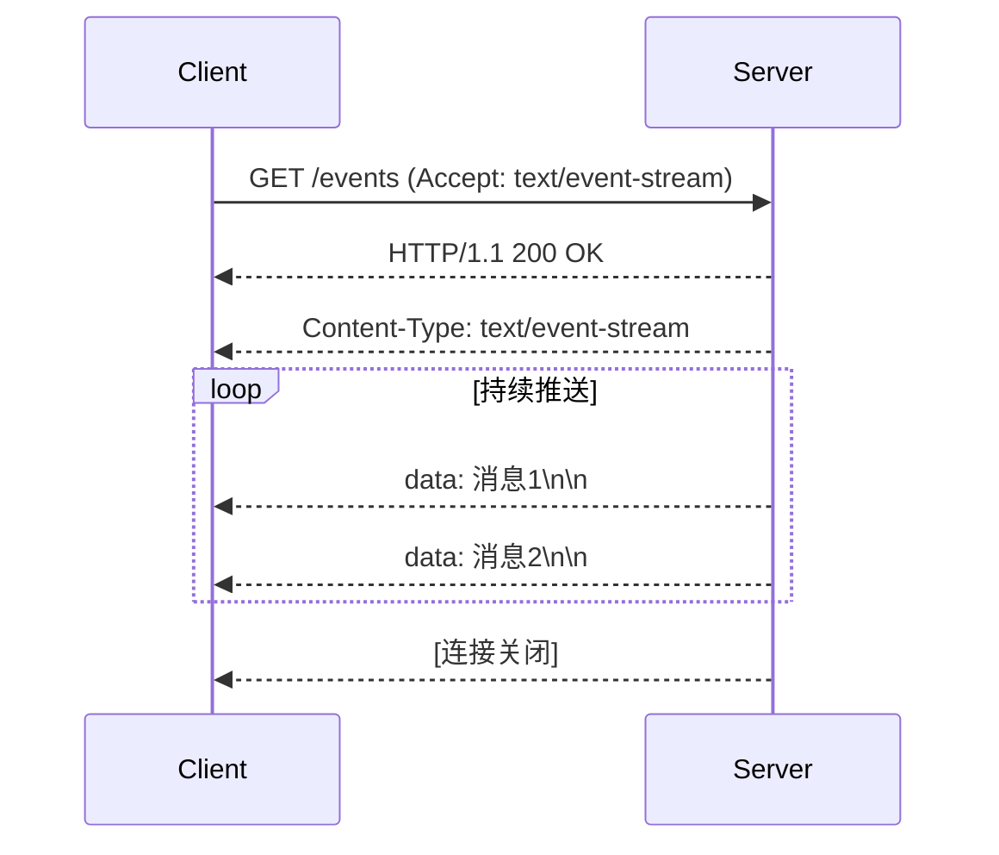
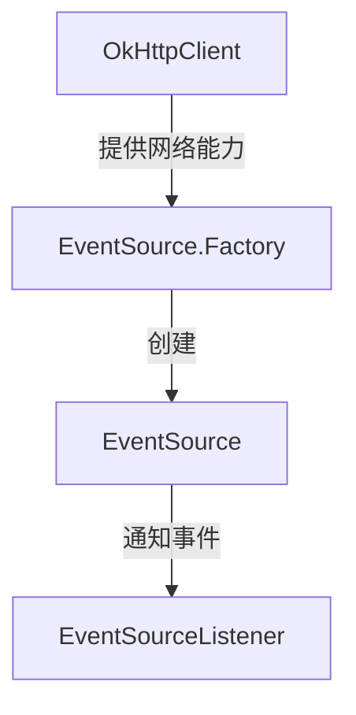
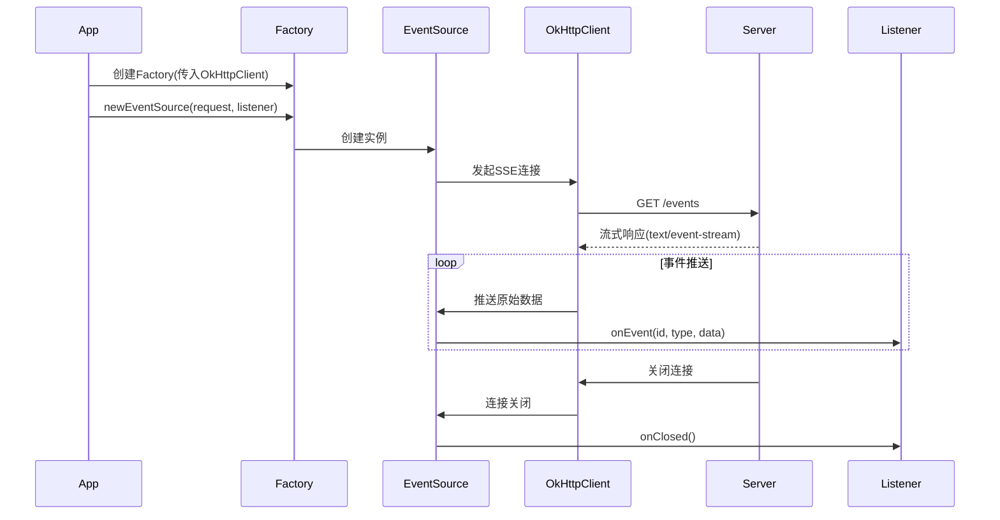

# EventSource、OkHttpClient 和 EventSourceListener 详解

这三个组件构成了处理 Server-Sent Events (SSE) 的核心架构。


## sse流式应答

SSE (Server-Sent Events) 是一种允许服务器向客户端**实时推送数据**的Web技术。

SSE 是一种基于 HTTP 的**服务器到客户端单向通信协议**，特点包括：
- **单向通道**：仅服务器 → 客户端
- **文本协议**：传输普通文本（可编码为JSON）
- **长连接**：保持HTTP连接开放
- **自动重连**：内置断线重连机制

想象SSE就像：
- **电台广播**：服务器是电台，客户端是收音机
- **学校广播**：教务处（服务器）向所有教室（客户端）广播通知
- **微信群发**：管理员发消息，所有成员接收（但成员不能回复）

### 1. 工作原理-基本流程


### 2. 协议细节
服务器响应的典型格式：
```
event: message
id: 123
data: {"time":"2023-01-01","content":"hello"}

data: 这是一条多行
data: 消息内容
```

### 3. SSE 与相关技术对比

| 特性     | SSE              | WebSocket    | 长轮询       |
| -------- | ---------------- | ------------ | ------------ |
| 通信方向 | 单向（服务器推） | 双向         | 半双工       |
| 协议     | HTTP             | 独立协议     | HTTP         |
| 数据格式 | 文本             | 二进制/文本  | 文本         |
| 自动重连 | 支持             | 需手动实现   | 需手动实现   |
| 适用场景 | 实时通知/日志流  | 实时交互应用 | 简单实时更新 |

### 4. SSE 的优势

1. **简单易用**：基于普通HTTP，无需特殊协议
2. **自动处理**：
   - 自动重连（客户端自动尝试重新连接）
   - 事件ID跟踪（断线后可从最后位置恢复）
3. **高效性**：比轮询节省资源
4. **浏览器原生支持**：通过 `EventSource` API

### 5. SSE 的消息格式

1. **基本字段**

| 字段    | 说明                   | 示例               |
| ------- | ---------------------- | ------------------ |
| `data`  | 消息内容（必选）       | `data: hello\n\n`  |
| `event` | 事件类型（自定义）     | `event: message\n` |
| `id`    | 事件ID（用于断线恢复） | `id: 42\n`         |
| `retry` | 重连延迟时间（毫秒）   | `retry: 5000\n`    |

2. **完整示例**

```
event: userconnect
id: 12345
data: {"username": "张三", "time": "12:00"}

data: 这是一条多行
data: 消息内容

: 这是注释（不会被处理）
```


### 6. 典型应用场景

1. **实时通知**：
   - 社交网络新消息提醒
   - 系统报警通知

2. **实时数据展示**：
   - 股票行情更新
   - 体育比赛实时比分
   - 物联网设备数据监控

3. **进度报告**：
   - 文件处理进度
   - 后台任务状态


## 一、核心组件角色



### 1. OkHttpClient - "网络快递员"
- **是什么**：OkHttp 库的核心类，负责实际网络通信
- **职责**：
  - 建立和管理 HTTP 连接
  - 处理请求和响应
  - 管理连接池、超时等底层细节
- **特点**：
  - 可以全局复用（推荐）
  - 可配置各种参数（超时、拦截器等）

```java
// 典型配置示例
OkHttpClient client = new OkHttpClient.Builder()
    .connectTimeout(10, TimeUnit.SECONDS)
    .readTimeout(30, TimeUnit.SECONDS) // SSE通常需要长超时
    .build();
```

### 2. EventSource - "事件收音机"
- **是什么**：**SSE 连接的客户端表示**
- **职责**：
  - 维持与服务器的长连接
  - 接收并解析事件流
  - 将事件转发给监听器
- **特点**：
  - **每个URL需要独立的EventSource实例**
  - 可以主动关闭连接

```java
// 创建后会立即开始连接
EventSource eventSource = factory.newEventSource(request, listener);

// 需要时可关闭
eventSource.cancel();
```

### 3. EventSourceListener - "事件处理器"
- **是什么**：接收事件回调的接口
- **职责**：
  - 处理服务器推送的事件
  - 响应连接状态变化
  - 处理错误情况
- **核心方法**：

| 方法        | 触发时机     | 典型处理     |
| ----------- | ------------ | ------------ |
| `onEvent`   | 收到数据事件 | 解析业务数据 |
| `onOpen`    | 连接建立     | 初始化资源   |
| `onClosed`  | 连接正常关闭 | 释放资源     |
| `onFailure` | 发生错误     | 错误恢复处理 |

```java
new EventSourceListener() {
    @Override
    public void onEvent(EventSource eventSource, String id, String type, String data) {
        System.out.println("收到事件：" + data);
    }
    
    @Override
    public void onFailure(EventSource eventSource, Throwable t, Response response) {
        System.err.println("连接出错：" + t.getMessage());
    }
}
```

## 二、组件协作流程



## 三、实际代码示例

### 1. 完整初始化流程
```java
// 1. 创建网络客户端
OkHttpClient client = new OkHttpClient.Builder()
    .readTimeout(0, TimeUnit.SECONDS) // 重要：SSE需要无限等待
    .build();

// 2. 创建事件源工厂
EventSource.Factory factory = EventSources.createFactory(client);

// 3. 准备SSE请求
Request request = new Request.Builder()
    .url("https://api.example.com/real-time")
    .header("Accept", "text/event-stream")
    .build();

// 4. 创建监听器
EventSourceListener listener = new EventSourceListener() {
    @Override
    public void onEvent(EventSource eventSource, String id, String type, String data) {
        System.out.printf("事件[%s]: %s%n", type, data);
    }
    
    @Override
    public void onFailure(EventSource eventSource, Throwable t, Response response) {
        System.err.println("错误: " + t.getMessage());
        // 实现重连逻辑...
    }
};

// 5. 创建事件源（立即开始连接）
EventSource eventSource = factory.newEventSource(request, listener);

// 6. 需要时关闭连接
// eventSource.cancel();
```

### 2. 各组件配置要点

**OkHttpClient 关键配置**：
```java
new OkHttpClient.Builder()
    .connectTimeout(10, TimeUnit.SECONDS) // 连接超时
    .readTimeout(0, TimeUnit.SECONDS)    // 读取超时(0表示不限)
    .pingInterval(30, TimeUnit.SECONDS)  // 保持连接心跳
    .addInterceptor(new HttpLoggingInterceptor()) // 日志
    .build();
```

**EventSourceListener 增强实现**：
```java
class SmartListener extends EventSourceListener {
    private final String tag;
    
    public SmartListener(String tag) {
        this.tag = tag;
    }
    
    @Override
    public void onOpen(EventSource eventSource, Response response) {
        System.out.println(tag + " 连接已建立");
    }
    
    @Override
    public void onEvent(EventSource eventSource, String id, String type, String data) {
        if ("heartbeat".equals(type)) {
            System.out.println(tag + " 收到心跳");
            return;
        }
        // 业务处理...
    }
    
    @Override
    public void onClosed(EventSource eventSource) {
        System.out.println(tag + " 连接正常关闭");
    }
    
    @Override
    public void onFailure(EventSource eventSource, Throwable t, Response response) {
        System.err.println(tag + " 连接异常: " + t.getMessage());
        // 可在此实现自动重连
    }
}
```

## 四、常见问题解决方案

### 问题1：连接意外断开
**解决方案**：实现重连机制
```java
@Override
public void onFailure(EventSource eventSource, Throwable t, Response response) {
    System.err.println("连接断开，5秒后重试...");
    new Handler(Looper.getMainLooper()).postDelayed(() -> {
        factory.newEventSource(request, this); // 重新连接
    }, 5000);
}
```

### 问题2：事件堆积导致内存溢出
**解决方案**：实现背压控制
```java
private final Semaphore semaphore = new Semaphore(5); // 最大并行处理数

@Override
public void onEvent(EventSource eventSource, String id, String type, String data) {
    try {
        semaphore.acquire(); // 获取许可
        executorService.submit(() -> {
            try {
                processEvent(data); // 实际处理
            } finally {
                semaphore.release();
            }
        });
    } catch (InterruptedException e) {
        Thread.currentThread().interrupt();
    }
}
```

### 问题3：需要身份验证
**解决方案**：添加认证头
```java
Request request = new Request.Builder()
    .url(sseUrl)
    .header("Authorization", "Bearer " + authToken)
    .header("Accept", "text/event-stream")
    .build();
```

这三个组件共同构成了一个健壮的SSE客户端体系，理解它们的关系和协作方式，就能轻松处理各种实时数据流场景。