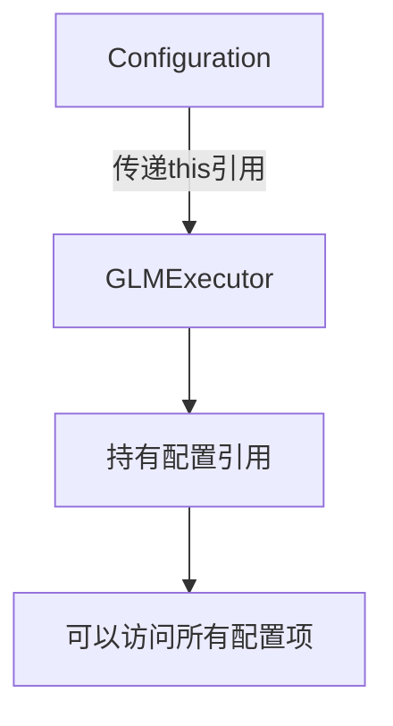
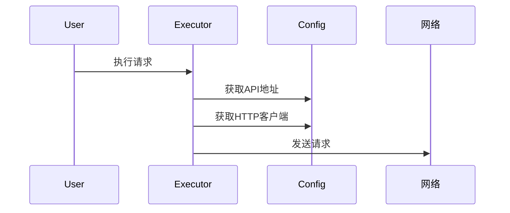

# Configuration 传递执行器机制详解

## 一、核心概念图解



## 二、逐行解析代码

### 1. 创建执行器实例
```java
Executor glmExecutor = new GLMExecutor(this);
```
- `this`：指当前Configuration对象自己
- 相当于把"整个配置工具箱"传给新创建的GLMExecutor

### 2. 执行器构造函数
```java
public GLMExecutor(Configuration configuration) {
    this.configuration = configuration;          // ① 保存配置引用
    this.openAiApi = configuration.getOpenAiApi();     // ② 获取API实例
    this.okHttpClient = configuration.getOkHttpClient(); // ③ 获取HTTP客户端
}
```

## 三、内存模型演示

```
┌───────────────────────┐       ┌───────────────────────┐
│    Configuration      │       │      GLMExecutor      │
│                       │       │                       │
│   - apiHost          │───────│─> configuration      │
│   - apiSecretKey     │       │   - openAiApi        │
│   - openAiApi        │<───────│─  - okHttpClient    │
│   - okHttpClient     │       │                       │
└───────────────────────┘       └───────────────────────┘
```

## 四、为什么这样设计？

### 1. 共享配置的好处
- 避免重复创建相同对象（如OkHttpClient）
- 保证所有执行器使用统一配置
- 方便集中管理配置变更

### 2. 工作流程示例


## 五、关键点解析

### 1. `this` 的含义
- 代表"当前对象实例"
- 在这里就是正在创建的Configuration对象

### 2. 引用传递 vs 值传递
- 传递的是对象**引用**（内存地址）
- 不是复制整个对象
- 修改Configuration会影响所有执行器

### 3. 设计模式应用
这是典型的**依赖注入**：
- 将依赖项（Configuration）通过构造函数传入
- 而不是在执行器内部创建

## 六、类比理解

想象你在开餐厅：
- `Configuration` = 中央厨房（存放所有食材和工具）
- `GLMExecutor` = 单个厨师工作站
- `this` = 给工作站分配厨房使用权限

好处：
- 所有厨师共享同一套食材
- 厨房升级时所有工作站自动受益
- 避免每个工作站自己准备全套工具

## 七、常见疑问解答

### Q1：为什么不直接让执行器自己创建配置？
- 会造成资源浪费（多个OkHttpClient实例）
- 难以保持配置一致性
- 违反"单一职责原则"

### Q2：这样传递会不会不安全？
- Java对象引用是类型安全的
- 通过接口限定访问权限
- 实际是标准的最佳实践

### Q3：如果配置变更怎么办？
- 执行器持有的引用会自动"看到"最新配置
- 因为是同一个内存对象

## 八、扩展思考

### 1. 替代方案对比
| 方案       | 优点               | 缺点       |
| ---------- | ------------------ | ---------- |
| 传递this   | 简单直接，内存高效 | 耦合度略高 |
| 克隆配置   | 隔离性好           | 内存开销大 |
| 服务定位器 | 灵活               | 复杂度高   |

### 2. 最佳实践
- 适合中小型项目
- 大型项目建议结合Spring等DI框架
- 保持配置对象不可变更安全

## 九、代码调试建议

1. 打印对象hashCode验证引用同一性：
```java
System.out.println("Config: " + System.identityHashCode(configuration));
System.out.println("Executor's config: " + 
    System.identityHashCode(this.configuration));
```

2. 观察配置变更的影响：
```java
configuration.setApiHost("新地址");
// 所有执行器会立即使用新地址
```