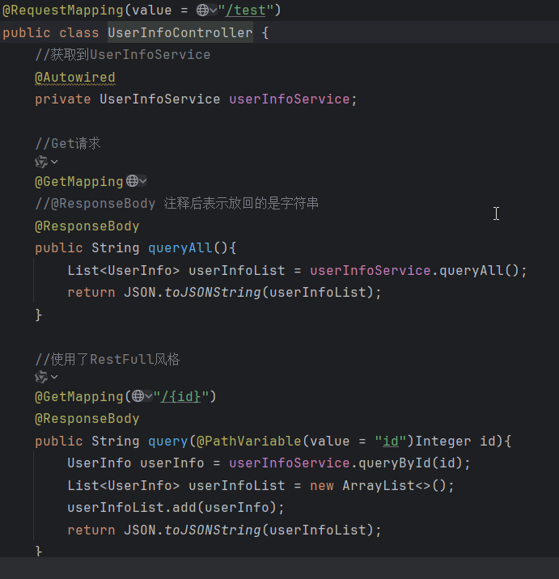

# springboot讲解

[TOC]

## 1. spring讲解

### 1.1 spring是什么

Spring是一个开放源代码的设计层面框架，他解决的是**业务逻辑层和其他各层的松耦合问题**，因此它将面向接口的编程思想贯穿整个系统应用。

- **一句话**：Spring 是一个开源的 Java 框架，目的是让企业级 Java 开发**更简单**、**更高效**。
- **核心思想**：通过“管理对象”和“解耦代码”，帮你省去重复劳动，专注业务逻辑。


### 1.2 spring核心概念

#### 1. **IoC（控制反转）**

- **传统方式**：你自己控制对象的创建（比如 `UserService userService = new UserService()`）。
- **IoC：**把控制权交给 Spring，让它帮你创建对象并管理生命周期。
  - 比如：Spring 就像一个“容器”，你告诉它需要什么对象，它直接给你。

#### 2. **DI（依赖注入）**

- **问题**：对象之间可能互相依赖（比如 `UserService` 需要 `UserRepository`）。
- **传统方式**：你需要在代码中手动组装依赖（比如 `userService.setRepository(new UserRepository())`）。
- **DI**：Spring 自动帮你把依赖“注入”到对象中（通过构造函数、Setter 或注解）。

#### 3. **Bean**

- **定义**：由 Spring 容器管理的对象称为 **Bean**。
- **如何声明**：通过 XML 配置、Java 注解（如 `@Component`）或 Java 代码。

#### 4. **AOP（面向切面编程）**

- **问题**：某些代码（如日志、事务）会重复出现在多个地方。
- **AOP 的解决**：将这些代码抽离成“切面”，在需要的地方自动插入。
  - 比如：自动为所有 Service 方法添加事务管理。


## 2. springboot讲解

### 2.1 Spring Boot 是什么？

- **一句话**：Spring Boot 是 Spring 的“快速开发助手”，帮你 **10 秒启动一个 Web 服务**，不用写繁琐的配置！

- **核心功能：**

  - **自动配置**：不用再写大量XML！Spring Boot 根据依赖自动配置项目。
  - **内嵌服务器**：直接运行一个 JAR 包就能启动 Web 应用（比如 Tomcat）。
  - **起步依赖**：一个依赖搞定一组功能（如 `spring-boot-starter-web` 包含 Web 开发所需的所有库）。

  

#### 2.2 为什么需要 Spring Boot？

假设你要用 Spring 开发一个网站，传统方式需要：

1. 配置 Tomcat 服务器。
2. 写一堆 XML 定义 Bean。
3. 处理各种依赖冲突。

**Spring Boot 的解决方案**：

1. **自动配置**：你只管写业务代码，配置交给 Spring Boot。
2. **一键启动**：用 `main` 方法直接运行，内嵌 Tomcat。
3. **依赖管理**：通过 `starter` 依赖，避免版本冲突。


## 简单案例

简单实现增删查改


### 1.目录结构


#### **整体结构**

```
Project
├── src/              # 源代码
│   ├── main/         # 主代码
│   │   ├── java/     # Java 源码
│   │   └── resources/ # 配置文件、静态资源
│   └── test/        # 测试代码
└── pom.xml           # Maven 项目配置文件（图中未显示，但一般存在）
```


#### 核心目录说明

##### **(1) `src/main/java`：Java 源码**

```
com.example.demo
├── aspect/       # AOP 切面（如日志、事务）
│   └── LogAspect.java
├── controller/   # 控制器（处理 HTTP 请求）
│   └── UserInfoController.java
├── entity/       # 实体类（对应数据库表）
│   └── UserInfo.java
├── mapper/       # 数据访问层（如 MyBatis 接口）
│   └── UserInfoMapper.java
└── service/      # 服务层（业务逻辑）
    ├── impl/     # 服务实现类
    │   └── UserInfoServiceImpl.java
    └── UserInfoService.java  # 服务接口
```

- 分层意义：
  - **controller**：接收请求，返回响应（类似餐厅服务员）。
  - **service**：处理业务逻辑（类似厨师）。
  - **mapper**：操作数据库（类似厨房助手）。
  - **entity**：定义数据模型（类似菜单上的菜品）。

##### **(2) `src/main/resources`：资源文件**

```
resources/
├── mapper/        # MyBatis XML 映射文件（如 UserInfoMapper.xml）
├── static/        # 静态资源（CSS、JS、图片）
├── templates/     # 模板文件（如 Thymeleaf、HTML）
└── application.properties  # 配置文件（数据库、端口等）
```

- 关键文件：
  - `application.properties`：配置数据库连接、服务器端口等。
  - `mapper/*.xml`：编写 SQL 语句（如果使用 MyBatis）。

##### **(3) `src/test`：单元测试**

```
test/
└── java/
    └── com.example.demo
        └── UserInfoControllerTest.java  # 控制器测试类
```


### 2. 各层协作流程

1. **用户访问 `/user` 接口** → `UserInfoController` 接收请求。
2. **Controller 调用** → `UserInfoService` 处理业务逻辑。
3. **Service 调用** → `UserInfoMapper` 查询数据库。
4. **Mapper 通过 XML 或注解** → 执行 SQL，返回数据。
5. **结果层层返回** → 用户看到响应。


### 3. 项目依赖配置pom.xml

```xml
<?xml version="1.0" encoding="UTF-8"?>
<project xmlns="http://maven.apache.org/POM/4.0.0" xmlns:xsi="http://www.w3.org/2001/XMLSchema-instance"
	xsi:schemaLocation="http://maven.apache.org/POM/4.0.0 https://maven.apache.org/xsd/maven-4.0.0.xsd">
	<modelVersion>4.0.0</modelVersion>
    
     <!-- 继承 Spring Boot 的默认配置（如依赖版本、插件配置），无需手动指定版本。 -->
	<parent>
		<groupId>org.springframework.boot</groupId>
		<artifactId>spring-boot-starter-parent</artifactId>
		<version>3.4.2</version>
		<relativePath/> <!-- 项目属性 -->
	</parent>
    
    <!-- 基础信息 -->
	<groupId>com.example</groupId>
	<artifactId>demo</artifactId><!-- SNAPSHOT 表示开发中版本 -->
	<version>0.0.1-SNAPSHOT</version>
	<name>demo</name>
	<description>demo</description>
    
    
	<url/>
	<licenses>
		<license/>
	</licenses>
	<developers>
		<developer/>
	</developers>
	<scm>
		<connection/>
		<developerConnection/>
		<tag/>
		<url/>
	</scm>
    
    <!-- 项目属性 指定 Java 版本为 17（必须安装 JDK 17 才能运行项目）。-->
	<properties>
		<java.version>17</java.version>
	</properties>
    
    <!-- 依赖项，便于maven导入相关包-->
	<dependencies>
        <!-- 提供springboot的 Web 开发能力-->
		<dependency>
			<groupId>org.springframework.boot</groupId>
			<artifactId>spring-boot-starter-web</artifactId>
		</dependency>

        <!-- 提供 springboot的测试 开发能力-->
		<dependency>
			<groupId>org.springframework.boot</groupId>
			<artifactId>spring-boot-starter-test</artifactId>
			<scope>test</scope>
		</dependency>
		<!-- Spring Boot Starter AOP编程 -->
		<dependency>
			<groupId>org.springframework.boot</groupId>
			<artifactId>spring-boot-starter-aop</artifactId>
		</dependency>


		<!--springboot+mybatis的依赖-->
		<dependency>
			<groupId>org.mybatis.spring.boot</groupId>
			<artifactId>mybatis-spring-boot-starter</artifactId>
			<version>3.0.3</version>
		</dependency>
		<!--MySQL数据库驱动-->
		<dependency>
			<groupId>mysql</groupId>
			<artifactId>mysql-connector-java</artifactId>
			<version>8.0.23</version>
		</dependency>
		<!--druid数据库连接池依赖-->
		<dependency>
			<groupId>com.alibaba</groupId>
			<artifactId>druid-spring-boot-starter</artifactId>
			<version>1.2.8</version>
		</dependency>
		<!--Lombok依赖（可以配置也可以不用配置具体看自己）-->
		<dependency>
			<groupId>org.projectlombok</groupId>
			<artifactId>lombok</artifactId>
		</dependency>


		<!--fastjson-->
		<dependency>
			<groupId>com.alibaba</groupId>
			<artifactId>fastjson</artifactId>
			<version>1.2.78</version>
		</dependency>

		<dependency>
			<groupId>org.junit.jupiter</groupId>
			<artifactId>junit-jupiter-api</artifactId>
			<version>5.9.0</version>
			<scope>test</scope>
		</dependency>

		<dependency>
			<groupId>org.springframework.boot</groupId>
			<artifactId>spring-boot-test</artifactId>
			<version>2.3.1.RELEASE</version>
			<scope>test</scope>
		</dependency>
	</dependencies>

    <!--构建项目的插件-->
	<build>
		<plugins>
			<plugin>
                <!-- mvn spring-boot:run 直接运行项目。 -->
				<groupId>org.springframework.boot</groupId>
				<artifactId>spring-boot-maven-plugin</artifactId>
			</plugin>


		</plugins>
	</build>

</project>

```


- 你的项目能力：
  - 开发 REST API（`spring-boot-starter-web`）。
  - 操作 MySQL 数据库（MyBatis + MySQL）。
  - 记录日志或管理事务（AOP）。
  - 简化代码（Lombok）。
  - 高性能 JSON 处理（FastJSON）。

运行 `mvn clean install` 即可编译打包，生成一个 `demo-0.0.1-SNAPSHOT.jar`，可以用 `java -jar` 运行


### 4. **Spring Boot 配置文件**

**Spring Boot 配置文件用于集中管理项目参数**，例如：

- 数据库连接信息
- 服务器端口号
- 日志级别
- 第三方 API 密钥
- 功能开关（如缓存启用/禁用）

**配置文件的类型**

Spring Boot 支持两种格式的配置文件：

- **`application.properties`**（键值对格式，默认优先级更高）

  ```properties
  server.port=8080
  spring.datasource.url=jdbc:mysql://localhost:3306/mydb
  ```

- **`application.yml`**（YAML 格式，结构清晰，推荐使用）

  ```yaml
  server:
    port: 8080
  spring:
    datasource:
      url: jdbc:mysql://localhost:3306/mydb
  ```


本demo的配置文件：

**`application.properties`**

```properties
# ================ 应用基础配置 ================
# 应用名称（用于服务注册、监控标识）
spring.application.name=demo
# 服务启动端口（默认8080，访问地址: http://localhost:8080）
server.port=8080


# ================ 数据库连接配置 ================
# 数据库URL（test是数据库名，注意替换成你的数据库名）
spring.datasource.url=jdbc:mysql://localhost:3306/test?useUnicode=true&characterEncoding=utf-8&useSSL=false&serverTimezone=UTC
# 数据库用户名
spring.datasource.username=root
# 数据库密码
spring.datasource.password=admin
# 指定JDBC驱动类（MySQL 8.0+）
spring.datasource.driver-class-name=com.mysql.cj.jdbc.Driver
# 使用Druid高性能连接池（对应依赖druid-spring-boot-starter）
spring.datasource.type=com.alibaba.druid.pool.DruidDataSource


# ================ Druid连接池高级配置 ================
# 初始化连接数（默认5）
spring.datasource.druid.initial-size=5
# 最小空闲连接数（默认5）
spring.datasource.druid.min-idle=5
# 最大活跃连接数（默认20）
spring.datasource.druid.max-active=20
# 获取连接最大等待时间（毫秒，默认60000）
spring.datasource.druid.max-wait=60000
# 监控统计过滤器（stat=监控，wall=SQL防火墙，log4j=日志）
spring.datasource.druid.filters=stat,wall,log4j
# 启用Druid监控页面（访问地址: http://localhost:8080/druid）
spring.datasource.druid.stat-view-servlet.enabled=true


# ================ MyBatis配置 ================
# 实体类包路径（对应entity包，XML中可直接用类名）
mybatis.type-aliases-package=com.example.demo.entity
# MyBatis XML映射文件位置（对应resources/mapper目录）
mybatis.mapper-locations=classpath:mapper/*.xml


# ================ 日志配置 ================
# 设置LogAspect切面类的日志级别为WARN（减少调试日志）
logging.level.com.example.demo.aspect.LogAspect=WARN
# 日志文件输出路径（日志会写入/var/log/myapp目录）
logging.file.path=/var/log/myapp
```


**`application.yml`**

```yaml
# 应用基础配置
spring:
  application:
    name: demo  # 应用名称
  datasource:
    # 数据库连接配置
    url: jdbc:mysql://localhost:3306/test?useUnicode=true&characterEncoding=utf-8&useSSL=false&serverTimezone=UTC
    username: root
    password: admin
    driver-class-name: com.mysql.cj.jdbc.Driver
    type: com.alibaba.druid.pool.DruidDataSource  # 使用Druid连接池

    # Druid连接池高级配置
    druid:
      initial-size: 5
      min-idle: 5
      max-active: 20
      max-wait: 60000
      time-between-eviction-runs-millis: 60000
      min-evictable-idle-time-millis: 300000
      validation-query: SELECT 1 FROM DUAL
      test-while-idle: true
      test-on-borrow: false
      test-on-return: false
      pool-prepared-statements: true
      max-pool-prepared-statement-per-connection-size: 20
      connection-properties: druid.stat.slowSqlMillis=5000
      filters: stat,wall,log4j
      useGlobalDataSourceStat: true
      stat-view-servlet:
        enabled: true  # 启用监控页面

# MyBatis配置
mybatis:
  type-aliases-package: com.example.demo.entity  # 实体类包路径
  mapper-locations: classpath:mapper/*.xml        # XML文件位置

# 日志配置
logging:
  level:
    com.example.demo.aspect.LogAspect: WARN  # 指定类日志级别

# 服务端口
server:
  port: 8080
```


### 5. 数据库操作封装

#### 1. 实体类

- **作用**：映射数据库`userinfo`表的结构
- 注解说明：
  - `@Data`：自动生成JavaBean方法（getter、setter、equals等）
  - `@AllArgsConstructor`：生成包含所有字段的构造函数
  - `@NoArgsConstructor`：生成无参构造函数（MyBatis反射需要）
-  **字段匹配**：类中的 `id`、`username`、`password`、`authority` 必须与数据库表 `userinfo` 的列名一致。 

```java
package com.example.demo.entity;

import lombok.AllArgsConstructor;
import lombok.Data;
import lombok.NoArgsConstructor;

//使用@Data自动生成需要的get、set
@Data
//使用@AllArgsConstructor自动生成有参构造
@AllArgsConstructor
//使用@NoArgsConstructor自动生成无参构造
@NoArgsConstructor
public class UserInfo {

    private Integer id;
    private String username;
    private String password;
    private String authority;
}

```


#### 2. Mybatis数据库操作

**@Mapper 注解的核心作用***

`@Mapper` 是 MyBatis 的核心注解，**用于标识一个接口为 MyBatis 的 Mapper 接口**。它的核心作用包括：

- **动态代理生成实现类**
  MyBatis 会在运行时通过动态代理技术，​**自动生成该接口的实现类**，无需手动编写实现代码。
- **SQL 映射绑定**
  通过接口方法与 XML 文件中的 ``/`` 等标签的 `id` 进行匹配，​**将 Java 方法调用转化为具体的 SQL 执行**。
- **Spring Boot 集成**
  配合 `@MapperScan("com.example.demo.mapper")`（需在启动类添加），​**自动扫描所有带 `@Mapper` 的接口**，将其注册为 Spring Bean。


**@Repository 注解的辅助作用**

`@Repository` 是 Spring 框架的注解，**用于标识数据访问层组件**（DAO）。在 MyBatis 中的使用场景：

- **可读性增强**
  明确表示该接口属于持久层组件，​**提高代码可维护性**。
- **异常转换**
  Spring 会将 MyBatis 抛出的 `SQLException` ​**转换为统一的 `DataAccessException` 体系**，便于全局异常处理。
- **非必须但推荐**
  在 Spring Boot 中，只要配置了 `@MapperScan`，即使不加 `@Repository`，MyBatis 接口也能正常工作。但显式添加可以：
  - 让 IDE 的组件扫描更准确
  - 在单元测试中更容易通过 `@Autowired` 注入


1. UserInfoMapper.java

```java
package com.example.demo.mapper;

import com.example.demo.entity.UserInfo;
import org.apache.ibatis.annotations.Mapper;
import org.springframework.stereotype.Repository;

import java.util.List;

@Repository
@Mapper
public interface UserInfoMapper {

    /**
     * 增加一条数据
     * @param userInfo 数据
     */
    void add(UserInfo userInfo);

    /**
     * 删除一条数据
     * @param id 被删除数据的id
     */
    void delete(Integer id);

    /**
     * 修改一条数据
     * @param userInfo 修改的数据
     */
    void update(UserInfo userInfo);

    /**
     * 根据id去查询一条数据
     * @param id 查询的id
     */
    UserInfo queryById(Integer id);

    /**
     * 查询全部数据
     * @return
     */
    List<UserInfo> queryAll();

    /**
     * 根据用户名查询一条数据
     * @param username
     * @return
     */
    UserInfo queryByUsername(String username);
}

```


2. UserInfoMapper.xml

```xml
<?xml version="1.0" encoding="UTF-8" ?>
<!DOCTYPE mapper
        PUBLIC "-//mybatis.org//DTD Mapper 3.0//EN"
        "http://mybatis.org/dtd/mybatis-3-mapper.dtd">

<mapper namespace="com.example.demo.mapper.UserInfoMapper">

    <insert id="add" parameterType="UserInfo">
        insert into test.userinfo (username, password, authority)
        values (#{username},#{password},#{authority});
    </insert>

    <delete id="delete" parameterType="Integer">
        delete from test.userinfo where id = #{id};
    </delete>

    <update id="update" parameterType="UserInfo">
        update test.userinfo set username=#{username},password=#{password},authority=#{authority}
        where id=#{id};
    </update>

    <select id="queryById" parameterType="Integer" resultType="UserInfo">
        select * from test.userinfo where id=#{id};
    </select>

    <select id="queryAll" resultType="UserInfo">
        select * from test.userinfo;
    </select>

    <select id="queryByUsername" parameterType="String" resultType="UserInfo">
        select * from test.userinfo where username=#{username};
    </select>

</mapper>

```


### 6. 控制层和服务处操作

1. UserInfoService.java

   ```java
   package com.example.demo.service;
   import com.example.demo.entity.UserInfo;
   import java.util.List;
   
   public interface UserInfoService {
       /**
        * 增加一条数据
        * @param userInfo 数据
        */
       void add(UserInfo userInfo);
   
       /**
        * 删除一条数据
        * @param id 被删除数据的id
        */
       void delete(Integer id);
   
       /**
        * 修改一条数据
        * @param userInfo 修改的数据
        */
       void update(UserInfo userInfo);
   
       /**
        * 根据id去查询一条数据
        * @param id 查询的id
        */
       UserInfo queryById(Integer id);
   
       /**
        * 查询全部数据
        * @return
        */
       List<UserInfo> queryAll();
   
       /**
        * 根据用户名查询一条数据
        * @param username
        * @return
        */
       UserInfo queryByUsername(String username);
   }
   
   
   ```

   

2. UserInfoServiceImpl.java

   ```java
   package com.example.demo.service.impl;
   
   import com.example.demo.entity.UserInfo;
   import com.example.demo.mapper.UserInfoMapper;
   import com.example.demo.service.UserInfoService;
   import org.springframework.beans.factory.annotation.Autowired;
   import org.springframework.stereotype.Service;
   
   import java.util.List;
   
   @Service
   public class UserInfoServiceImpl implements UserInfoService {
   
       @Autowired
       private UserInfoMapper userInfoMapper;
   
       @Override
       public void add(UserInfo userInfo) {
           userInfoMapper.add(userInfo);
       }
   
       @Override
       public void delete(Integer id) {
           userInfoMapper.delete(id);
       }
   
       @Override
       public void update(UserInfo userInfo) {
           userInfoMapper.update(userInfo);
       }
   
       @Override
       public UserInfo queryById(Integer id) {
           return userInfoMapper.queryById(id);
       }
   
       @Override
       public List<UserInfo> queryAll() {
           return userInfoMapper.queryAll();
       }
   
       @Override
       public UserInfo queryByUsername(String username) {
           return userInfoMapper.queryByUsername(username);
       }
   }
   
   ```

   

3. UserInfoController.java

   ```java
   package com.example.demo.controller;
   
   import com.alibaba.fastjson.JSON;
   import com.example.demo.entity.UserInfo;
   import com.example.demo.service.UserInfoService;
   import org.springframework.beans.factory.annotation.Autowired;
   import org.springframework.stereotype.Controller;
   import org.springframework.web.bind.annotation.*;
   
   import java.util.ArrayList;
   import java.util.List;
   
   @CrossOrigin(origins = "http://localhost:5173") // 这里修改为前端的端口
   //@Controller 控制层需要的注解
   //@RestController 使用这个也是可以的，但是使用后他里面所有请求返回的都是字符串！
   //一般只需要作为接口放回JSON格式数据的话推荐使用@RestController
   //@Controller这个是可以与Thymeleaf模板引擎使用时可以返回一个页面的
   @Controller
   //@RequestMapping指定路径名
   //@RequestMapping("/test")用这个来指定路径也是可以的
   @RequestMapping(value = "/test")
   public class UserInfoController {
       //获取到UserInfoService
       @Autowired
       private UserInfoService userInfoService;
   
       //Get请求
       @GetMapping
       //@ResponseBody 注释后表示放回的是字符串
       @ResponseBody
       public String queryAll(){
           List<UserInfo> userInfoList = userInfoService.queryAll();
           return JSON.toJSONString(userInfoList);
       }
   
       //使用了RestFull风格
       @GetMapping("/{id}")
       @ResponseBody
       public String query(@PathVariable(value = "id")Integer id){
           UserInfo userInfo = userInfoService.queryById(id);
           List<UserInfo> userInfoList = new ArrayList<>();
           userInfoList.add(userInfo);
           return JSON.toJSONString(userInfoList);
       }
   
       //post请求
       //@RequestBody 表示接收请求是JSON格式的数据
       @PostMapping
       @ResponseBody
       public String add(@RequestBody UserInfo userInfo){
           userInfoService.add(userInfo);
           return "添加OK";
       }
   
       //Delete请求
       @DeleteMapping(value = "/{id}")
       @ResponseBody
       public String delete(@PathVariable("id")Integer id){
           userInfoService.delete(id);
           return "删除成功";
       }
   
       //Put请求
       @PutMapping("/{id}")
       @ResponseBody
       public String update(@PathVariable("id")Integer id,
                            @RequestBody UserInfo userInfo){
           userInfo.setId(id);
           userInfoService.update(userInfo);
           return "修改成功";
       }
   
       @PostMapping("/login")
       @ResponseBody
       public String login(@RequestBody UserInfo userInfo) {
           UserInfo user = userInfoService.queryByUsername(userInfo.getUsername());
           if (user != null && user.getPassword().equals(userInfo.getPassword())) {
               return JSON.toJSONString(user); // 返回用户信息
           } else {
               return "Login failed";
           }
       }
   }
   
   ```

   

#### 1. 相关知识讲解

##### 1.1 @Repository

- @Repository是属于Spring的注解。它用来标注访问层的类（Dao层），它表示一个仓库，主要用于封装对于数据库的访问。

- **其实现方式与@Component注解相同，只是为了明确类的作用而设立。**

- 作用是在类上实例化bean，并把当前类对象的实现类交给spring容器进行管理。

  

  

  


##### 1.2 @Autowired

- @Autowired 注释，它可以对类成员变量、方法及构造函数进行标注，完成自动装配的工作。

- 通过 @Autowired的使用来消除 set ，get方法。在使用@Autowired之前，我们对一个bean配置起属性时如下：

  ```xml
  <property name="属性名" value=" 属性值"/>
  ```

- 通过这种方式来，配置比较繁琐，而且代码比较多。在Spring 2.5 引入了 @Autowired 注释

 

##### 1.3 @PathVariable

- @PathVariable 映射 URL 绑定的占位符；

-  通过 @PathVariable 可以将 URL 中占位符参数绑定到控制器处理方法的入参中:URL 中的 {xxx} 占位符可以通过 @PathVariable(“xxx”) 绑定到操作方法的入参中。 

  ```java
  @RequestMapping("/getUserById/{name}")
      public User getUser(@PathVariable("name") String name){
          return userService.selectUser(name);
      }
  
  ```

-  若方法参数名称和需要绑定的url中变量名称一致时,可以简写 

  ```java
  @RequestMapping("/getUser/{name}")
      public User getUser(@PathVariable String name){
          return userService.selectUser(name);
      }
  
  ```

  

#####  1.4 @RequestMapping

-  **用于将任意HTTP 请求映射到控制器方法上** 

-  @RequestMapping表示共享映射，如果没有指定请求方式，将接收GET、POST、HEAD、OPTIONS、PUT、PATCH、DELETE、TRACE、CONNECT所有的http请求方式。

-  @GetMapping、@PostMapping、@PutMapping、@DeleteMapping、@PatchMapping 都是HTTP方法特有的快捷方式@RequestMapping的变体，分别对应具体的HTTP请求方式的映射注解。 

  


##### 1.5  @ResponseBody 

-  **将java对象转为json格式的数据**
-  将controller的方法返回的对象通过适当的转换器转换为指定的格式之后，**写入到response对象的body区，通常用来返回JSON数据或者是XML数据**。
-  在使用 @RequestMapping后，返回值通常解析为跳转路径，但是加上 @ResponseBody 后返回结果不会被解析为跳转路径，而是直接写入 HTTP response body 中。

-  @RestController = @Controller + @ResponseBody 
- `@RestController // 所有方法自动加@ResponseBody`


##### 1.6  **@RequestBody**  

- 接收请求体内容：`@RequestBody`注解用于将请求体中的内容绑定到方法参数上。

- 自动数据转换：`@RequestBody`会根据请求的Content-Type自动进行数据转换，将请求体中的内容转换为指定的Java对象。

  ```java\
  @RestController
  @RequestMapping("/api")
  public class MyController {
      @PostMapping("/user")
      public String createUser(@RequestBody User user) {
          // 处理接收到的User对象
          // ...
          return "User created: " + user.getName();
      }
  }
  ```

  


