# 项目部署

[TOC]


## 前言

部署教程

 [《ChatGPT 微服务应用体...-知识星球](https://wx.zsxq.com/group/48411118851818/topic/188414845252452) 

项目分支

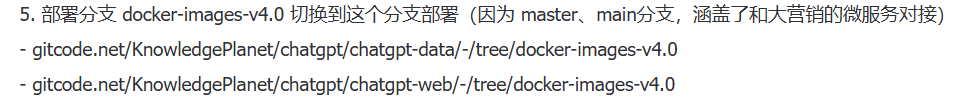


## 1.  前端

1. 微信公众号需要改成自己的

   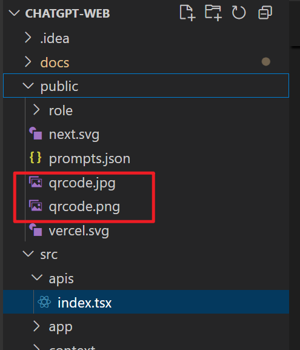

2. 修改域名

   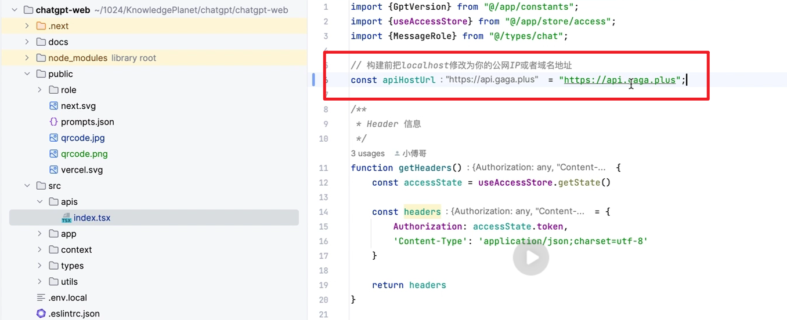

3. 讲执行脚本修改成自己的容器名

   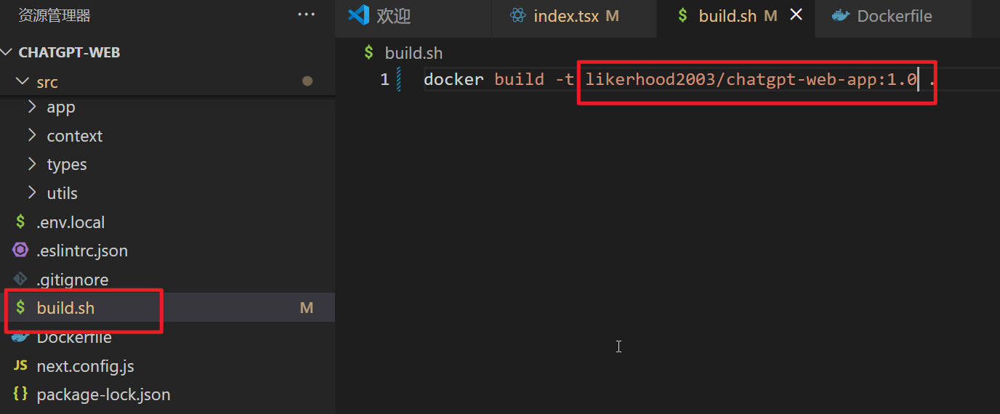

4. 把前端代码传输到linux服务器中，在build.sh目录下面执行build.sh脚本

   ```bash
   # 1. 进入主目录
   cd 主目录
   # 2. 查看有没有build.sh
   ls
   # 3. 给build.sh执行权限
   chmod +x ./build.sh
   # 4. 执行该脚本
   ./build.sh
   ```

   


## 2. 后端部署

1. 修改总配置文件，切换到线上部署部分

   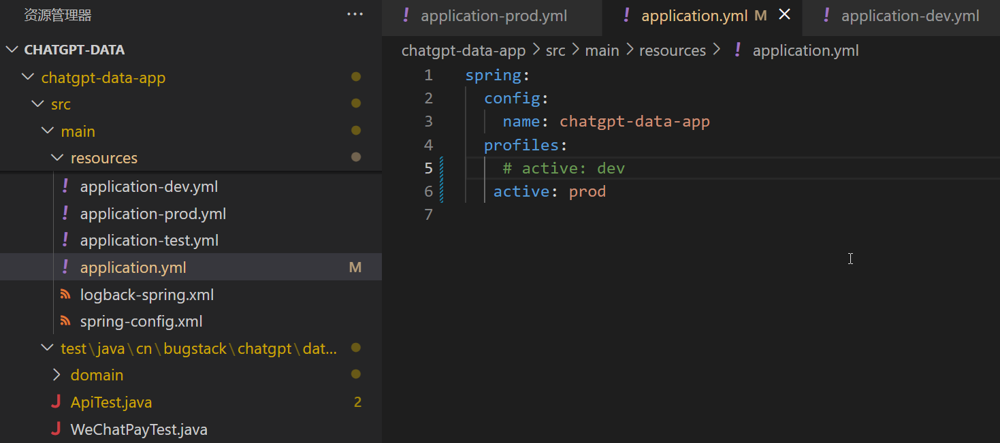

2. 修改prod.yml和dev.yml文件中关于chatgpt、chatglm的apikey和微信公众号的信息

   ```bash
   # ChatGPT SDK Config
   chatgpt:
     sdk:
       config:
         # 状态；true = 开启、false 关闭
         enabled: true
         # 官网地址 https://api.openai.com/ 1美金:7人民币。或者有ApiHost 这种代理地址和key，淘宝也可以
         api-host: https://api.nuwaapi.com/
         # 官网申请 https://platform.openai.com/account/api-keys
         api-key: sk-erYx993NfCP45GUjCN8p2r7zvwNuhT3d6yf4M6CBJjTDvlNT
   
   # ChatGLM SDK Config
   chatglm:
     sdk:
       config:
         # 状态；true = 开启、false 关闭
         enabled: true
         # 官网地址
         api-host: https://open.bigmodel.cn/
         # 官网申请 https://open.bigmodel.cn/usercenter/apikeys - 自己可申请(默认18块的额度很够用)，也推荐测试学习的时候，使用 ChatGLM
         api-secret-key: 1fa47f123902470890d81fdfcd249e4d.oaxJHknE0x0zFy66
   
   # 微信公众号配置信息
   # originalid：原始ID
   # appid：个人AppID
   # token：开通接口服务自定义设置
   wx:
     config:
       originalid: gh_ec98629c347d
       appid: wx91d9d3980294327c
       token: b8b6
   ```

   

3. 还没开启微信支付的话，先将微信支付的配置置为false，同时代码上注释掉这个

   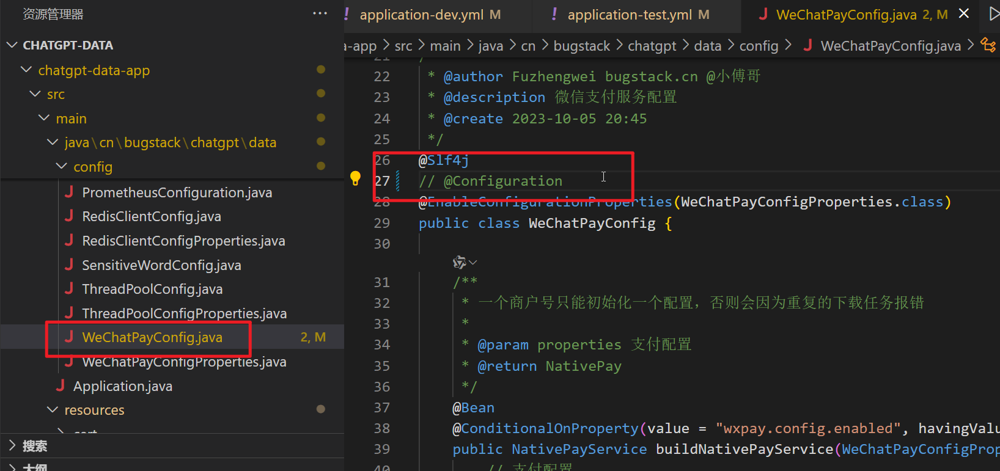


4. 在后端部署文件中修改相关容器名，比如把自己打包好的前后端容器名写上去

   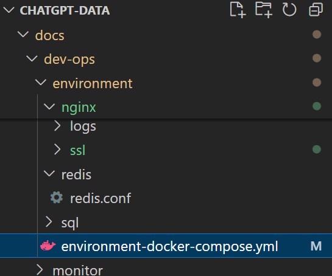

   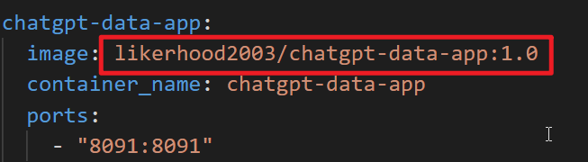

   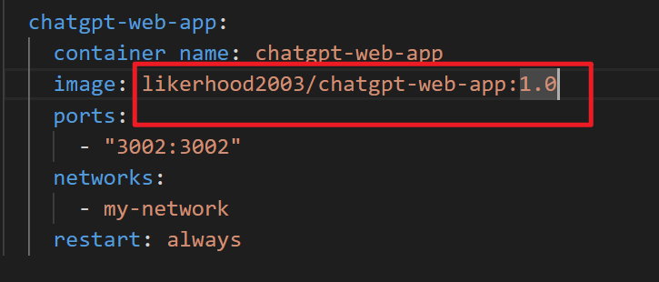

   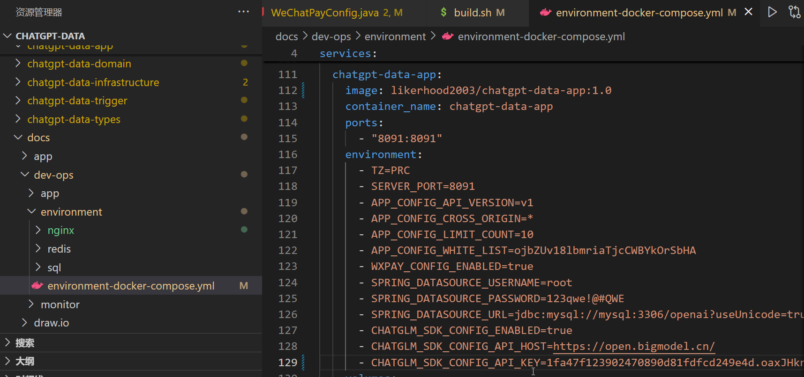

5. 修改nginx相关配置

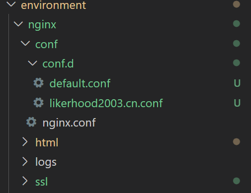


6. 先chatgpt-sdk和chatgpt-glm执行打包到主仓库中

   ```bash
   # 进入他们的主目录
   # maven命令打包
   mvn clean install
   ```

7. 进入chat-data主目录，执行打包

   ```bash
   mvn clean install
   ```

8. 进入chat-data-app主目录，修改打包容器的build.sh脚本，修改容器名和版本

   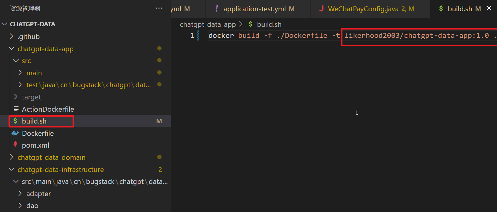

9. 进入chat-data-app主目录，执行build.sh打包容器

   ```bash
   # 1. 进入主目录
   cd 主目录
   # 2. 查看有没有build.sh
   ls
   # 3. 给build.sh执行权限
   chmod +x ./build.sh
   # 4. 执行该脚本
   ./build.sh
   ```

10. 进入后端配置文件主目录`docs\dev-ops\environment`，运行`environment-docker-compose.yml`

    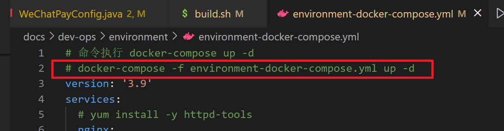

    ```bash
    docker-compose -f environment-docker-compose.yml up -d
    ```

    

## 3. 后端相关网站密码

1. mysql

   ```bash
   端口：13306
   root的密码：123qwe!@#QWE
   ```

2. phpmyadmin：查看mysql数据库的

   ```bash
   端口：8899
   root的密码：123qwe!@#QWE
   ```

3. redis-admin：查看redis的

   ```bash
   端口：8081
   用户名：admin
   密码：admin
   ```

4. redis

   ```bash
   端口：16379
   ```

5. nginx

   - windows

     ```shell
     # 国内镜像
     docker pull ccr.ccs.tencentyun.com/library/nginx
     
     # 启动容器
     docker run -p 80:80 -d --name nginx ccr.ccs.tencentyun.com/library/nginx:latest
     
     # 挂载
     docker run -p 80:80 -d --name nginx -v D:\note\dev-ops\nginx\conf\nginx.conf:/etc/nginx/nginx.conf -v D:\note\dev-ops\nginx\conf\conf.d:/etc/nginx/conf.d -v D:\note\dev-ops\nginx\html:/usr/share/nginx/html nginx:latest
     
     
     
     ```

     


### 2.1 系统开发技术框架

| 层次/模块      | 技术/工具                    | 主要作用与说明                                           |
| :------------: | :--------------------------: | :------------------------------------------------------: |
| 架构设计       | 微服务架构、DDD              | 解耦各业务模块，提升系统扩展性和可维护性                 |
| 后端开发       | Spring Boot                  | 后端核心开发框架，支持微服务和快速开发                   |
|                | MyBatis                      | 数据持久化，简化数据库操作                               |
|                | Redis/Guava                  | 缓存与分布式锁，提升性能与并发能力                       |
|                | OKHttp3、Retrofit2           | 高效HTTP通信，对接多种大语言模型（如ChatGPT、ChatGLM等） |
|                | JWT                          | 用户身份认证与权限控制，保障系统安全                     |
|                | 敏感词过滤组件sensitive-word | 实时过滤用户输入和AI输出，保障内容安全                   |
| 前端开发       | React            | 前后端分离，提升开发效率和用户体验                       |
| 运维与部署     | Docker                       | 容器化部署，提升可移植性和扩展性                         |
|                | Nginx                        | 反向代理与负载均衡，提高并发处理能力                     |
|                | 云服务平台（京东云）     | 弹性扩展与高可用部署                                     |
|                | 日志与监控                   | 前后端集成日志与性能监控，保障系统稳定运行               |

通过上述技术框架的合理组合，系统实现了高效、稳定、可扩展的多模型智能问答服务平台，为后续功能拓展和业务创新提供了坚实的技术基础。


```

server {
    listen       80;
    listen  [::]:80;
    server_name  likerhood2003.cn;

    rewrite ^(.*) https://$server_name$1 permanent;

}

server {
    listen       443 ssl;
    server_name  likerhood2003.cn;

    ssl_certificate      /etc/nginx/ssl/likerhood2003.cn.crt;
    ssl_certificate_key  /etc/nginx/ssl/likerhood2003.cn.key;

    ssl_session_cache    shared:SSL:1m;
    ssl_session_timeout  5m;

    ssl_ciphers  HIGH:!aNULL:!MD5;
    ssl_prefer_server_ciphers  on;

    location / {
        proxy_pass http://117.72.46.249:8091;
        proxy_http_version 1.1;
        chunked_transfer_encoding off;
        proxy_buffering off;
        proxy_cache off;
    }

    error_page   500 502 503 504  /50x.html;
    location = /50x.html {
        root   /usr/share/nginx/html;
    }
}
```

