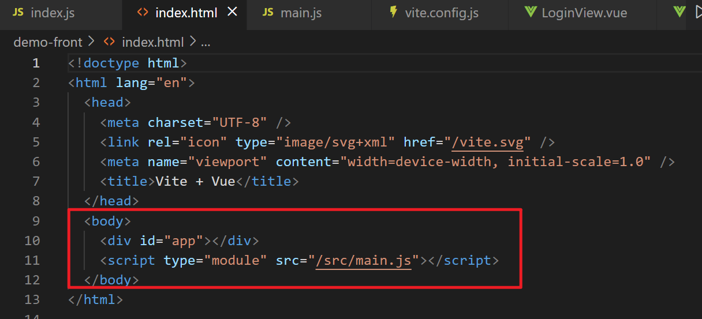
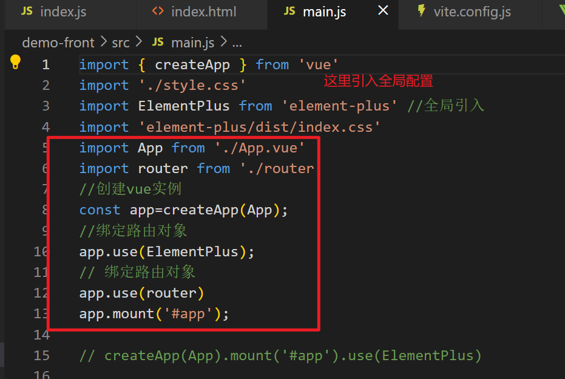
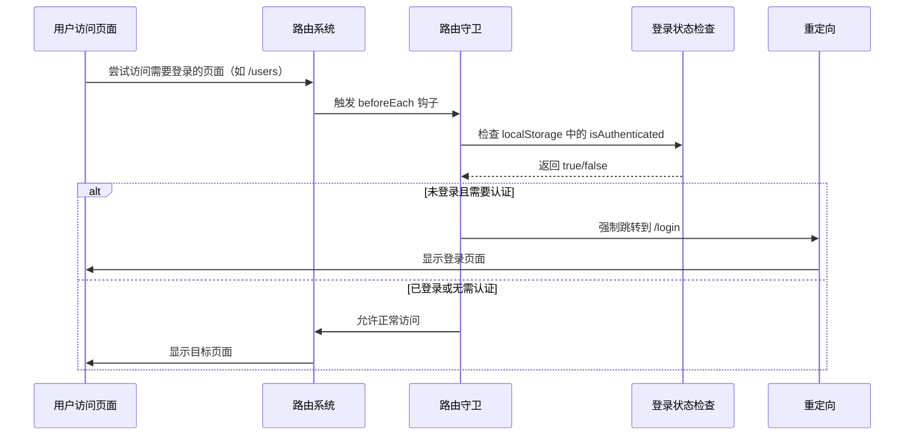

# vue前端

[TOC]

## 1. vue3前端项目结构

```
demo-front/
├─ .vscode/           # VS Code编辑器配置
├─ node_modules/      # 项目依赖库（自动生成）
├─ public/            # 静态资源（直接复制到构建结果）
│  └─ index.html      # 入口HTML文件
├─ src/               # 核心开发目录
│  ├─ assets/         # 图片/字体等资源（会被构建工具处理）
│  ├─ router/         # 路由配置
│  │  └─ index.js     # 定义所有页面路径规则
│  ├─ views/          # 页面级组件
│  │  ├─ LoginView.vue   # 登录页
│  │  └─ UserInfoView.vue # 用户信息页
│  ├─ App.vue         # 根组件（所有页面的容器）
│  ├─ main.js         # 项目启动入口
│  └─ style.css       # 全局CSS样式
├─ .gitignore         # Git忽略规则
└─ package-lock.json  # 依赖版本锁定文件
```


### 1.1 index.html



- **作用**：浏览器访问的入口文件
- 特点：
  - Vite会自动注入打包后的JS/CSS文件
  - `  <div id="app">  `是Vue组件的挂载容器


### 1.2 **src/main.js**



- **作用**：项目启动入口
- **流程**：
  ① 加载根组件`App.vue`
  ② 加载路由配置
  ③ 将整个应用挂载到HTML的`#app`元素


### 1.3 **src/App.vue**

```vue
<template>
  <!-- 路由视图容器 -->
  <router-view></router-view>
</template>

<script setup>
// 可在此处添加全局逻辑
</script>
```

- **作用**：所有页面的根容器
- 核心功能：
  - ` <router-view> `根据URL显示不同页面
  - 可添加全局导航栏/页脚等公共组件


### 1.4 **src/router/index.js**

```js
import { createRouter, createWebHistory } from 'vue-router'
// 引入组件
import LoginView from '../views/LoginView.vue'

const routes = [
  {
    path: '/login',
    name: 'Login',
    component: LoginView
  },
  {
    path: '/users',
    name: 'UserList',
    component: () => import('../views/UserInfoView.vue')
  }
]

const router = createRouter({
  history: createWebHistory(),
  routes
})

export default router
```

- **作用**：定义页面访问规则
- 关键配置：
  - `path`：浏览器访问路径（如`/login`）
  - `component`：对应的Vue组件文件
  - `history`：控制URL显示模式（hash模式或history模式）


## 2. 路由守卫

 **`router.beforeEach`** 是 Vue Router 提供的 **全局前置路由守卫**，它会在 **每次路由切换前** 被调用。你可以将它理解为一个「安检关卡」，用于在用户访问页面之前执行权限检查、登录验证等操作。 

例如登录部分流程如图所示：



**代码示例：**

```js
// src/router/index.js
import { createRouter } from 'vue-router'

const router = createRouter({ /* 路由配置 */ })

// 注册全局前置守卫
router.beforeEach((to, from, next) => {
  // 1. 检查目标路由是否需要登录
  if (to.meta.requiresAuth) {
    // 2. 验证用户是否已登录
    const isAuthenticated = localStorage.getItem('isLoggedIn') === 'true'
    
    // 3. 未登录则跳转到登录页
    if (!isAuthenticated) {
      next('/login')
    } else {
      next() // 放行
    }
  } else {
    next() // 不需要认证的路由直接放行
  }
})
```


**关键参数说明**

|  参数  |   类型    |                          作用                          |
| :----: | :-------: | :----------------------------------------------------: |
|  `to`  | Route对象 |  即将进入的目标路由信息（包含路径、参数、meta字段等）  |
| `from` | Route对象 |                 当前正要离开的路由信息                 |
| `next` |   函数    | 必须调用的函数，用于控制路由行为（放行、重定向或终止） |

- **绿灯**：调用 `next()` → 允许跳转
- **红灯**：调用 `next(false)` → 禁止跳转
- **改道**：调用 `next('/login')` → 强制跳转到指定路径


## 3. vue常见语法

### 3.1 组合式 API（Composition API）
```vue
<script setup>
// 1. 响应式变量
import { ref, reactive } from 'vue'

// 基本类型用 ref
const count = ref(0)

// 对象类型用 reactive
const user = reactive({
  name: 'John',
  age: 25
})

// 2. 计算属性
import { computed } from 'vue'
const double = computed(() => count.value * 2)

// 3. 方法
const increment = () => count.value++

// 4. 侦听器
import { watch } from 'vue'
watch(count, (newVal, oldVal) => {
  console.log(`count变化: ${oldVal} → ${newVal}`)
})

// 5. 生命周期
import { onMounted } from 'vue'
onMounted(() => {
  console.log('组件已挂载')
})
</script>
```

---

### 3.2 模板语法
```vue
<template>
  <!-- 响应式数据绑定 -->
  <p>{{ count }}</p>
  
  <!-- 事件处理 -->
  <button @click="increment">+1</button>

  <!-- 条件渲染 -->
  <div v-if="count > 5">大于5</div>
  <div v-else-if="count === 5">等于5</div>
  <div v-else>小于5</div>

  <!-- 列表渲染 -->
  <ul>
    <li v-for="item in list" :key="item.id">
      {{ item.name }}
    </li>
  </ul>

  <!-- 双向绑定 -->
  <input v-model="user.name">
  
  <!-- 样式绑定 -->
  <div :class="{ active: isActive }" :style="{ color: textColor }"></div>
</template>
```

---

### 3.3 组件通信
**通信方式对比表**

|      方式      |     适用场景     |       优点       |       缺点       |
| :------------: | :--------------: | :--------------: | :--------------: |
|  Props/Events  | 父子组件简单通信 |     直观明确     |  跨层级传递繁琐  |
| Provide/Inject |  跨多层组件通信  |   避免逐层传递   | 数据流向不够透明 |
|     Pinia      |   全局状态管理   | 集中管理，响应式 | 需要额外学习成本 |
| Template Refs  |  父调子组件方法  | 直接访问组件实例 |  破坏组件封装性  |
|   Event Bus    |  任意组件间通信  |     灵活方便     |   难以跟踪维护   |

------

**最佳实践建议**

1. **简单场景**优先使用 Props/Events
2. **跨层级通信**使用 Provide/Inject
3. **复杂应用**必用 Pinia 状态管理
4. **慎用 Event Bus**（大型项目易导致混乱）
5. 避免直接修改子组件状态，通过方法调用实现

**实际应用选择**：

- 用户列表与删除操作：父子组件通过事件通信
- 登录状态管理：使用 Pinia 全局共享
- 主题切换功能：通过 Provide/Inject 实现
- 表单验证结果反馈：通过模板引用调用方法


---

### 3.4 响应式核心
| 方法          | 适用场景          | 示例                                          |
| ------------- | ----------------- | --------------------------------------------- |
| `ref`         | 基本类型/对象引用 | `const num = ref(0)`                          |
| `reactive`    | 对象/数组         | `const obj = reactive({})`                    |
| `toRefs`      | 解构响应式对象    | `const { name } = toRefs(obj)`                |
| `watchEffect` | 自动追踪依赖      | `watchEffect(() => console.log(count.value))` |

---

### 3.5 生命周期
| 选项式API     | 组合式API       | 触发时机            |
| ------------- | --------------- | ------------------- |
| beforeCreate  | -               | 实例初始化前        |
| created       | -               | 实例创建完成        |
| beforeMount   | onBeforeMount   | 挂载DOM前           |
| mounted       | onMounted       | 挂载完成            |
| beforeUpdate  | onBeforeUpdate  | 数据变化，DOM更新前 |
| updated       | onUpdated       | DOM更新完成         |
| beforeUnmount | onBeforeUnmount | 实例销毁前          |
| unmounted     | onUnmounted     | 实例销毁完成        |


## 4. asnyc和await

- **`async`**：声明一个函数是异步的，它会隐式返回一个 Promise。
- **`await`**：只能在 `async` 函数内部使用，用于等待一个 Promise 完成并返回其结果。
- **核心作用**：让异步代码的写法更接近同步代码，避免回调地狱，提升代码可读性。

**定义异步函数**

```js
async function fetchData() {
  const response = await fetch('https://api.example.com/data');
  const data = await response.json();
  return data;
}
```

**在 Vue3 组件中使用**

```vue
<script setup>
import { ref } from 'vue';

const data = ref(null);

async function loadData() {
  try {
    const response = await fetch('https://api.example.com/data');
    data.value = await response.json();
  } catch (error) {
    console.error('请求失败:', error);
  }
}

// 在生命周期钩子中调用
onMounted(() => {
  loadData();
});
</script>

<template>
  <div v-if="data">{{ data }}</div>
  <div v-else>Loading...</div>
</template>
```


