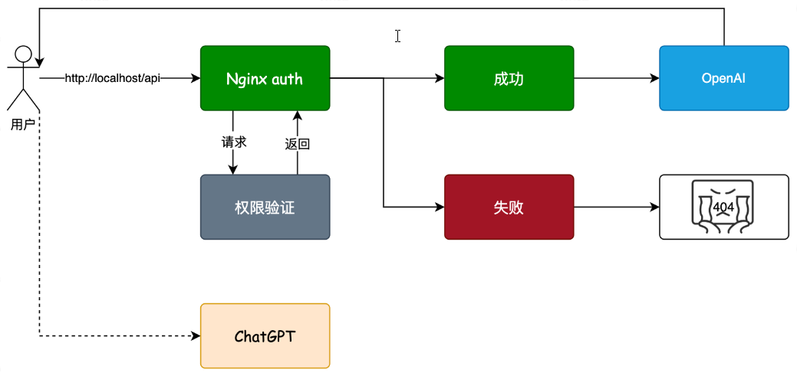
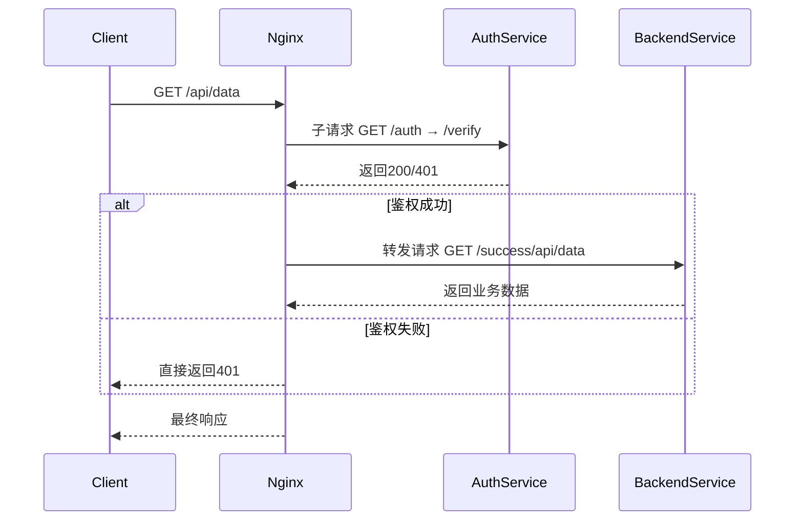

# API工程搭建和简单访问认证

[TOC]


## 1.  核心诉求

开发过程中，首先需要梳理需求，并且完成需求目标的各种验证（也就是测试），以确保方案可行性。验证了基础模块之后，再把各个模块搭建起来，搭建的过程是架构和设计模式的运用。


这里目标是**通过nginx访问接口的时候，做一些权限校验**。只有通过校验才能访问接口。**类似一些网站购买的一个月有效期的服务，过期就不能使用的场景。**





## 2. 方案实现

1. api工程

   创建一个springboot工程，提供简单的api工程。

   ```java
   @SpringBootApplication
   @RestController
   public class Application {
   
       private Logger logger = LoggerFactory.getLogger(Application.class);
   
       public static void main(String[] args) {
           SpringApplication.run(Application.class, args);
       }
   
       @GetMapping("/verify")
       public ResponseEntity<String> verify(String token) {
           logger.info("验证 token：{}", token);
           if ("success".equals(token)){
               return ResponseEntity.status(HttpStatus.OK).build();
           } else {
               return ResponseEntity.status(HttpStatus.BAD_REQUEST).build();
           }
       }
   
       @GetMapping("/success")
       public String success(){
           return "test success by xfg";
       }
   
   }
   ```

   - 目前的工程还非常简单，只是在 Application 中提供了2个接口，一个认证，一个成功。
   - 在 verify 接口中，如果 `token == success 就返回 HttpStatus.OK == 200 的码，否则返回 HttpStatus.BAD_REQUEST == 400`  错误码。


2. nginx部署

   -  改动 Nginx conf.d/default.conf 文件，添加 auth 认证模块 

   ```java 
   server {
   
       listen       80;
       server_name  192.168.1.101;
   
       # 首页
       index index.html;
   
       location / {
           root   /usr/share/nginx/html;
           index  index.html index.htm;
       }
   
       location /api/ {
           auth_request /auth;
           # 鉴权通过后的处理方式
           proxy_pass http://192.168.1.101:8080/success;
       }
   
       location = /auth {
           # 发送子请求到HTTP服务，验证客户端的凭据，返回响应码
           internal;
           # 设置参数
           set $query '';
           if ($request_uri ~* "[^\?]+\?(.*)$") {
               set $query $1;
           }
           # 验证成功，返回200 OK
           proxy_pass http://192.168.1.101:8080/verify?$query;
           # 发送原始请求
           proxy_pass_request_body off;
           # 清空 Content-Type
           proxy_set_header Content-Type "";
        }
   
       error_page 404 /404.html;
           location = /40x.html {
   
           }
   
       error_page   500 502 503 504  /50x.html;
        location = /50x.html {
        }
   
   }
   ```

   - 用户访问 http://localhost/api 目标是到 `http://192.168.1.101:8080/success`  但这里添加了 auth 模块，所以会先进入 auth 的处理。

   - `= auth 是绝对匹配，没有 = 号就是前缀匹配。在 auth 中把请求 api 的参数获取到在访问到验证地址 http://192.168.1.101:8080/verify?$query`  如果接口返回一个200的码就通过，其他的码就失败。

   

   

## 3. 语法详解

   ### 3.1 LoggerFactory

   [参考博客](https://blog.csdn.net/wenxuankeji/article/details/138199675)

    `LoggerFactory.getLogger()`是SLF4J API提供的标准方法，用于创建或获取与特定类关联的`Logger`实例。使用时，你需要手动编写如下代码： 

   ```java
import org.slf4j.Logger;
   import org.slf4j.LoggerFactory;

   public class MyClass {
 private static final Logger logger = LoggerFactory.getLogger(MyClass.class);
   
    public void someMethod() {
           logger.info("Some information message");
        logger.debug("Debugging details");
           logger.warn("A warning message");
        // ...
       }
   }
   ```

   这里，**getLogger()方法接受一个类的Class对象作为参数，通常传入this.getClass()或MyClass.class。这样，日志输出时会自动包含类名信息，有助于在日志中快速识别日志来源。**

   优点

   - **灵活性**：无需依赖Lombok库，适用于不能或不愿引入Lombok的项目。
- **显式控制**：手动初始化Logger对象使得日志创建过程更为明确，便于理解和控制。
  

  

**拓展**

**@Slf4j注解**

**@Slf4j是Lombok库提供的一种注解**，用于简化日志记录的初始化和使用。当你在类上添加@Slf4j注解时，**Lombok会在编译阶段自动生成一个名为log的Logger实例变量，并自动调用**LoggerFactory.getLogger()方法初始化该实例。这意味着你无需手动编写如下代码：

```java
   import org.slf4j.Logger;
import org.slf4j.LoggerFactory;
   
public class MyClass {
       private static final Logger logger = LoggerFactory.getLogger(MyClass.class);
    // ...
   }

```

    取而代之，只需在类声明处添加`@Slf4j`注解： 

   ```java
import lombok.extern.slf4j.Slf4j;
   
@Slf4j
   public class MyClass {
       // ...
   }
   
   ```

   优点

   - 简洁性：省去了手动创建和初始化Logger对象的代码，使代码更干净、更专注于业务逻辑。
   - 一致性：为所有使用@Slf4j注解的类自动生成同名的log变量，增强了代码风格的一致性。
   - 编译时生成：Lombok的处理发生在编译时，不会增加运行时负担，同时避免了手动初始化可能引入的错误。
     
     
     

   

### 3.2 ResponseEntity

[参考博客1](https://zhuanlan.zhihu.com/p/626962131)

[参考博客2](https://blog.csdn.net/m0_64974617/article/details/142651648)

 `ResponseEntity`是Spring框架中的一个类，它继承自`HttpEntity`，代表了整个HTTP响应（包括状态码、头信息和响应体）。`ResponseEntity`为你提供了更大的灵活性来控制REST API的响应。 

使用`ResponseEntity`有以下几个优势：

- **灵活性**：可以自定义HTTP状态码、头信息和响应体。
- **清晰度**：代码更具可读性，明确地表明了返回的HTTP响应信息。
- **封装性**：可以封装各种类型的响应体，包括字符串、对象、列表等。


springboot框架底层实现http响应的流程如下：

- **DispatcherServlet** 作为前端控制器，接收所有HTTP请求

- 根据URL路径匹配对应的`@Controller`或`@RestController`

  ```java
  // 开发者只需做三件事：
  1. 定义路由：@GetMapping("/path")
  2. 执行业务：userService.findById()
  3. 返回实体：ResponseEntity.ok(data)
  
  // Spring自动完成：
  - 请求解析
  - 参数绑定
  - 响应封装
  - 异常转换
  - 网络传输
  ```

   ```mermaid
sequenceDiagram
    participant Client
    participant DispatcherServlet
    participant Controller
    participant HttpMessageConverter
    participant Jackson

    Client->>DispatcherServlet: GET /users/123
    DispatcherServlet->>Controller: 查找匹配的@GetMapping
    Controller->>Controller: 执行业务逻辑
    Controller->>DispatcherServlet: 返回ResponseEntity<User>
    DispatcherServlet->>HttpMessageConverter: 需要转换响应吗？
    HttpMessageConverter->>Jackson: 调用ObjectMapper
    Jackson->>HttpMessageConverter: 生成JSON字符串
    HttpMessageConverter->>DispatcherServlet: 写入响应体
    DispatcherServlet->>Client: 发送完整HTTP响应
   ```

  


### 3.3 nginx配置

之前提到过nginx实现客户端向服务端请求的反向代理。这里功能是根据客户端的请求先做一个拦截和鉴定权限。




**关键代码：**

```nginx
location /api/ {
    auth_request /auth;
    # 鉴权通过后的处理方式
    proxy_pass http://localhost:8080/success;
}

location = /auth {
    # 发送子请求到HTTP服务，验证客户端的凭据，返回响应码
    internal;
    # 设置参数
    set $query '';
    if ($request_uri ~* "[^\?]+\?(.*)$") {
        set $query $1;
    }
    # 验证成功，返回200 OK
    proxy_pass http://localhost:8080/verify?$query;
    # 发送原始请求
    proxy_pass_request_body off;
    # 清空 Content-Type
    proxy_set_header Content-Type "";
}
```


### 3.1.1 **`auth_request /auth;` 的作用与原理**

`auth_request /auth;` 是 Nginx 的一个 **子请求鉴权机制**，它的核心功能是：  
**在访问 `/api/` 路径前，先向 `/auth` 发起一个内部请求（子请求）进行权限验证**，只有 `/auth` 返回 `200` 时，Nginx 才会允许请求继续转发到 `http://localhost:8080/success`。

---

#### **1. 完整流程解析**
假设客户端请求：  
```
GET /api/data?token=123
```

**步骤 1：触发鉴权子请求**

- Nginx 收到 `/api/data` 请求时，发现配置了 `auth_request /auth`，**先暂停当前请求**。
- **向 `/auth` 发起一个内部 HTTP 请求**（子请求），验证权限。

**步骤 2：`/auth` 处理子请求**

- `/auth` 的配置会提取原始请求的查询参数（`?token=123`），转发到后端验证服务：  
  ```
  GET http://localhost:8080/verify?token=123
  ```
- **后端验证逻辑**（你的 Spring Boot 代码）：
  ```java
  @GetMapping("/verify")
  public ResponseEntity<String> verify(String token) {
      if ("success".equals(token)) {
          return ResponseEntity.ok().build();  // 返回 200
      } else {
          return ResponseEntity.badRequest().build(); // 返回 400
      }
  }
  ```

**步骤 3：根据鉴权结果决定行为**

- 如果 `/verify` 返回 `200`：  
  - Nginx 认为鉴权通过，继续处理原始请求，将其转发到 `proxy_pass http://localhost:8080/success`。
- 如果 `/verify` 返回 `40x/50x`：  
  - Nginx 直接向客户端返回相同的错误码（如 `401 Unauthorized`），**不会转发到 `/success`**。

---

#### **2. 关键配置详解**
**(1) `auth_request /auth;`**

- **作用位置**：在 `location /api/` 中定义，表示对该路径的请求需先通过 `/auth` 的鉴权。
- **子请求特性**：  
  - 子请求是 Nginx **内部发起的 HTTP 请求**，客户端无感知。  
  - 子请求的响应码决定主请求是否继续。

**(2) `internal;`**

- 表示 `/auth` 是一个 **内部接口**，禁止外部直接访问（如用户直接访问 `/auth` 会返回 `404`）。

**(3) 参数透传逻辑**

```nginx
set $query '';
if ($request_uri ~* "[^\?]+\?(.*)$") {
    set $query $1;
}
proxy_pass http://localhost:8080/verify?$query;
```
- **目的**：将原始请求的查询参数（如 `?token=123`）透传给 `/verify` 接口。  
- **示例**：  
  - 原始请求：`/api/data?token=123`  
  - 子请求：`/verify?token=123`

**(4) `proxy_pass_request_body off;`**

- 禁止将原始请求的 **请求体（如 POST 数据）** 转发到 `/verify`，因为鉴权通常只需验证 URL 参数或请求头。

---

#### **3. 常见问题**
**Q1：如果 `/verify` 需要原始请求的 Headers 怎么办？**

需要在 `/auth` 中显式传递需要的请求头：  
```nginx
proxy_set_header X-Original-Token $http_token;  # 传递原始请求的 token 头
```

**Q2：如何缓存鉴权结果？**

使用 Nginx 的 `proxy_cache` 缓存 `/verify` 的响应，避免重复验证：  
```nginx
proxy_cache auth_cache;
proxy_cache_valid 200 5m;  # 缓存 200 响应 5 分钟
```

**Q3：如果鉴权需要请求体（如 POST JSON）？**

需修改配置，允许转发请求体：  
```nginx
proxy_pass_request_body on;
proxy_set_header Content-Type $content_type;
```

   

   

### 3.1.2 正则表达式的使用

**正则模式：`[^\?]+\?(.*)$`**

分解每个部分的含义：

| 字符     | 含义                                                         | 示例匹配内容（以 `/auth?token=123` 为例） |
| -------- | ------------------------------------------------------------ | ----------------------------------------- |
| `[^\?]+` | 匹配 **非 `?` 的字符 1 次或多次**                            | 匹配 `/auth`                              |
| `\?`     | 匹配 **字面量的 `?` 符号**（`\` 是转义符）                   | 匹配 `?`                                  |
| `(.*)`   | **捕获组**：匹配任意字符（除换行符）0 次或多次，并保存到 `$1` | 捕获 `token=123`                          |
| `$`      | 匹配字符串的**结尾**                                         | 确保参数在末尾                            |

**关键概念**：

1. **`[^\?]`**  
   - `[]` 是字符组，`^` 在字符组内表示**否定**，`\?` 是字面量的 `?`。  
   - 合起来表示：**“匹配任何一个不是 `?` 的字符”**。

2. **`+`**  
   - 表示前面的模式（`[^\?]`）**至少出现 1 次**（贪婪匹配）。

3. **`(.*)`**  
   - `()` 是**捕获组**，括号内的内容会被保存到 `$1`（第一个捕获组）。  
   - `.*` 表示“匹配任意字符（除了换行符）0 次或多次”。


**匹配过程示例**：

假设 `$request_uri` 是 `/auth?token=123`：
1. `[^\?]+` → 匹配 `/auth`（因为 `a,u,t,h` 都不是 `?`）。  
2. `\?` → 匹配 `?`。  
3. `(.*)` → 匹配 `token=123` 并存入 `$1`。  
4. `$` → 确保后面没有其他字符。

最终：  
- **`$1 = "token=123"`**  
- `set $query $1;` → `$query = "token=123"`。


### 3.1.3   **HTTP 请求参数如何自动绑定到 Spring Boot 控制器方法的参数** 

1. **HTTP 请求到达 Spring Boot**：
   - URL: `http://localhost:8080/verify?token=123`
   - Spring 解析出查询参数：`token=123`。
2. **Spring 匹配方法参数**：
   - 发现方法参数名为 `token`，和查询参数 `token` 同名。
   - 自动将 `123` 赋值给 `token` 参数。
3. **执行控制器逻辑**：
   - 你的代码检查 `token` 是否是 `"success"`，返回对应的 HTTP 状态码。

   


###   3.1.4 docker容器的网络部分

当nginx启动一个容器，nginx的配置文件关于localhost会指向容器的内部网络，此时可以用

`host.docker.internal`来指向自己电脑（或者也叫宿主机）。

```nginx
proxy_pass http://host.docker.internal:8080/success;
```

   

   

   

   

   

   

   

   


