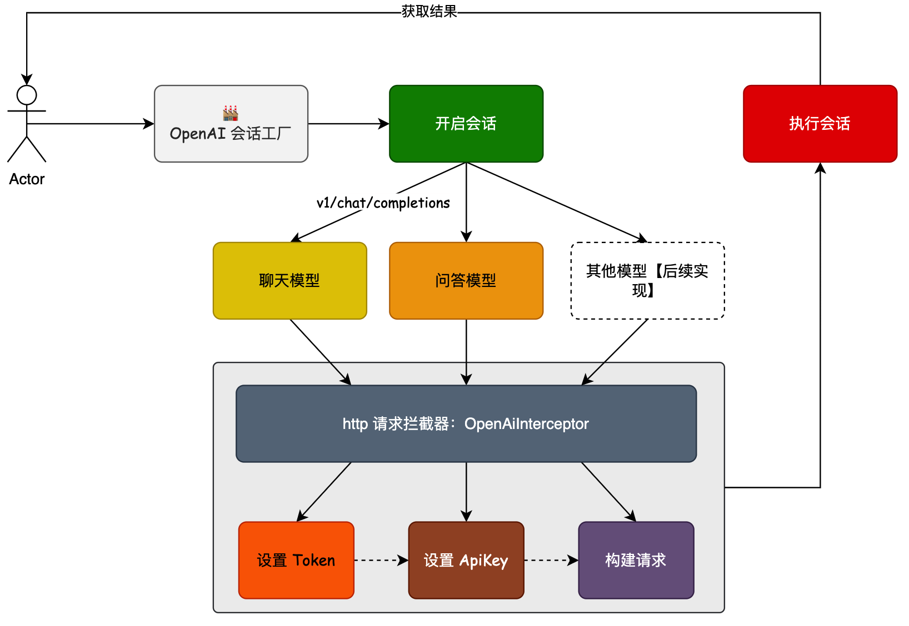
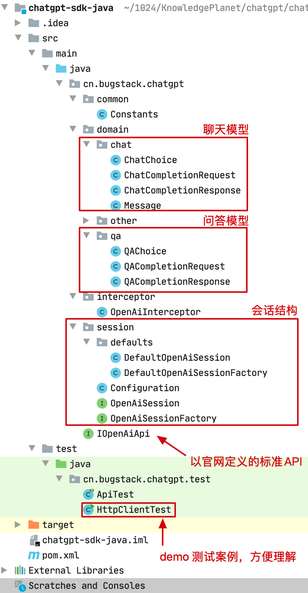
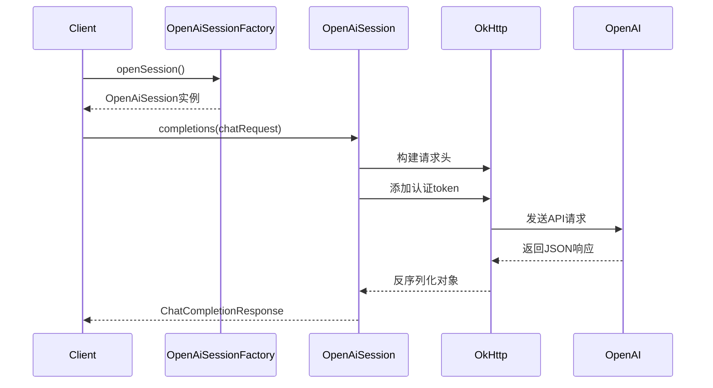

# chatgpt-sdk开发

[toc]

## 1. 核心需求

 搭建一个 ChatGPT-SDK 组件工程，专门用于封装对 OpenAI 接口的使用。由于 OpenAI 接口本身较多，并有各类配置的设置，所以开发一个共用的 SDK 组件，更合适我们在各类工程中扩展使用。所以我们这个章节以 OpenAI 抽象为会话模型，建立工程结构设计。 

  


## 2. 相关组件依赖

1. **SLF4J API 和 Simple Implementation**
   ```xml
   <dependency>
       <groupId>org.slf4j</groupId>
       <artifactId>slf4j-api</artifactId>
       <version>${slf4j.version}</version>
   </dependency>
   <dependency>
       <groupId>org.slf4j</groupId>
       <artifactId>slf4j-simple</artifactId>
       <version>${slf4j.version}</version>
   </dependency>
   ```
   - 作用：SLF4J 是一个日志门面框架，`slf4j-api` 提供日志接口，`slf4j-simple` 是一个简单的日志实现，用于开发和测试环境。

2. **Jackson Databind**
   ```xml
   <dependency>
       <groupId>com.fasterxml.jackson.core</groupId>
       <artifactId>jackson-databind</artifactId>
       <version>2.13.3</version>
   </dependency>
   ```
   - 作用：用于 JSON 数据的序列化和反序列化，处理 HTTP 请求和响应的 JSON 数据。

3. **Hutool All**
   ```xml
   <dependency>
       <groupId>cn.hutool</groupId>
       <artifactId>hutool-all</artifactId>
       <version>5.8.12</version>
   </dependency>
   ```
   - 作用：Hutool 是一个 Java 工具库，提供各种实用功能（如 HTTP 请求、加密、日期处理等），简化开发。

4. **OkHttp SSE 和 Logging Interceptor**
   ```xml
   <dependency>
       <groupId>com.squareup.okhttp3</groupId>
       <artifactId>okhttp-sse</artifactId>
       <version>3.14.9</version>
   </dependency>
   <dependency>
       <groupId>com.squareup.okhttp3</groupId>
       <artifactId>logging-interceptor</artifactId>
       <version>3.14.9</version>
   </dependency>
   ```
   - 作用：
     - `okhttp-sse`：支持 Server-Sent Events (SSE)，用于处理流式响应（如 ChatGPT 的流式输出）。
     - `logging-interceptor`：OkHttp 的日志拦截器，用于调试 HTTP 请求和响应。

5. **Retrofit2 及其扩展**
   ```xml
   <dependency>
       <groupId>com.squareup.retrofit2</groupId>
       <artifactId>retrofit</artifactId>
       <version>${retrofit2.version}</version>
   </dependency>
   <dependency>
       <groupId>com.squareup.retrofit2</groupId>
       <artifactId>converter-jackson</artifactId>
       <version>${retrofit2.version}</version>
   </dependency>
   <dependency>
       <groupId>com.squareup.retrofit2</groupId>
       <artifactId>adapter-rxjava2</artifactId>
       <version>${retrofit2.version}</version>
   </dependency>
   ```
   - 作用：
     - `retrofit`：用于构建 REST API 客户端，简化 HTTP 请求。
     - `converter-jackson`：将 Retrofit 的响应通过 Jackson 转换为 Java 对象。
     - `adapter-rxjava2`：支持 Retrofit 与 RxJava2 结合，实现响应式编程。

6. **JUnit**
   ```xml
   <dependency>
       <groupId>junit</groupId>
       <artifactId>junit</artifactId>
       <version>4.13.2</version>
       <scope>test</scope>
   </dependency>
   ```
   - 作用：单元测试框架，用于编写和运行测试用例（此处配置为跳过测试）。

7. **JetBrains Annotations**
   ```xml
   <dependency>
       <groupId>org.jetbrains</groupId>
       <artifactId>annotations</artifactId>
       <version>RELEASE</version>
       <scope>compile</scope>
   </dependency>
   ```
   - 作用：提供注解（如 `@Nullable`、`@NotNull`），帮助静态代码分析工具检测潜在问题。

8. **JTokkit**
   ```xml
   <dependency>
       <groupId>com.knuddels</groupId>
       <artifactId>jtokkit</artifactId>
       <version>0.2.0</version>
   </dependency>
   ```
   - 作用：用于计算 OpenAI 模型的 Token 数量（如 GPT-3 的文本分词）。

9. **Lombok**
   ```xml
   <dependency>
       <groupId>org.projectlombok</groupId>
       <artifactId>lombok</artifactId>
       <version>1.18.30</version>
       <scope>compile</scope>
   </dependency>
   ```
   - 作用：通过注解（如 `@Getter`、`@Setter`）自动生成代码（如 getter/setter），减少样板代码。

**总结**

这些依赖共同支持以下功能：
- **HTTP 通信**：Retrofit + OkHttp 处理 API 请求，支持 SSE 流式响应。
- **JSON 处理**：Jackson 实现数据序列化/反序列化。
- **工具辅助**：Hutool 和 Lombok 简化开发。
- **日志记录**：SLF4J 管理日志。
- **Token 计算**：JTokkit 用于 OpenAI 模型分词。
- **测试与注解**：JUnit 测试，JetBrains 注解增强代码健壮性。


## 3. 工程结构

  


1. ChatGPT 的 API 包含；简单问答模型 - v1/completions、会话聊天模型- v1/chat/completions 所以在工程的 domain 下也添加了对应的这两部分请求和应答对象。
2. 之后就是以 session 会话为入口，管理整个服务的启动、调用、封装结果信息。


## 4. 代码细节讲解

### 4.1 **IOpenAiApi.java**

```java
package cn.bugstack.chatgpt;

import cn.bugstack.chatgpt.domain.chat.ChatCompletionRequest;
import cn.bugstack.chatgpt.domain.chat.ChatCompletionResponse;
import cn.bugstack.chatgpt.domain.qa.QACompletionRequest;
import cn.bugstack.chatgpt.domain.qa.QACompletionResponse;
import io.reactivex.Single;
import retrofit2.http.Body;
import retrofit2.http.POST;

/**
 * @author 小傅哥，微信：fustack
 * @description 以 ChatGPT 官网 API 模型，定义接口。官网：https://platform.openai.com/playground
 * @github https://github.com/fuzhengwei
 * @Copyright 公众号：bugstack虫洞栈 | 博客：https://bugstack.cn - 沉淀、分享、成长，让自己和他人都能有所收获！
 */
public interface IOpenAiApi {

    /**
     * 文本问答
     * @param qaCompletionRequest 请求信息
     * @return                    返回结果
     */
    @POST("v1/completions")
    Single<QACompletionResponse> completions(@Body QACompletionRequest qaCompletionRequest);

    /**
     * 默认 GPT-3.5 问答模型
     * @param chatCompletionRequest 请求信息
     * @return                      返回结果
     */
    @POST("v1/chat/completions")
    Single<ChatCompletionResponse> completions(@Body ChatCompletionRequest chatCompletionRequest);

}

```


- **作用**：定义 OpenAI API 的 HTTP 请求方法，供 `Retrofit` 调用。
- **请求方式**：`POST`（OpenAI API 主要使用 POST 请求）。
- **返回类型**：`Single`（RxJava 的 `Single`，表示异步单次请求）。
- **依赖**：
  - Retrofit（HTTP 请求）
  - RxJava（响应式编程支持）


**(1) `completions(QACompletionRequest)` —— 文本问答（如 `text-davinci-003`）**

```
@POST("v1/completions")
Single<QACompletionResponse> completions(@Body QACompletionRequest qaCompletionRequest);
```

- **用途**：调用 OpenAI 的 **文本补全（Completion）API**，适用于 `text-davinci-003` 等模型。
- **请求路径**：`v1/completions`（OpenAI 标准 API 路径）。
- **参数**：
  - `QACompletionRequest`：包含 `prompt`（问题）、`max_tokens`（最大 token 数）等参数。
- **返回**：
  - `Single`：RxJava 的异步单次响应，包含 `text`（回答内容）。

**示例请求（JSON）**：

```
{
  "model": "text-davinci-003",
  "prompt": "Java 如何实现多线程？",
  "max_tokens": 100
}
```

**适用场景**：

- 单轮问答（如知识查询）。
- 代码补全、文本生成。


**(2) `completions(ChatCompletionRequest)` —— 聊天对话（如 `gpt-3.5-turbo`）**

```
@POST("v1/chat/completions")
Single<ChatCompletionResponse> completions(@Body ChatCompletionRequest chatCompletionRequest);
```

- **用途**：调用 OpenAI 的 **聊天补全（Chat Completion）API**，适用于 `gpt-3.5-turbo` 等模型。
- **请求路径**：`v1/chat/completions`（OpenAI 标准 API 路径）。
- **参数**：
  - `ChatCompletionRequest`：包含 `messages`（聊天消息列表）、`model`（模型名称）等参数。
- **返回**：
  - `Single`：RxJava 的异步单次响应，包含 `choices`（回复列表）。

**示例请求（JSON）**：

```
{
  "model": "gpt-3.5-turbo",
  "messages": [
    {"role": "user", "content": "Java 如何实现多线程？"}
  ]
}
```

**适用场景**：

- 多轮对话（如聊天机器人）。
- 上下文关联的问答。

**3. 关键点**

**(1) `@POST` 注解**

- 表示这是一个 `POST` 请求，路径为 `v1/completions` 或 `v1/chat/completions`。
- OpenAI API 主要使用 `POST`，因为请求通常包含较长的 `prompt` 或 `messages`。

**(2) `@Body` 注解**

- 表示请求体（`QACompletionRequest` 或 `ChatCompletionRequest`）会被 Retrofit 自动序列化为 JSON。

**(3) `Single` 返回值**

- 来自 **RxJava**，表示 **异步单次请求**（类似于 `CompletableFuture` 或 `Promise`）。

- 可以通过 `.subscribe()` 处理响应：

  ```
  openAiApi.completions(request)
      .subscribe(
          response -> System.out.println(response.getText()),  // 成功回调
          error -> error.printStackTrace()                    // 失败回调
      );
  ```

**(4) 方法重载**

- 两个方法都叫 `completions`，但参数不同：
  - `QACompletionRequest` → 文本问答（`v1/completions`）。
  - `ChatCompletionRequest` → 聊天对话（`v1/chat/completions`）。
- 编译器会根据传入的参数类型自动选择正确的方法。


### 4.2 Constants.java

```java
package cn.bugstack.chatgpt.common;

public class Constants {

    /**
     * 官网支持的请求角色类型；system、user、assistant
     * https://platform.openai.com/docs/guides/chat/introduction
     */
    public enum Role {

        SYSTEM("system"),
        USER("user"),
        ASSISTANT("assistant"),
        ;

        private String code;

        Role(String code) {
            this.code = code;
        }

        public String getCode() {
            return code;
        }

    }

}

```


这个代码定义的是一个枚举(Enum)类型，它是Java中一种特殊的类，用于定义一组固定的常量。让我们详细解析这个`Role`枚举的结构和作用。


1. **枚举常量定义部分**

```java
SYSTEM("system"),
USER("user"),
ASSISTANT("assistant"),
;
```

- 这部分定义了枚举的三个常量值：`SYSTEM`、`USER`和`ASSISTANT`
- 每个常量后面的括号表示调用枚举的构造函数，传递参数值
- 最后的**分号**表示**枚举常量定义结束，后面可以定义枚举类的成员变量和方法**
- 如果没有成员变量或方法，分号可以省略

2. **成员变量和构造方法**

```java
private String code;
// 构造函数
Role(String code) {
    this.code = code;
}
```

- 枚举可以有成员变量，这里有一个`code`字符串
- 枚举可以有构造方法，但必须是`private`的(可省略不写，默认就是private)
- 构造方法在定义枚举常量时被调用

3. **方法**

```java
public String getCode() {
    return code;
}
```

- 枚举可以有自己的方法，这里提供了获取`code`值的方法


枚举实际上是一个特殊的类：

1. 这个类继承了`java.lang.Enum`
2. 枚举常量是该类的实例对象
3. 这些实例对象是在类加载时创建的

上面的`Role`枚举编译后大致相当于：

```java
public final class Role extends Enum<Role> {
    public static final Role SYSTEM = new Role("system");
    public static final Role USER = new Role("user");
    public static final Role ASSISTANT = new Role("assistant");
    
    private String code;
    
    private Role(String code) {
        this.code = code;
    }
    
    public String getCode() {
        return code;
    }
}
```


### 4.3 **ChatChoice.java**

```java
package cn.bugstack.chatgpt.domain.chat;

import com.fasterxml.jackson.annotation.JsonIgnoreProperties;
import com.fasterxml.jackson.annotation.JsonProperty;
import lombok.Data;

import java.io.Serializable;

@Data
@JsonIgnoreProperties(ignoreUnknown = true)
public class ChatChoice implements Serializable {

    private long index;
    /** stream = true 请求参数里返回的属性是 delta */
    @JsonProperty("delta")
    private Message delta;
    /** stream = false 请求参数里返回的属性是 delta */
    @JsonProperty("message")
    private Message message;
    @JsonProperty("finish_reason")
    private String finishReason;

    private String logprobs;

}

```


 这个 `ChatChoice` 类是 ChatGPT API 响应中的一个重要数据结构，用于封装 AI 返回的 **对话选项**。它处理 **流式(stream)** 和 **非流式** 两种响应模式，并包含对话完成的原因等信息。 

- **流式响应**：逐步返回数据，适合实时交互。
- **非流式响应**：一次性返回数据，适合简单请求。
- **`ChatChoice`**：是封装API回复的核心类，通过 `message`/`delta` 字段适配不同模式，提供统一的处理接口。


**(1) `@Data`（Lombok）**

```java
@Data
```
- **作用**：自动生成以下方法：
  - `getter` / `setter`
  - `toString()`
  - `equals()` 和 `hashCode()`
- **优势**：减少样板代码，使类更简洁。

**(2) `@JsonIgnoreProperties`（Jackson）**

```java
@JsonIgnoreProperties(ignoreUnknown = true)
```
- **作用**：忽略 JSON 中存在的但类中没有定义的字段。
- **示例**：如果 API 返回了额外的字段（如 `unexpected_field`），不会导致反序列化失败。
- **适用场景**：API 响应可能扩展，但客户端不需要所有字段时。

**(3) `@JsonProperty`（Jackson）**

```java
@JsonProperty("delta")
private Message delta;

@JsonProperty("message")
private Message message;

@JsonProperty("finish_reason")
private String finishReason;
```
- **作用**：指定 Java 字段与 JSON 属性的映射关系。
- **细节**：
  - `delta` ↔ `"delta"`（流式响应字段）。
  - `message` ↔ `"message"`（非流式响应字段）。
  - `finishReason` ↔ `"finish_reason"`（下划线命名转驼峰命名）。


### 4.4 ChatCompletionRequest.java

[关于builder模式的参考博客](https://blog.csdn.net/weixin_44009447/article/details/118526794)

```java
package cn.bugstack.chatgpt.domain.chat;

import cn.bugstack.chatgpt.common.Constants;
import com.fasterxml.jackson.annotation.JsonIgnoreProperties;
import com.fasterxml.jackson.annotation.JsonInclude;
import com.fasterxml.jackson.annotation.JsonProperty;
import lombok.*;
import lombok.extern.slf4j.Slf4j;

import java.io.Serializable;
import java.util.List;
import java.util.Map;

@Data
@Builder
@Slf4j
@JsonInclude(JsonInclude.Include.NON_NULL)
@NoArgsConstructor
@AllArgsConstructor
@JsonIgnoreProperties(ignoreUnknown = true)
public class ChatCompletionRequest implements Serializable {

    /** 默认模型 */
    private String model = Model.GPT_3_5_TURBO.getCode();
    /** 问题描述 */
    private List<Message> messages;
    /** 控制温度【随机性】；0到2之间。较高的值(如0.8)将使输出更加随机，而较低的值(如0.2)将使输出更加集中和确定 */
    private double temperature = 0.2;
    /** 多样性控制；使用温度采样的替代方法称为核心采样，其中模型考虑具有top_p概率质量的令牌的结果。因此，0.1 意味着只考虑包含前 10% 概率质量的代币 */
    @JsonProperty("top_p")
    private Double topP = 1d;
    /** 为每个提示生成的完成次数 */
    private Integer n = 1;
    /** 是否为流式输出；就是一蹦一蹦的，出来结果 */
    private boolean stream = false;
    /** 停止输出标识 */
    private List<String> stop;
    /** 输出字符串限制；0 ~ 4096 */
    @JsonProperty("max_tokens")
    private Integer maxTokens = 2048;
    /** 频率惩罚；降低模型重复同一行的可能性 */
    @JsonProperty("frequency_penalty")
    private double frequencyPenalty = 0;
    /** 存在惩罚；增强模型谈论新话题的可能性 */
    @JsonProperty("presence_penalty")
    private double presencePenalty = 0;
    /** 生成多个调用结果，只显示最佳的。这样会更多的消耗你的 api token */
    @JsonProperty("logit_bias")
    private Map logitBias;
    /** 调用标识，避免重复调用 */
    private String user;

    @Getter
    @AllArgsConstructor
    public enum Model {
        /** gpt-3.5-turbo */
        GPT_3_5_TURBO("gpt-3.5-turbo"),
        /** GPT4.0 */
        GPT_4("gpt-4"),
        /** GPT4.0 超长上下文 */
        GPT_4_32K("gpt-4-32k"),
        ;
        private String code;
    }

}

```

`ChatCompletionRequest` 类的主要作用是：

1. 封装所有与 OpenAI 聊天 API 交互所需的请求参数
2. 提供默认参数值，简化 API 调用
3. 通过 Builder 模式方便地构建复杂请求对象
4. 支持 JSON 序列化/反序列化，用于网络传输

[文本聊天api官网](https://api.nuwaapi.com/doc)


### 4.5 ChatCompletionResponse.java

```java
@Data
@JsonIgnoreProperties(ignoreUnknown = true)
public class ChatCompletionResponse implements Serializable {

    /** ID */
    private String id;
    /** 对象 */
    private String object;
    /** 模型 */
    private String model;
    /** 对话 */
    private List<ChatChoice> choices;
    /** 创建 */
    private long created;
    /** 耗材 */
    private Usage usage;
    /**
     * 该指纹代表模型运行时使用的后端配置。
     * https://platform.openai.com/docs/api-reference/chat
     */
    @JsonProperty("system_fingerprint")
    private String systemFingerprint;

}

```

 `ChatCompletionResponse` 类是 ChatGPT SDK 中用于封装 OpenAI 聊天 API 返回结果的类。 

1. 封装 OpenAI 聊天 API 的完整响应数据
2. 提供结构化的方式访问 API 返回的各种信息
3. 支持 JSON 反序列化，将 API 返回的 JSON 数据转换为 Java 对象
4. 实现 Serializable 接口，支持对象序列化传输


### 4.6 Message.java

```java

@Data
@JsonInclude(JsonInclude.Include.NON_NULL)
@JsonIgnoreProperties(ignoreUnknown = true)
public class Message implements Serializable {

    private String role;
    private String content;
    private String name;

    public Message() {
    }

    private Message(Builder builder) {
        this.role = builder.role;
        this.content = builder.content;
        this.name = builder.name;
    }

    public static Builder builder() {
        return new Builder();
    }

    /**
     * 建造者模式
     */
    public static final class Builder {

        private String role;
        private String content;
        private String name;

        public Builder() {
        }

        public Builder role(Constants.Role role) {
            this.role = role.getCode();
            return this;
        }

        public Builder content(String content) {
            this.content = content;
            return this;
        }

        public Builder name(String name) {
            this.name = name;
            return this;
        }

        public Message build() {
            return new Message(this);
        }
    }

}

```

 `Message` 类是 ChatGPT SDK 中用于表示 **单条聊天消息** 的核心数据结构，它定义了对话中的角色、内容和可选标识。 

- **封装单条对话消息**：包括用户输入、AI 回复或系统指令
- **构建多轮对话**：通过组合多个 `Message` 对象形成对话上下文
- **支持流式/非流式交互**：统一处理增量(`delta`)和完整(`message`)内容

**关键： 建造者模式**

| 设计选择   | 原因                      | 带来的好处             |
| :--------- | :------------------------ | :--------------------- |
| **内部类** | 逻辑上属于Message的一部分 | 高内聚、访问私有构造   |
| **static** | 不依赖Message实例         | 使用更方便、内存更高效 |
| **final**  | 不需要被继承              | 更安全、意图更明确     |
| **public** | 需要被外部调用            | 保证可用性             |


### 4.7  OpenAiInterceptor.java

```java
package cn.bugstack.chatgpt.interceptor;

import cn.hutool.http.ContentType;
import cn.hutool.http.Header;
import okhttp3.HttpUrl;
import okhttp3.Interceptor;
import okhttp3.Request;
import okhttp3.Response;
import org.jetbrains.annotations.NotNull;

public class OpenAiInterceptor implements Interceptor {

    /** OpenAi apiKey 需要在官网申请 */
    private String apiKey;
    /** 访问授权接口的认证 Token */
    private String authToken;

    public OpenAiInterceptor(String apiKey, String authToken) {
        this.apiKey = apiKey;
        this.authToken = authToken;
    }

    @NotNull
    @Override
    public Response intercept(Chain chain) throws IOException {
        return chain.proceed(this.auth(apiKey, chain.request()));
    }

    private Request auth(String apiKey, Request original) {
        // 设置Token信息；如果没有此类限制，是不需要设置的。
        HttpUrl url = original.url().newBuilder()
                .addQueryParameter("token", authToken)
                .build();

        // 创建请求
        return original.newBuilder()
                .url(url)
                .header(Header.AUTHORIZATION.getValue(), "Bearer " + apiKey)
                .header(Header.CONTENT_TYPE.getValue(), ContentType.JSON.getValue())
                .method(original.method(), original.body())
                .build();
    }

}

```

 `OpenAiInterceptor` 是一个 OkHttp 拦截器，专门用于处理 OpenAI API 请求的认证和请求头设置。

- **API 密钥认证**：添加 `Authorization: Bearer {apiKey}` 请求头
- **认证 Token 传递**：在 URL 查询参数中添加 `token`
- **内容类型设置**：确保请求头包含 `Content-Type: application/json`

**okhttp使用：**[参考博客](https://blog.csdn.net/weixin_64015266/article/details/139069620)

- 构建客户端对象OkHttpClient
- 构建请求Request
- 生成Call对象
- Call发起请求（同步/异步）

```java
        OkHttpClient httpClient = new OkHttpClient();

        String url = "https://www.baidu.com/";
        Request getRequest = new Request.Builder()
                .url(url)
                .get()
                .build();

        Call call = httpClient.newCall(getRequest);

        new Thread(new Runnable() {
            @Override
            public void run() {
                try {
                    //同步请求，要放到子线程执行
                    Response response = call.execute();
                    Log.i(TAG, "okHttpGet run: response:"+ response.body().string());
                } catch (IOException e) {
                    e.printStackTrace();
                }
            }
        }).start();
```

 首先，创建了OkHttpClient实例，接着用Request.Builder构建了Request实例并传入了百度主页的url，然后httpClient.newCall方法传入Request实例生成call，最后在子线程调用call.execute()执行请求获得结果response。 


有个问题，这里是放在子线程执行请求的，这是因为call.execute()是同步方法。想要在主线程直接使用而不用手动创建子线程可以嘛？当然可以，使用call.enqueue(callback)即可：

```java
        call.enqueue(new Callback() {
            @Override
            public void onFailure(Call call, IOException e) {
            }

            @Override
            public void onResponse(Call call, Response response) throws IOException {
                Log.i(TAG, "okHttpGet enqueue: onResponse:"+ response.body().string());

                ResponseBody body = response.body();
                String string = body.string();
                byte[] bytes = body.bytes();
                InputStream inputStream = body.byteStream();
            }
        });
```


### 4.8 OpenAiSession 和 OpenAiSessionFactory

```java
package cn.bugstack.chatgpt.session;

import cn.bugstack.chatgpt.domain.chat.ChatCompletionRequest;
import cn.bugstack.chatgpt.domain.chat.ChatCompletionResponse;
import cn.bugstack.chatgpt.domain.qa.QACompletionRequest;
import cn.bugstack.chatgpt.domain.qa.QACompletionResponse;
public interface OpenAiSession {

    /**
     * 文本问答
     * @param qaCompletionRequest 请求信息
     * @return                    返回结果
     */
    @Deprecated
    QACompletionResponse completions(QACompletionRequest qaCompletionRequest);

    /**
     * 文本问答；简单请求
     * @param question 请求信息
     * @return         返回结果
     */
    @Deprecated
    QACompletionResponse completions(String question);

    /**
     * 默认 GPT-3.5 问答模型
     * @param chatCompletionRequest 请求信息
     * @return                      返回结果
     */
    ChatCompletionResponse completions(ChatCompletionRequest chatCompletionRequest);

}
  


package cn.bugstack.chatgpt.session;
public interface OpenAiSessionFactory {

    OpenAiSession openSession();

}
```


**1. OpenAiSession 接口**

**定位**：OpenAI 会话操作门面
​**​核心作用​**​：提供统一的高层API，封装不同AI模型（问答/聊天）的调用细节

**2. OpenAiSessionFactory 接口**

**定位**：会话生命周期管理器
​**​核心作用​**​：解耦会话创建过程，为未来多实例扩展提供基础




### 4.9 DefaultOpenAiSession 和 DefaultOpenAiSessionFactory

```java
package cn.bugstack.chatgpt.session.defaults;

import cn.bugstack.chatgpt.common.Constants;
import cn.bugstack.chatgpt.domain.chat.ChatCompletionRequest;
import cn.bugstack.chatgpt.domain.chat.ChatCompletionResponse;
import cn.bugstack.chatgpt.domain.chat.Message;
import cn.bugstack.chatgpt.domain.qa.QACompletionRequest;
import cn.bugstack.chatgpt.domain.qa.QACompletionResponse;
import cn.bugstack.chatgpt.session.Configuration;
import cn.bugstack.chatgpt.IOpenAiApi;
import cn.bugstack.chatgpt.session.OpenAiSession;
import io.reactivex.Single;

import java.util.Collections;

public class DefaultOpenAiSession implements OpenAiSession {

    private IOpenAiApi openAiApi;

    public DefaultOpenAiSession(IOpenAiApi openAiApi) {
        this.openAiApi = openAiApi;
    }

    @Override
    public QACompletionResponse completions(QACompletionRequest qaCompletionRequest) {
        return this.openAiApi.completions(qaCompletionRequest).blockingGet();
    }

    @Override
    public QACompletionResponse completions(String question) {
        QACompletionRequest request = QACompletionRequest
                .builder()
                .prompt(question)
                .build();
        Single<QACompletionResponse> completions = this.openAiApi.completions(request);
        return completions.blockingGet();
    }

    @Override
    public ChatCompletionResponse completions(ChatCompletionRequest chatCompletionRequest) {
        return this.openAiApi.completions(chatCompletionRequest).blockingGet();
    }

}


package cn.bugstack.chatgpt.session.defaults;

import cn.bugstack.chatgpt.IOpenAiApi;
import cn.bugstack.chatgpt.interceptor.OpenAiInterceptor;
import cn.bugstack.chatgpt.session.Configuration;
import cn.bugstack.chatgpt.session.OpenAiSession;
import cn.bugstack.chatgpt.session.OpenAiSessionFactory;
import okhttp3.OkHttpClient;
import okhttp3.logging.HttpLoggingInterceptor;
import retrofit2.Retrofit;
import retrofit2.adapter.rxjava2.RxJava2CallAdapterFactory;
import retrofit2.converter.jackson.JacksonConverterFactory;

import java.net.InetSocketAddress;
import java.net.Proxy;
import java.util.concurrent.TimeUnit;

public class DefaultOpenAiSessionFactory implements OpenAiSessionFactory {

    private final Configuration configuration;

    public DefaultOpenAiSessionFactory(Configuration configuration) {
        this.configuration = configuration;
    }

    @Override
    public OpenAiSession openSession() {
        // 1. 日志配置
        HttpLoggingInterceptor httpLoggingInterceptor = new HttpLoggingInterceptor();
        httpLoggingInterceptor.setLevel(HttpLoggingInterceptor.Level.HEADERS);

        // 2. 开启 Http 客户端
        OkHttpClient okHttpClient = new OkHttpClient
                .Builder()
                .addInterceptor(httpLoggingInterceptor)
                .addInterceptor(new OpenAiInterceptor(configuration.getApiKey(), configuration.getAuthToken()))
                .connectTimeout(450, TimeUnit.SECONDS)
                .writeTimeout(450, TimeUnit.SECONDS)
                .readTimeout(450, TimeUnit.SECONDS)
                //.proxy(new Proxy(Proxy.Type.HTTP, new InetSocketAddress("127.0.0.1", 21284)))
                .build();

        // 3. 创建 API 服务
        IOpenAiApi openAiApi = new Retrofit.Builder()
                .baseUrl(configuration.getApiHost())
                .client(okHttpClient)
                .addCallAdapterFactory(RxJava2CallAdapterFactory.create())
                .addConverterFactory(JacksonConverterFactory.create())
                .build().create(IOpenAiApi.class);

        return new DefaultOpenAiSession(openAiApi);
    }

}
```


