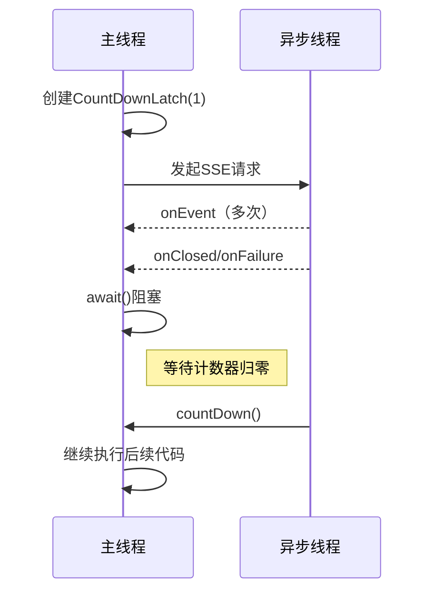
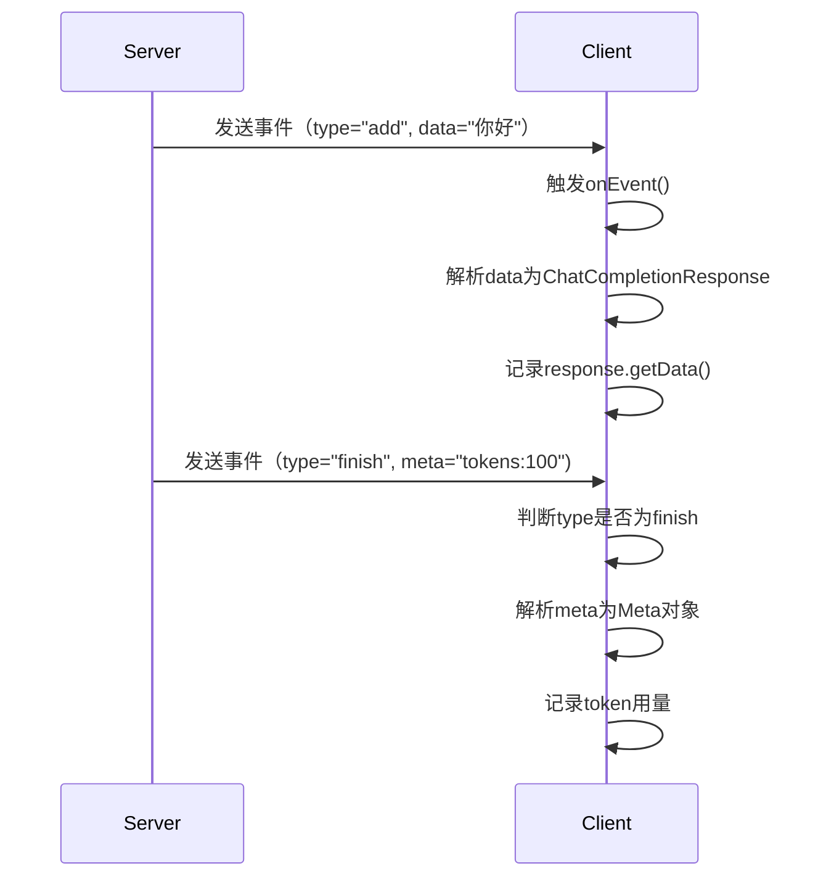
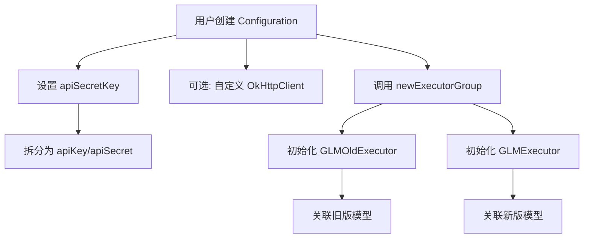
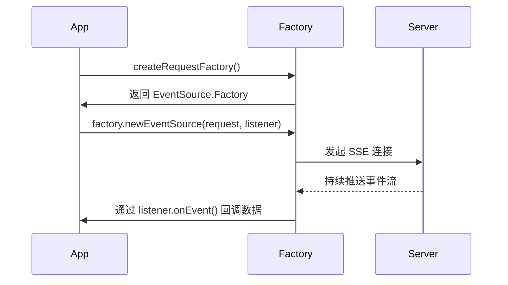

# 开发2

[TOC]

## 1. 代码

```
Prompt类 (消息单元)
├── 基础字段
│   ├── role (角色：user/assistant)
│   └── content (内容：文本或JSON字符串)
│
├── Content子类 (内容详细结构)
│   ├── type (内容类型：text/image_url)
│   ├── text (纯文本内容)
│   └── imageUrl (图片URL对象)
│       └── url (图片地址)
│
└── PromptBuilder (建造者)
    ├── role()
    ├── content(String)
    └── content(Content)
```


```json
{
  "role": "user",
  "content": {
    "type": "image_url",
    "image_url": {
      "url": "https://example.com/image.jpg"
    }
  }
}
```


### **关键注解与 Lombok 的作用**

|        注解/类        |                             作用                             |
| :-------------------: | :----------------------------------------------------------: |
|        `@Data`        | 自动生成 `getter`、`setter`、`equals`、`hashCode`、`toString`。 |
|      `@Builder`       |            生成 Builder 模式代码，支持链式调用。             |
| `@NoArgsConstructor`  |                      生成无参构造方法。                      |
| `@AllArgsConstructor` |                      生成全参构造方法。                      |
|    `@JsonProperty`    |             指定 JSON 字段名（如 `image_url`）。             |
|       `@Getter`       |                 生成枚举值的 `getter` 方法。                 |


```java
public class User {
    private Long id;
    private String name;
    private int age;

    // 私有构造方法（参数与字段顺序一致）
    private User(Long id, String name, int age) {
        this.id = id;
        this.name = name;
        this.age = age;
    }

    // 静态方法返回 Builder 实例
    public static UserBuilder builder() {
        return new UserBuilder();
    }

    // 内部 Builder 类
    public static class UserBuilder {
        private Long id;
        private String name;
        private int age;

        // 链式设置方法
        public UserBuilder id(Long id) {
            this.id = id;
            return this;
        }

        public UserBuilder name(String name) {
            this.name = name;
            return this;
        }

        public UserBuilder age(int age) {
            this.age = age;
            return this;
        }

        // 构建最终对象
        public User build() {
            return new User(id, name, age);
        }

        @Override
        public String toString() {
            return "UserBuilder(id=" + id + ", name=" + name + ", age=" + age + ")";
        }
    }
}
```


### 

| 字段      | 类型   | 必需 | 说明                                                         |
| :-------- | :----- | :--- | :----------------------------------------------------------- |
| `role`    | String | 是   | 标识消息发送者角色： `user` - 用户输入 `assistant` - 模型回复 |
| `content` | String | 是   | 消息内容，可以是： - 纯文本 - JSON字符串（多模态内容）       |


| 角色        | 说明     | 典型使用场景     |
| :---------- | :------- | :--------------- |
| `user`      | 用户输入 | 用户提问、指令   |
| `assistant` | AI回复   | 携带历史对话记录 |


```
List<Prompt> messages = Arrays.asList(
    new Prompt("user", "推荐北京的美食"),
    new Prompt("assistant", "北京烤鸭是非常有名的特色美食"),
    new Prompt("user", "具体在哪能吃到正宗的？")
);
```


```
Tool类
├── 工具类型 (Type enum)
├── 函数工具 (Function)
├── 知识库工具 (Retrieval)
└── 网络搜索工具 (WebSearch)
```


### 1. 流式应答概念

流式应答(Server-Sent Events, SSE)是一种服务器向客户端持续推送数据的技术，与传统的"请求-响应"模式不同，它具有以下特点：

- **持续连接**：建立连接后保持打开状态
- **单向通信**：只支持服务器→客户端方向
- **分块传输**：数据分成多个片段陆续发送
- **自动重连**：内置断线重连机制

### 2. `openAiSession.completions()` 方法解析

java

复制

```
openAiSession.completions(request, new EventSourceListener() {
    // 回调方法实现
});
```

参数说明：

- `request`: 包含模型、提示词等配置的请求对象
- `EventSourceListener`: 处理服务器事件回调的监听器

### 3. 事件回调方法

#### (1) `onEvent` - 数据接收

java

复制

```
public void onEvent(EventSource eventSource, String id, String type, String data) {
    // 1. 解析响应数据
    ChatCompletionResponse response = JSON.parseObject(data, ChatCompletionResponse.class);
    
    // 2. 处理内容
    log.info("测试结果 onEvent：{}", response.getData());
    
    // 3. 结束事件处理
    if (EventType.finish.getCode().equals(type)) {
        ChatCompletionResponse.Meta meta = JSON.parseObject(response.getMeta(), 
            ChatCompletionResponse.Meta.class);
        log.info("[输出结束] Tokens {}", JSON.toJSONString(meta));
    }
}
```

参数说明：

- `eventSource`: 事件源对象
- `id`: 事件ID（可选）
- `type`: 事件类型（`add`/`finish`/`error`/`interrupted`）
- `data`: 实际数据内容

#### (2) `onClosed` - 连接关闭

java

复制

```
public void onClosed(EventSource eventSource) {
    log.info("对话完成");
    countDownLatch.countDown(); // 释放等待锁
}
```

#### (3) `onFailure` - 异常处理

java

复制

```
public void onFailure(EventSource eventSource, Throwable t, Response response) {
    log.info("对话异常");
    countDownLatch.countDown(); // 异常时也释放锁
}
```

### 4. 流式应答流程示例

复制

```
[客户端] 发送请求
[服务器] 返回: data: {"data":"你好"} (type=add)
[服务器] 返回: data: {"data":"你好，"} (type=add)
[服务器] 返回: data: {"data":"你好，有什么"} (type=add)
[服务器] 返回: data: {"meta":{...}} (type=finish)
[服务器] 关闭连接
```


## 五、完整交互流程

1. **初始化阶段**：
   - 创建API会话(`openAiSession`)
   - 构建请求参数(`ChatCompletionRequest`)
2. **请求阶段**：
   - 发起流式请求(`completions()`)
   - 注册事件监听器(`EventSourceListener`)
3. **响应阶段**：
   - 接收数据片段(`onEvent`)
   - 处理结束信号(`onClosed`)
   - 错误处理(`onFailure`)
4. **同步控制**：
   - 主线程等待(`await()`)
   - 回调触发释放(`countDown()`)
5. **结果处理**：
   - 实时显示增量内容
   - 最终统计token使用情况





### **1. `JSON.parseObject(data, ChatCompletionResponse.class)`**

#### **作用**

- **JSON反序列化**：将服务器返回的JSON字符串（`data`）转换为Java对象（`ChatCompletionResponse`）。

- 

  参数解析

  ：

  - `data`：原始JSON字符串（例如 `{"data": "回答内容", "meta": "元数据"}`）。
  - `ChatCompletionResponse.class`：目标类模板，告诉解析器如何映射JSON字段到Java类的属性。

#### **代码示例**

java

复制

```java
// 假设 data = {"data": "你好", "meta": "{\"tokens\": 100}"}
ChatCompletionResponse response = JSON.parseObject(data, ChatCompletionResponse.class);

// 此时 response 对象：
//   response.getData() -> "你好"
//   response.getMeta() -> "{\"tokens\": 100}"（仍是JSON字符串）
```

#### **类比**

- **类似场景**：就像把一封信（JSON字符串）翻译成你能理解的母语（Java对象）。











