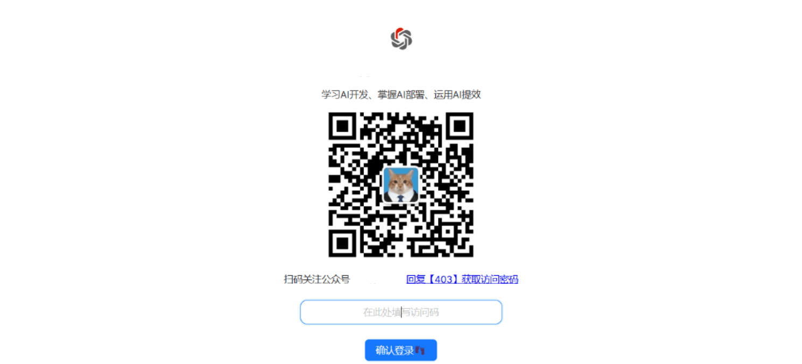
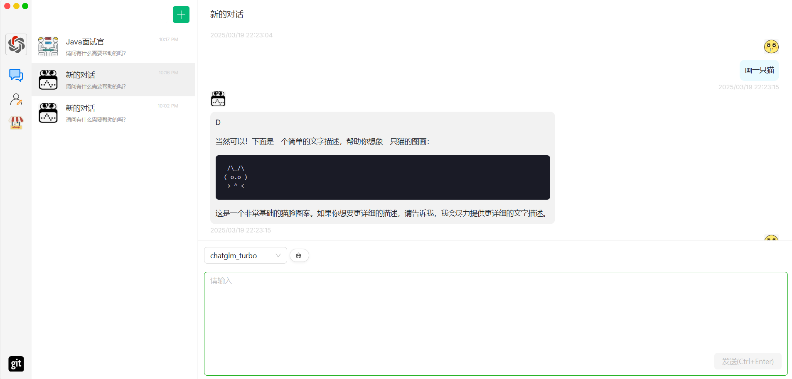
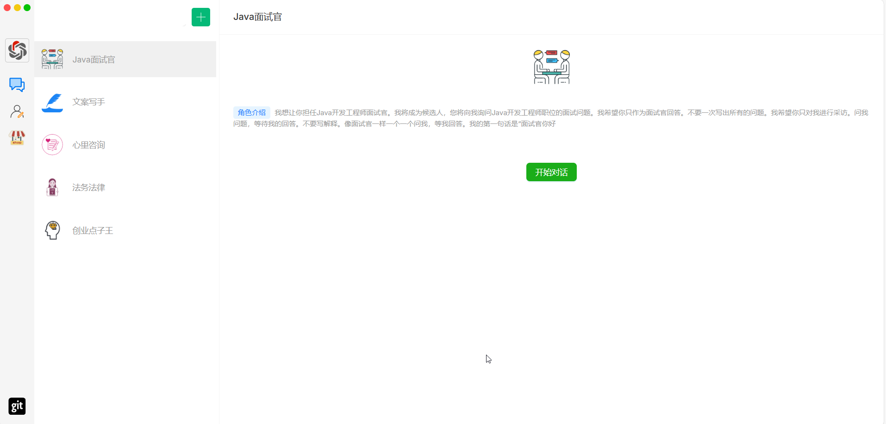
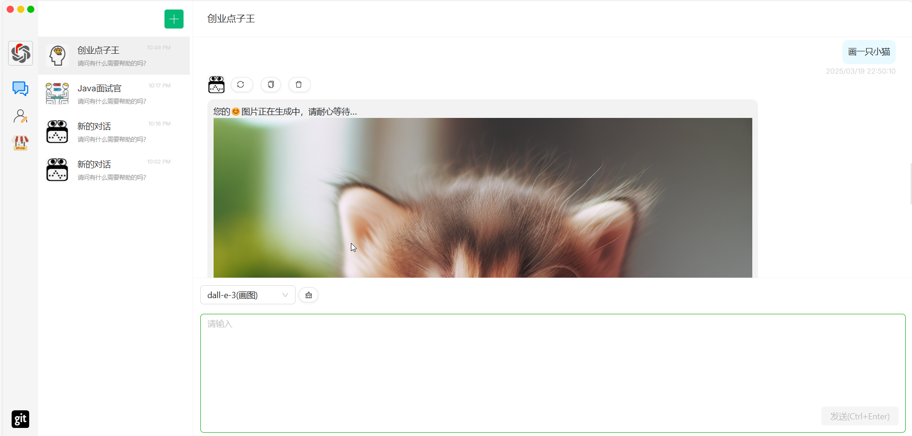
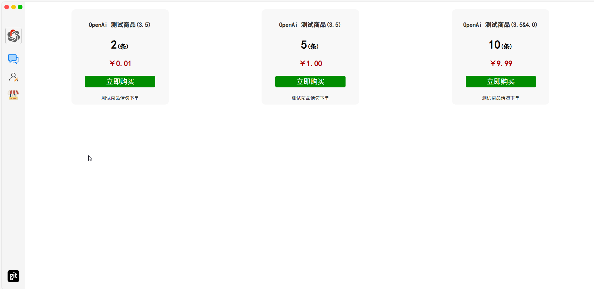
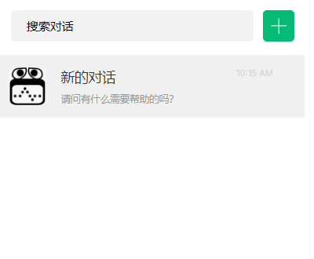
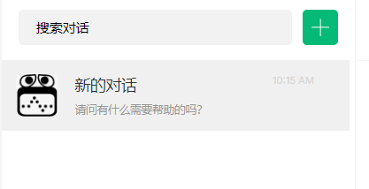
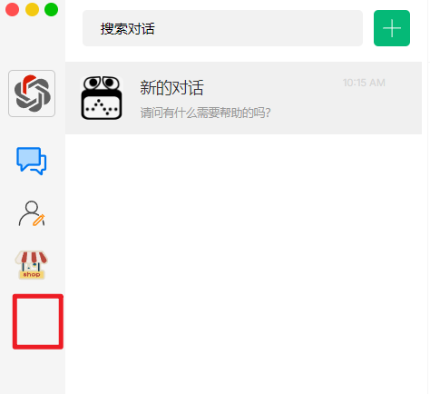

# 网站进展

目前已经实现的部分：

1. 对接公众号实现验证码登录

     

2. 写完chatgpt-sdk和chatglm-sdk，可以调用该模型实现对话

   

3. 实现角色定制

   

4. 对接dalle实现画图

   

5. 构建对话商品的界面

   

后面计划实现的部分

1. 将网站部署到服务器上
2. 继续对接文心一言、deepseek模型，写好相关sdk
3. 写一个管理员管理系统，查看用户信息
4. 实现对话额度部分商品购买，申请微信支付的sdk
5. 实现对话的图片识别，图片下载功能

细节改进

1. 搜索框可以搜索对话关键词

   

2. 增加左侧栏可展开

   

3. 增加一个ai云盘

   

4. 可以考虑网页解析和ai视频

5. 增加token使用情况面板以及个人登录信息等等展示

6. 

